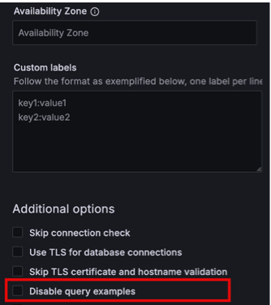

# Percona Monitoring and Management 3.5.0

**Release date**:

Percona Monitoring and Management (PMM) is an open source database monitoring, management, and observability solution for MySQL, PostgreSQL, MongoDB, and Valkey/Redis. PMM empowers you to: 

- monitor the health and performance of your database systems
- identify patterns and trends in database behavior
- diagnose and resolve issues faster with actionable insights
- manage databases across on-premises, cloud, and hybrid environments

## Release summary

## Release highlights

### MongoDB dashboard improvements

We've made several enhancements to improve MongoDB monitoring:

- Renamed **Query Execution Times** panel to **Operation Latencies** in **Router Summary**, **Sharded Cluster Summary**, and **Replica Set Summary** dashboards for clarity
- Fixed duplicate service counts in MongoDB dashboards and node filtering issues in **Replica Set Summary**, **Cluster Summary**, and **Router Summary** dashboards
- Added idle connections metric to the **Connections** panel in **Cluster Summary** and **Replica Set Summary** dashboards to help identify performance issues:

    

### Query Analytics shows only your monitored databases

Query Analytics (QAN) now provides a cleaner view by excluding PMM Server's internal PostgreSQL queries from the default display.

This helps you focus on your database performance without the distraction of PMM's operational activity. If you need to monitor PMM Server queries for troubleshooting or High Availability scenarios, re-enable the option in **PMM Configuration > Settings > Advanced Settings**.

For details, see [QAN for PMM Server](../use/qan/index.md#qan-for-pmm-servers-internal-postgresql).

### Support for partial certificates for remote MySQL monitoring
PMM now supports adding remote MySQL instances using partial TLS configurations. You can configure TLS connections using only the CA certificate, without requiring client certificate and key files. 

This enables you to:

- monitor Azure MySQL Flexible Server instances using only the downloaded `DigiCertGlobalRootCA.crt.pem` certificate
- monitor Google Cloud SQL (MySQL) instances with single certificate files
- configure TLS connections using only the CA certificate, without requiring separate client certificate and key files

For instructions, see [Connect MySQL databases to PMM](../install-pmm/install-pmm-client/connect-database/mysql/mysql.md).

Similar support for PostgreSQL will be available in a future release.

### Improved data privacy: Disable query examples in the UI 

You can now enhance data privacy in PMM by disabling the collection and display of sensitive SQL queries when adding MySQL or PostgreSQL services.

The new **Disable query examples** option prevents PMM from showing full SQL queries containing real data in QAN.

When this option is enabled, the **Examples** tab in QAN will not display any query examples, helping protect sensitive information while still providing valuable performance insights.

To enable, go to **PMM Configuration > PMM Inventory > MySQL/PostgreSQL > Add Service > Additional Options** and select **Disable query examples**: 

## Components upgrade

## Improvements

- [PMM-6659](https://perconadev.atlassian.net/browse/PMM-6659): Query Analytics now hides PMM Server's internal PostgreSQL queries by default, keeping the view focused on your monitored databases. You can re-enable this in **PMM Configuration > Settings > Advanced Settings** for troubleshooting or HA scenarios.

- [PMM-13782](https://perconadev.atlassian.net/browse/PMM-13782): We've removed **MySQL Query Response Time Details** from the main navigation menu. You can still access this dashboard in **Dashboards > MySQL** if you're a MariaDB user with the Query Response Time plugin enabled.
This change streamlines your navigation experience, as the dashboard only supports outdated Percona Server for MySQL 5.7. If you're using MySQL 8.0 or later, use Query Analytics (QAN) with Performance Schema.

- [PMM-14108](https://perconadev.atlassian.net/browse/PMM-14108): Added idle connections metric to the **Connections** panel available in **MongoDB Cluster Summary** and **Replica Set Summary** dashboards. Idle connections are now displayed alongside Available and Current connections to help identify potential performance issues.

- [PMM-14107](https://perconadev.atlassian.net/browse/PMM-14107): Renamed the **Query Execution Times** panel to **Operation Latencies** in **MongoDB Router Summary**, **Sharded Cluster Summary**, and **Replica Set Summary** dashboards to better reflect the actual metrics being displayed.

- [PMM-14271](https://perconadev.atlassian.net/browse/PMM-14271): Fixed misleading status indicators for disabled agents in PMM Inventory. Disabled agents now display <b style="color:#6C757D;">Disabled</b> status with grey background instead of **Unknown**, clearly indicating they are intentionally disabled rather than failing. The **Services** tab **Monitoring** status has been improved: services show <b style="color:#73BF69;">OK</b> (green) when only non-critical agents are disabled, <b style="color:#FF9830;">Warning</b> (orange) when multiple agents are disabled, and <b style="color:#e02f44;">Failed</b> (red) when agents are actually failing.

- [PMM-14006](https://perconadev.atlassian.net/browse/PMM-14006): Added **Disable query examples** checkbox when adding MySQL and PostgreSQL services. Enable this to prevent PMM from collecting full SQL queries with literal data values in Query Analytics, showing only query fingerprints instead. Available under **PMM Configuration > PMM Inventory > Add Service > Advanced Settings**.

## Fixed issues
- [PMM-14022](https://perconadev.atlassian.net/browse/PMM-14022): Fixed duplicate service counts in MongoDB dashboards and the MongoDB down alert rule on the **Alert rules** page caused by high-resolution and low-resolution exporter jobs being counted separately.
- [PMM-14106](https://perconadev.atlassian.net/browse/PMM-14106): Fixed **MongoDB Command Operations** and **Collection Details** panels in **Replica Set Summary**, **Cluster Summary**, and **Router Summary** dashboards to correctly apply the node filter selection. The panels now display data only for the selected node instead of always showing all nodes.

