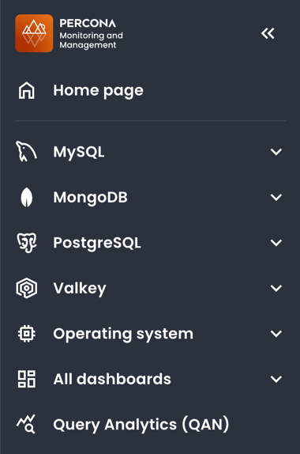
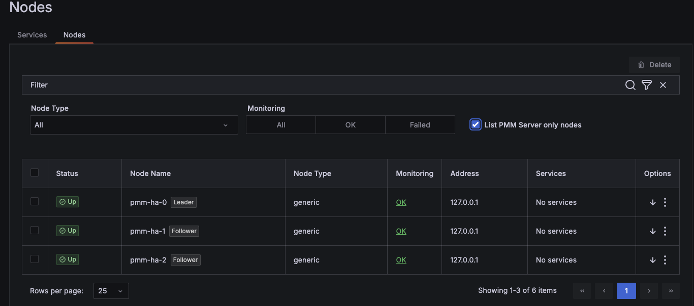
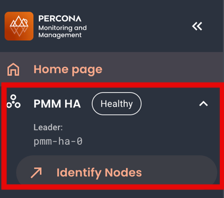
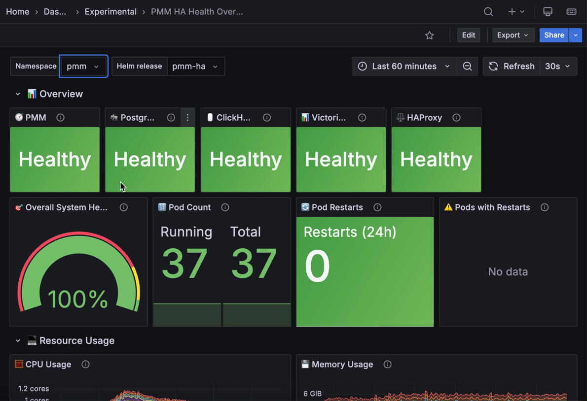
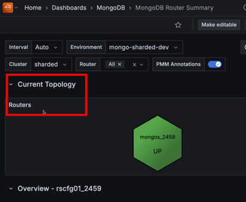
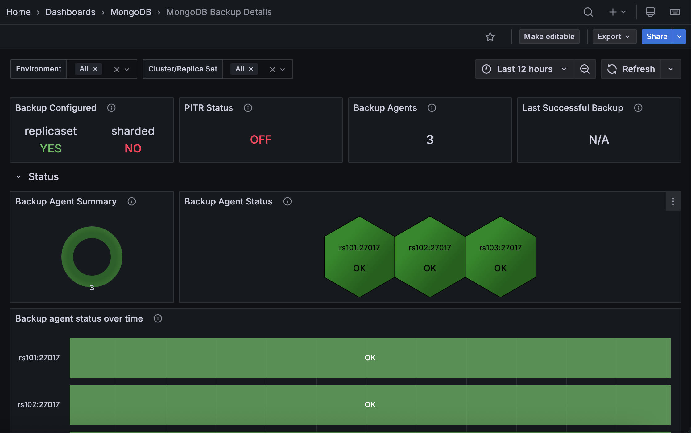

# Percona Monitoring and Management 3.6.0

**Release date**: January 2026

Percona Monitoring and Management (PMM) is an open source database monitoring, management, and observability solution for MySQL, PostgreSQL, MongoDB, Valkey and Redis. PMM empowers you to: 

- monitor the health and performance of your database systems
- identify patterns and trends in database behavior
- diagnose and resolve issues faster with actionable insights
- manage databases across on-premises, cloud, and hybrid environments

## 📋 Release summary

## ✨ Release highlights

### New native PMM navigation and revamped user interface
The first thing you'll notice with this update is the new look-and-feel of the PMM interface. We've moved away from Grafana's built-in menus to PMM's own navigation, organized around PMM's workflows to make it easier for you to move through PMM and find what you need faster. This brings: 

- A new, always-visible sidebar that provides consistent access to all PMM features without relying on Grafana’s native menus: 

    

- Sticky time range and variables: Selected time ranges and dashboard variables now persist when switching between dashboards, so you no longer need to reapply filters.

- A new theme switcher in the sidebar applies Light or Dark mode to both the PMM interface and embedded dashboards.

- Query Analytics now fully supports the light theme

- Centralized Help & Resources: Quick access to documentation, the community forum, support contact, and feedback tools. Admin users also see **Dump** and **Logs** options.

-  New interactive onboarding tour to help first-time users explore PMM’s key features. You can start it from the Help Center’s Welcome Card or from **Useful tips > Start PMM tour**.

- Clearer update reminders: small badges and pop-up messages so you can easily see when updates are available.

#### You should know that: 

- The new navigation is enabled by default, and you will not be able to revert to the previous Grafana-based menus.
- If you use a custom `grafana.ini` file, add [`allow_embedding = true`](https://grafana.com/docs/grafana/latest/setup-grafana/configure-grafana/#allow_embedding) to the `[security]` section so that the new interface can display dashboards correctly.

For details on navigating the new interface, see [Interface overview](../reference/ui/ui_components.md) and Help Center.

### Clustered High Availability with zero-downtime monitoring (Technical Preview)

!!! warning "Technical Preview Status"
    This feature is not production-ready. Use for testing and feedback only.

PMM 3.5.0 introduces PMM HA Clustered, a zero-downtime HA option for continuous monitoring visibility.

PMM's two production-ready HA options ([Docker](../install-pmm/HA-docker.md) and [Kubernetes single-instance](../install-pmm/HA-kubernetes-single-instance.md)) work well but leave 1-5 minute monitoring gaps during failover. 

For enterprises needing continuous visibility, we announced development of a fully clustered architecture. That architecture is now available for testing ans delivers the core high availability features announced previously:

- three PMM server replicas with Raft consensus leader election
- HAProxy load balancing with automatic traffic routing
- distributed databases (ClickHouse, VictoriaMetrics, PostgreSQL) via Kubernetes operators
- Helm-based installation via Kubernetes operators
- sub-30-second failover maintaining continuous monitoring

### HA status monitoring

Alongside the new clustered architecture, PMM 3.6.0 also improves visibility into HA deployments with new monitoring capabilities. Whether you're using the existing Docker or Kubernetes single-instance HA options or testing the new HA Clustered architecture, you can now track cluster health and status through:

- **HA badge** on Home dashboard: shows the current leader node and overall cluster health at a glance
    
- **Inventory integration**: displays HA roles and health status for each node in your cluster:
    
- **[PMM HA Health Overview dashboard](../reference/dashboards/dashboard-ha-health-overview.md)**: provides detailed monitoring of component health, resource usage, and pod status specifically for HA Clustered deployments

    

### What's still in development

This Technical Preview release focuses on core clustering functionality and zero-downtime failover. Several enterprise features are still under active development and will be added in future releases as we move toward production readiness.

- **Multi-region geographic distribution**: Deploy PMM HA nodes across different geographic regions for disaster recovery
- **Production-ready stability**: Additional testing, performance optimization, and hardening for production workloads
- **Migration paths**: Tools and procedures to migrate from existing PMM deployments to HA Clustered
- **Horizontal scalability**: Dynamic scaling based on monitoring load and advanced disaster recovery features

See [limitations and known issues](../install-pmm/HA-clustered.md#known-issues) for current restrictions.

### Platform Support

We've tested PMM HA Clustered on Amazon EKS with Kubernetes 1.24 and later versions. While the architecture should work on other Kubernetes platforms (GKE, AKS, on-premise Kubernetes, OpenShift), we haven't validated these yet. VMware Tanzu is not supported.

### Documentation and resources

For installation instructions, see [Install PMM with Kubernetes HA (Clustered)](../install-pmm/HA-clustered.md).

For programmatic monitoring, see the new [REST API endpoints](https://percona-pmm.readme.io/reference/release-notes-3-6-0).

### Provide feedback

Try out this feature and share your experience on the [PMM forum] and [JIRA Tracker], regardless of your platform. Your feedback during this Technical Preview phase helps us prioritize improvements, expand our support matrix, and ensure the final release meets enterprise monitoring needs.

### MongoDB dashboard improvements

Based on community feedback, we've simplified several MongoDB dashboards so you can check cluster health faster and focus on the metrics that matter:

- **[Instances Overview](../reference/dashboards/dashboard-mongodb-instances-overview.md)**: the **Overview** section now focuses on topology and health metrics instead of detailed resource metrics. Detailed metrics like **Cursors**, **Latency**, and **Query Efficiency** are now only available in **Instance Summary**, **Replica Set Summary**, and **Sharded Cluster Summary**.
- **[Instance Summary](../reference/dashboards/dashboard-mongodb-instances-overview.md)**: clearer **Uptime**, **QPS**, and **Latency** panels with one-decimal precision. The **Command Operations** panel now includes additional metrics.
- **[Router Summary](../reference/dashboards/dashboard-mongodb-router-summary.md)**: improved decimal precision across metrics. A new **Routers** panel at the top shows router status at a glance for quick cluster visibility:

    
    
 
### Redesigned MongoDB Backup Details dashboard

We've redesigned the **MongoDB PBM Details** dashboard with new and enhanced panels that make it easier to monitor your backup agents and track operations across your environment. You'll find it under its new name, **MongoDB Backup Details**, which better reflects what the dashboard now offers.

**New panels:**

- **Backup Agents**: See how many PBM agents are currently being monitored across your environment.
- **Backup Agent Summary**: Quickly assess the overall health of your backup infrastructure with a donut chart showing agent status distribution.
- **Backup Agent Status**: Identify problematic agents at a glance using a hexagon grid that highlights which specific hosts need attention.

**Enhanced panels:**

- **Backup agent status over time**: Spot patterns and troubleshoot issues by viewing how agent status has changed over your selected time range.
- **Backup history**: Get a complete picture of backups across your MongoDB infrastructure with new columns for Environment, Cluster/Replica Set, Size, and Duration.

To explore this dashboard, go to **MongoDB > MongoDB Backup Details** in the sidebar.
### Added support and deprecations

####  PostgreSQL 18 support on RHEL 10

Extending the RHEL 10 support introduced in PMM 3.4.0, you can now also monitor PostgreSQL 18 databases on Red Hat Enterprise Linux 10. To get started, [install PMM Client](../install-pmm/install-pmm-client/package_manager.md) on your AMD64 or ARM64 system.

#### Debian 13 support for PMM Client
PMM Client now supports Debian 13 (Trixie) so you can monitor databases on the latest Debian release (AMD64 and ARM64).
For installation instructions, see [Install PMM Client with Package Manager](../install-pmm/install-pmm-client/package_manager.md).

## 🔒 Security updates

### Custom alert rules require datasource update after upgrade

PMM 3.6.0 changes the datasource configuration for alerting. After upgrading, edit custom alert rules to update the datasource and restore functionality. 

Without this update, alerts fail with `data source not found`.
For instructions on editing alert rules, see [Alert rules](../alert/alert_rules.md#edit-alert-rules).

### Added support and deprecations

#### VMware support removed

VMware is no longer supported as a deployment platform for PMM Server. This completes the [deprecation announced in PMM 3.4.0](https://docs.percona.com/percona-monitoring-and-management/3/release-notes/3.4.0.html#vmware-support-removed).

This means that PMM Server OVA images for VMware are no longer provided. If you're still running PMM on VMware, migrate to one of these supported platforms:

- [Docker](../install-pmm/install-pmm-server/deployment-options/docker/index.md) (recommended): simplified deployment and updates
- [Podman](../install-pmm/install-pmm-server/deployment-options/podman/index.md): rootless container execution with enhanced security
- [VirtualBox](../install-pmm/install-pmm-server/deployment-options/virtual/virtualbox.md): familiar VM management with minimal learning curv
- [Kubernetes/OpenShift](../install-pmm/install-pmm-server/deployment-options/helm/index.md): scalable container orchestration

## 📦 Components upgrade 

### Nomad v1.11.0
Upgraded from v1.10.5 with security enhancements and new features including improved client identity management for RPC authentication, token-based client introduction, and system job deployment support. See the [Nomad v1.11.0 release notes](https://developer.hashicorp.com/nomad/docs/release-notes/nomad/v1-11-x) for details.

## 📈 Improvements
- [PMM-14375](https://perconadev.atlassian.net/browse/PMM-14375): Added `--agent-env-vars` flag to `pmm-admin` add commands. Use this to pass environment variables from `pmm-agent` to exporters when your monitoring setup requires environment-level credentials or configuration.

- [PMM-14528](https://perconadev.atlassian.net/browse/PMM-14528): Updated Watchtower and Docker API libraries  with full Docker v29.0.0 support. The `DOCKER_API_VERSION` workaround is no longer required. If you're using an older watchtower version and see `client version is too old` errors, see [Troubleshoot upgrade issues](../troubleshoot/upgrade_issues.md#watchtower-fails-with-client-version-is-too-old-error).

## ✅ Fixed issues

- [PMM-14378](https://perconadev.atlassian.net/browse/PMM-14378): Fixed `waitid: no child processes` error that could occasionally occur when registering PMM Client (Docker distribution) with PMM Server.

- [PMM-14321](https://perconadev.atlassian.net/browse/PMM-14321): Fixed a PMM Agent crash triggered when parsing slow query log entries containing queries that use `Value` as a column alias.

- [PMM-14440](https://perconadev.atlassian.net/browse/PMM-14440): Fixed `excessive was collected before with the same name and label values` errors in `mysqld_exporter` logs that caused rapid log file growth.

- [PMM-14568](https://perconadev.atlassian.net/browse/PMM-14568): Fixed `container is not a PMM server` error when upgrading PMM Server via the UI. This occurred when the image name was different from `pmm-server`. 

- [PMM-10308](https://perconadev.atlassian.net/browse/PMM-10308): Fixed missing metric queries in the **MySQL Instance Summary** dashboard that caused several panels to show `N/A` instead of actual values.

- [PMM-14573](https://perconadev.atlassian.net/browse/PMM-14573): Fixed a connection leak in MongoDB exporter that could exhaust connections and crash MongoDB nodes when replica set members were unreachable.

- [PMM-145343](https://perconadev.atlassian.net/browse/PMM-145343): Fixed duplicate and misleading panel names on the **MySQL Instances Overview** dashboard by renaming one of the panels from **MySQL Temporary Objects** to **Top 5 MySQL Temporary Objects**, so each panel now clearly reflects the metrics it displays.

## 🚀 Ready to upgrade to PMM 3.5.0?

- **New installation:** [Install PMM with our quickstart guide](../quickstart/quickstart.md)
- **Upgrading PMM 3:** [Upgrade your existing PMM 3 installation](../pmm-upgrade/index.md)
- **Upgrading from PMM 2:** [Migrate from PMM 2 to PMM 3](../pmm-upgrade/migrating_from_pmm_2.md)
