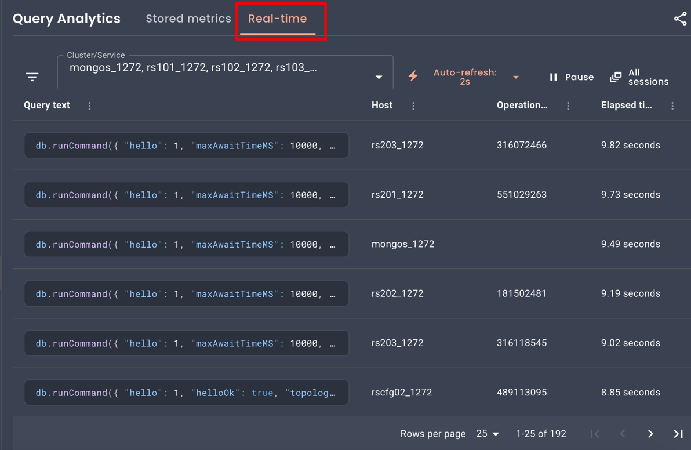
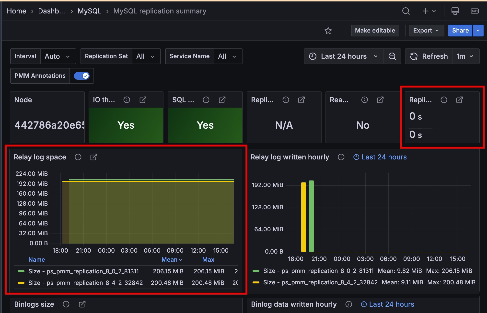

# Percona Monitoring and Management 3.7.0

**Release date**: April 1st, 2026

Percona Monitoring and Management (PMM) is an open source database monitoring, management, and observability solution for MySQL, PostgreSQL, MongoDB, Valkey and Redis. PMM empowers you to: 

- monitor the health and performance of your database systems
- identify patterns and trends in database behavior
- diagnose and resolve issues faster with actionable insights
- manage databases across on-premises, cloud, and hybrid environments

## 📋 Release summary
PMM 3.7.0 introduces Real-time Query Analytics (RTA) for MongoDB, completes the Percona Platform removal, and adds the `pmm-admin inventory change agent` command for updating MongoDB agents on the fly. 

This release also brings optional PMM Client config file encryption, component upgrades, security fixes, dashboard improvements, and multiple bug fixes across QAN, alerting, and monitoring.

## ✨ Release highlights

### Real-time Query Analytics (RTA) for MongoDB 

PMM 3.7.0 introduces RTA, a new way to see exactly what's happening on your databases right now.

While Query Analytics (QAN) stores queries after they complete for performance review and optimization, RTA shows queries as they execute. This means that when your database is struggling, you can immediately see what's causing the problem.

With a live stream updated every 1-5 seconds, RTA lets you spot long-running queries, identify lock contention, and investigate problematic operations as they happen. You can pause the stream, filter by cluster or service, and access raw MongoDB diagnostics for deeper troubleshooting.

To get started, go to **Query Analytics > Real-Time** and select a MongoDB service: 



RTA currently supports **MongoDB only**. Support for **MySQL** and **PostgreSQL** is planned for future releases.

To learn how to work with RTA, see [Real-time Query Analytics](../use/qan/QAN-realtime-analytics.md). For programmatic access, see the [Real-time Analytics API](https://percona-pmm.readme.io/reference/real-time-analytics).

### Improved MySQL Replication Summary dashboard

The **Replication Delay** and **Relay Log Space** panels now display time series with unique colors and include service names in the legend, making it easier to monitor multi-source replication setups.



### Change MongoDB monitoring settings on the fly from the command line
When managing services from the command line, you no longer need to remove and re-add a service just to change an agent setting. 

PMM 3.7.0 introduces the `pmm-admin inventory change agent` command, which lets you update a running agent's configuration directly by its ID. Only the flags you pass are updated, and changes take effect immediately with no monitoring gaps.

For the full list of supported flags, agent types, and usage examples, see [pmm-admin inventory change agent](../use/commands/pmm-admin/inventory.md#pmm-admin-inventory-change-agent).

The `pmm-admin inventory change agent` command currently supports MongoDB agent types only (`mongodb-exporter`, `mongodb-profiler-agent`, `qan-mongodb-profiler-agent`, `rta-mongodb-agent`). Support for additional agent types is planned for future releases.

### Encrypt the PMM Client configuration file

You can now encrypt the PMM Client configuration file (`pmm-agent.yaml`) to protect sensitive credentials like server passwords and API tokens on disk. 

To enable encryption, generate an RSA private key and pass it to PMM Client during setup. PMM Client then handles encryption and decryption automatically. Existing deployments without an encryption key continue to work as before.

For setup instructions, see [PMM Client configuration file encryption](../admin/security/client_config_encryption.md).

### Percona Platform connectivity removed

As announced in [PMM 3.5.0](3.5.0.md#free-built-in-advisors-and-alert-templates-replace-percona-platform), Percona Platform services are now discontinued.

With PMM 3.7.0, there's no longer any connection to Percona Platform in the UI or API. Since your advisors and alert templates now ship directly with PMM, everything will continue working exactly as before, you just won't see any Platform-related options anymore.

This also means you can no longer sign into PMM using your Percona Account. If you used this login method, [switch to a different authentication method](../reference/ui/log_in.md) such as basic auth, LDAP, OAuth, or SAML.

### Added support and deprecations

#### Deprecated PMM Server upgrades from the UI

Starting with PMM 3.9.0 (expected July 2026), you will no longer be able to upgrade PMM Server from the web interface.

Switch to one of these supported upgrade methods before PMM 3.9.0:

* **[Docker upgrade](../pmm-upgrade/upgrade_docker.md) (recommended)**: pull the latest image and restart the container
* [Podman upgrade](../pmm-upgrade/upgrade_podman.md): same container workflow with rootless execution
* [Helm upgrade](../pmm-upgrade/upgrade_helm.md): Kubernetes-native upgrade path

#### Deprecated OVF virtual appliance images 

PMM Server OVF virtual appliance images are deprecated and will no longer be available after PMM 3.9.0 (expected July 2026).

Existing OVF-based deployments will keep working, but new OVA images will not be available after PMM 3.9.0. Make sure you migrate to a supported deployment method before then:

* **[Docker](../install-pmm/install-pmm-server/deployment-options/docker/index.md) (recommended)**: simplified deployment and updates
* [Podman](../install-pmm/install-pmm-server/deployment-options/podman/index.md): rootless container execution with enhanced security
* [Kubernetes/Helm](../install-pmm/install-pmm-server/deployment-options/helm/index.md): scalable container orchestration

#### Direct migration from PMM 2.x deprecated

If you're still running PMM 2.x, now is the time to migrate. Starting with PMM 3.8.0, direct migration to the latest PMM 3.x version will be deprecated and may not work as expected.

If you migrate after PMM 3.8.0 and run into issues, you can still use PMM 3.7.0 as a stepping stone since this is the last version where we've fully tested migration from PMM 2.x:

```
PMM 2.x > PMM 3.7.0 > latest PMM version
```

However, this two-step path will only be available through PMM 3.12.x. After PMM 3.13.0 (expected January 2027), you will no longer be able to migrate from PMM 2.x at all.

If you are still running PMM 2.x, [migrate PMM 2 to PMM 3](../pmm-upgrade/migrating_from_pmm_2.md) now.

## 📦 Components upgrade 

- **VictoriaMetrics**: Upgraded from v1.114.0 to v1.138.0. Adds per-partition index support for improved query performance, along with upstream improvements and fixes. 
- **Grafana**: Upgraded to 11.6.13 to address security vulnerabilities. 
- **Nomad**: Upgraded to 1.11.3 to address security vulnerabilities. 

## 🔒 Security updates
PMM 3.7.0 fixes the following security vulnerabilities:

### Authenticated remote code execution via internal data source ([CVE-2026-25212](https://nvd.nist.gov/vuln/detail/CVE-2026-25212))

Resolved a vulnerability where an authenticated user could execute OS commands on the PMM Server through an internal PostgreSQL data source.

Percona would like to thank **Prasanna Dabi** for discovering and responsibly disclosing this vulnerability.
We appreciate all community security and bug reports that help us identify and fix issues. If you believe you’ve found a security issue, report it via [Percona Security](https://www.percona.com/security).

### Go standard library vulnerabilities

Updated Go dependencies to address the following vulnerabilities:

- Unexpected TLS session resumption ([CVE-2025-68121](https://nvd.nist.gov/vuln/detail/CVE-2025-68121))

    A TLS server could incorrectly resume sessions, potentially allowing a client to bypass certificate requirements. This issue is now fixed.

- Memory exhaustion via crafted query parameters ([CVE-2025-61726](https://nvd.nist.gov/vuln/detail/CVE-2025-61726))

    Crafted query parameters in net/url could cause excessive memory allocation, leading to denial of service. This is now fixed.

- CPU exhaustion via crafted zip archives ([CVE-2025-61728](https://nvd.nist.gov/vuln/detail/CVE-2025-61728))

    Building the index for a specially crafted zip archive could consume excessive CPU. This is now fixed.

### Incorrect IPv6 host literal parsing ([CVE-2025-61729](https://nvd.nist.gov/vuln/detail/CVE-2025-61729))

Malformed IPv6 literals in URLs can no longer be parsed incorrectly, potentially bypassing host validation. 

### Remaining third-party security risks
PMM 3.7.0 fixes the vulnerabilities listed above.

The items below are the remaining risks in third-party dependencies where upstream fixes were not available at release time.

Percona reviewed each item and assessed the risk for most PMM deployments as low. In a typical PMM environment, these issues are hard to exploit.

Percona continues to monitor upstream disclosures, reassess their impact on PMM, and update dependencies in later releases as fixes become available.

#### Bypass gRPC authorization checks ([CVE-2026-33186](https://nvd.nist.gov/vuln/detail/CVE-2026-33186))

##### Affected components
VictoriaMetrics, HashiCorp Nomad, and Grafana ClickHouse Datasource plugin (third-party dependencies).

##### Why this is hard to exploit in PMM
An attacker could bypass checks only if a gRPC server uses path-based deny and allow rules and accepts raw HTTP/2 frames with a malformed `:path` header.

PMM does not use that pattern in any component. PMM checks access through Grafana/nginx HTTP subrequests, not gRPC RBAC, so the required attack path is not present in PMM deployments.

##### Mitigating factors

In PMM, these three factors make this issue harder to exploit:

- none of the affected components use the `grpc/authz` package or implement path-based deny/allow policies in PMM's deployment context.
- the affected components communicate internally within the PMM Server
container and are not directly exposed to untrusted networks.
- Nomad is disabled by default in PMM.

##### Risk decision
Percona accepts this residual risk for PMM 3.7.0. CVSS rates it Critical, but for PMM the risk is Low because this attack path is not reachable. 

At release time, no upstream tagged release included the fix (`grpc >= 1.79.3`). Percona will address this in a later dependency update.

#### Parse IPv6 host literals incorrectly ([CVE-2026-25679](https://nvd.nist.gov/vuln/detail/CVE-2026-25679))

##### Affected component
This issue affects the Grafana ClickHouse Datasource plugin, a third-party dependency built with Go 1.26.0.

##### Why this is hard to exploit in PMM
Malformed IPv6 literals in URLs can bypass host checks. In PMM, the
ClickHouse Datasource plugin talks only to the local ClickHouse instance over localhost.

External user-controlled URLs do not reach this code path.

##### Mitigating factors

In PMM, these factors reduce risk:

- the plugin only connects to ClickHouse on the local network within the PMM Server container.
- PMM does not expose the plugin's URL parsing to untrusted input.

##### Risk decision
Percona accepts this residual risk for PMM 3.7.0 and will address it in a later dependency update.

#### Enforce email constraints incorrectly ([CVE-2026-27137](https://nvd.nist.gov/vuln/detail/CVE-2026-27137))

##### Affected component
This issue affects the Grafana ClickHouse Datasource plugin, a third-party dependency built with Go 1.26.0.

##### Why this is hard to exploit in PMM
This issue can cause incorrect email-constraint checks in x509 certificate validation.

The ClickHouse Datasource plugin uses self-signed certificates for local
ClickHouse TLS and does not validate external certificates with email
constraints.

##### Mitigating factors

In PMM, these factors reduce risk:

- the plugin's TLS communication is limited to internal, self-signed certificates generated at build time.
- no external certificate validation with email constraints occurs in PMM.

##### Risk decision
Percona accepts this residual risk for PMM 3.7.0 and will address it in a later dependency update.

#### Hijack PATH in OpenTelemetry SDK ([CVE-2026-24051](https://nvd.nist.gov/vuln/detail/CVE-2026-24051))

##### Affected component
This issue affects Grafana, a third-party dependency that uses `otel/sdk v1.39.0`.

##### Why this is hard to exploit in PMM
To exploit this issue, an attacker would need local file system access to the PMM Server container and control over `PATH`.

PMM Server runs in a locked-down container with no user shell access. If an attacker already has that level of local access, they already have broad control of the server.

##### Mitigating factors

In PMM, these factors reduce risk:

- PMM Server is intended to run on trusted infrastructure with restricted administrative access.
- the container does not provide shell access to unprivileged users.
- this vulnerability does not allow remote exploitation.

##### Risk decision
Percona accepts this residual risk for PMM 3.7.0 and will address it in a later dependency update.

#### Bypass Docker AuthZ plugin checks ([CVE-2026-34040](https://nvd.nist.gov/vuln/detail/CVE-2026-34040))

##### Affected component
This issue affects HashiCorp Nomad, a third-party dependency that uses `docker/moby v28.5.2`.

##### Why this is hard to exploit in PMM
This issue affects Docker daemon AuthZ plugins when they process oversized request bodies. In PMM, Nomad does not run as a Docker daemon and does not use Docker AuthZ plugins. Nomad is also disabled by default.

##### Mitigating factors

In PMM, these factors reduce risk:

- Nomad is disabled by default and requires explicit enablement.
- the vulnerable code path (Docker daemon AuthZ) is not exercised by Nomad in PMM.
- Nomad does not expose Docker daemon interfaces.

##### Risk decision
Percona accepts this residual risk for PMM 3.7.0 and will address it in a later dependency update.

#### How to reduce risk

To lower risk further, Percona recommends that you:

- restrict network access to PMM Server to trusted networks and users.
- minimize the number of PMM administrators and enforce strong authentication.
- apply resource limits to PMM Server containers where supported.
- keep Nomad disabled unless it is explicitly required for your deployment.

## 📈 Improvements
- [PMM-13788](https://perconadev.atlassian.net/browse/PMM-13788): Added optional encryption for the PMM Client configuration file (`pmm-agent.yaml`) to protect stored credentials and API tokens. See [Encrypt the PMM Client configuration file](../admin/security/client_config_encryption.md).

- [PMM-14831](https://perconadev.atlassian.net/browse/PMM-14831): Added `mongodb_currentop_fsync_lock_state` metric to detect when MongoDB is locked for backup or maintenance. Returns `1` when locked, `0` when unlocked. Enable with `--enable-all-collectors` when adding the service. Query in **Explore** or use in custom dashboards and alerts.

- [PMM-14412](https://perconadev.atlassian.net/browse/PMM-14412): Added `pmm-admin inventory change agent` command to update MongoDB agent configurations without removing and re-adding services.

- [PMM-14722](https://perconadev.atlassian.net/browse/PMM-14722): Added a low-memory ClickHouse configuration for PMM Server environments with less than 16 GB RAM. If you see "memory limit exceeded" errors in ClickHouse logs or experience performance issues when working with QAN, you can switch to the optimized configuration using the `switch-config.sh` script. See [ClickHouse memory issues](../troubleshoot/qan_issues.md#clickhouse-memory-issues-in-low-memory-environments) for details. As of PMM 3.9.0, use the `PMM_CLICKHOUSE_CONFIG` environment variable instead. The `switch-config.sh` script is deprecated.

- [PMM-14818](https://perconadev.atlassian.net/browse/PMM-14818): Improved performance for PostgreSQL instances with many databases (multitenant designs). The `pg_custom_database_size_custom` query now runs at low resolution (60 seconds by default) instead of high resolution (5 seconds). This significantly reduces CPU usage on servers with hundreds of databases.

- [PMM-759](https://perconadev.atlassian.net/browse/PMM-759): Improved the **Replication Delay** and **Relay Log Space** panels on the **MySQL Replication Summary** dashboard.

- [PMM-14700](https://perconadev.atlassian.net/browse/PMM-14700): Advisor checks now only run for database types present in your inventory. Previously, all checks executed regardless of your actual setup. For example, MongoDB checks no longer run if you only had PostgreSQL services configured. This keeps your results focused and reduces resource usage.

- [PMM-14824](https://perconadev.atlassian.net/browse/PMM-14824): Removed the `/v1/platform:connect` API endpoint as part of the Percona Platform sunset. Requests to this endpoint now return 404.

- [PMM-14899](https://perconadev.atlassian.net/browse/PMM-14899): Advisors and alert templates no longer require telemetry to be enabled. These are now bundled with PMM, so they work even when telemetry is disabled. The Advisors toggle has also moved to the **Execution intervals** section in **Advanced Settings**.

- [PMM-14527](https://perconadev.atlassian.net/browse/PMM-14527): Improved Aurora PostgreSQL support. PMM now skips replication collectors that use functions unavailable in Aurora, preventing exporter errors and false alerts.

- [PMM-14511](https://perconadev.atlassian.net/browse/PMM-14511): Improved Query Analytics layout to better use available screen space. The query table now fills the available area, and pagination remains visible when viewing query details.

- [PMM-14363](https://perconadev.atlassian.net/browse/PMM-14363): **Mountpoint** on the **Disk Details** dashboard are now shown in gigabytes (GB) instead of bytes, making it easier for you to read and interpret large values.

## ✅ Fixed issues

- [PMM-14267](https://perconadev.atlassian.net/browse/PMM-14267): PMM would stop collecting RDS metrics after restarting `pmm-agent`. Restarting the agent no longer interrupts metrics collection.

- [PMM-14376](https://perconadev.atlassian.net/browse/PMM-14376): Fixed alerts continuing to fire after removing a service or node from PMM inventory. Alerts now correctly check inventory before triggering, preventing false positives.

- [PMM-14790](https://perconadev.atlassian.net/browse/PMM-14790): Fixed **MongoDB Replset Summary** dashboard so that the **Operation Latencies**, **Query Efficiency**, **Queued Operations**, **Read & Writes**, and **Average Connections** panels now show data broken down by service name when **All** is selected.

- [PMM-9602](https://perconadev.atlassian.net/browse/PMM-9602): Fixed `runtime_mysql_servers` collection errors when monitoring ProxySQL with a non-admin user. PMM now skips runtime server metrics collection when the user lacks the required permissions.

- [PMM-14549](https://perconadev.atlassian.net/browse/PMM-14549): Fixed several panels on the **MySQL MyRocks Details** dashboard that were missing labels identifying each metric series.

- [PMM-14822](https://perconadev.atlassian.net/browse/PMM-14822): Fixed navigation issues that occurred when Grafana anonymous access (`auth.anonymous` in `grafana.ini`) was enabled, including missing menu items and search bar inconsistencies.

- [PMM-14686](https://perconadev.atlassian.net/browse/PMM-14686): PMM would return a 404 error when accessing `/debug/pprof/` endpoints in `mysqld_exporter`. This is now fixed, and you can now collect performance profiling data from exporters for debugging. See [Exporter issues](../troubleshoot/exporter_issues.md) for details.

- [PMM-14874](https://perconadev.atlassian.net/browse/PMM-14874): Fixed external links on several dashboards (**Valkey Overview**, **MySQL Query Response Time Details**, **MySQL Table Details**, **MySQL User Details**, and Experimental dashboards) that previously showed blank pages instead of opening the intended URL.

- [PMM-14843](https://perconadev.atlassian.net/browse/PMM-14843): Fixed "Failed to render panel image" error when generating images from dashboard panels. The **Share > Generate image** option on panel's menu now works correctly with the Grafana image render plugin.

- [PMM-14833](https://perconadev.atlassian.net/browse/PMM-14833): Fixed alert templates with the `tiers` field failing to save. The `tiers` field was part of Percona Platform integration and stopped working after Platform connectivity was removed in PMM 3.6.0. Templates now save correctly, the field is accepted but ignored and will be removed in PMM v4.

- [PMM-14761](https://perconadev.atlassian.net/browse/PMM-14761): Fixed Query Analytics triggering duplicate API requests when opening the page or refreshing. This reduces server load and improves response times.

- [PMM-14566](https://perconadev.atlassian.net/browse/PMM-14566): Fixed Query Analytics loading significantly slower in PMM 3 than PMM 2.

- [PMM-14512](https://perconadev.atlassian.net/browse/PMM-14512): Fixed **BP Data Dirty** panel on the **InnoDB Buffer Pool** dashboard not displaying data after upgrading from PMM 2.x to 3.x.

- [PMM-12478](https://perconadev.atlassian.net/browse/PMM-12478): Fixed external services incorrectly showing "Failed" monitoring status in PMM Inventory when they were working correctly.

- [PMM-14801](https://perconadev.atlassian.net/browse/PMM-14801): Fixed PostgreSQL exporter crash when monitoring GCP Cloud SQL PostgreSQL 13 and 14 instances.

## 🚀 Ready to upgrade to PMM 3.7.0?

- [New installation](../quickstart/quickstart.md)
- [Upgrading from PMM 3](../pmm-upgrade/index.md)
- [Upgrading from PMM 2](../pmm-upgrade/migrating_from_pmm_2.md)
