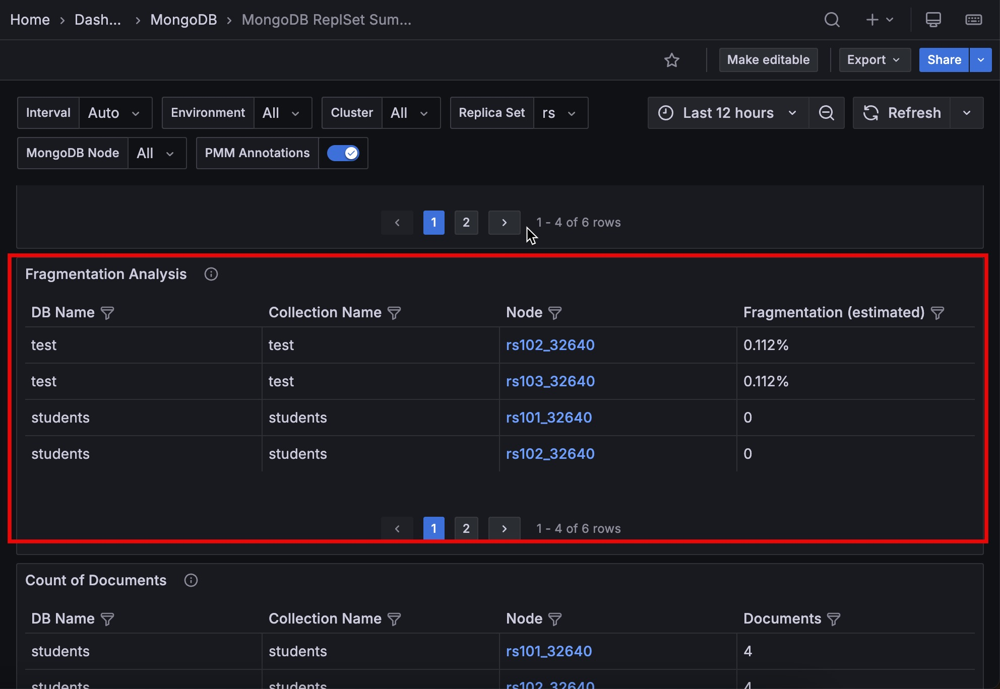

# Percona Monitoring and Management 3.7.1

**Release date**: April 30th, 2026

Percona Monitoring and Management (PMM) is an open source database monitoring, management, and observability solution for MySQL, PostgreSQL, MongoDB, Valkey and Redis. PMM empowers you to:

- monitor the health and performance of your database systems
- identify patterns and trends in database behavior
- diagnose and resolve issues faster with actionable insights
- manage databases across on-premises, cloud, and hybrid environments

## 📋 Release summary
PMM 3.7.1 is primarily a security release. It fixes several CVEs in third-party dependencies, upgrades key components including Grafana, Nomad, and VictoriaMetrics, and masks database credentials in logs to make log sharing safer.

It also adds a MongoDB storage fragmentation view, makes PMM Client setup more flexible for containerized environments, and fixes issues in Real-Time Analytics (RTA), dashboards, and exporters.

## ✨ Release highlights

### Spot MongoDB storage fragmentation at a glance

The [MongoDB Cluster Summary](../reference/dashboards/dashboard-mongodb-cluster-summary.md) and [MongoDB ReplSet Summary](../reference/dashboards/dashboard-mongodb-replset-summary.md) dashboards now include a **Fragmentation Analysis** panel showing the ratio of free to allocated storage per collection. Use it to quickly identify collections wasting disk space due to frequent deletes or document moves, and decide where running `compact` will have the most impact.

### Safer log sharing with automatic credential masking

PMM now masks database passwords and connection-string credentials in logs. This helps you share logs for troubleshooting without exposing sensitive values.

## 🔒 Security updates

PMM 3.7.1 upgrades key components and addresses several security vulnerabilities in third-party dependencies:

### Bypass gRPC authorization checks ([CVE-2026-33186](https://nvd.nist.gov/vuln/detail/CVE-2026-33186))

Fixed by upgrading gRPC dependencies to ≥1.79.3 across all PMM components. This vulnerability was not exploitable in PMM's architecture, but the fix removes it entirely.

### Grafana SQL expressions remote code execution ([CVE-2026-27876](https://nvd.nist.gov/vuln/detail/CVE-2026-27876))

Fixed by upgrading Grafana to 11.6.14. PMM doesn't enable the `sqlExpressions` feature toggle, so this wasn't exploitable in practice, but we applied the fix anyway.

### Go standard library vulnerabilities

We've upgraded the Go toolchain to 1.25.8+ across all PMM binaries to fix the following:

- TLS sessions could resume unexpectedly ([CVE-2025-68121](https://nvd.nist.gov/vuln/detail/CVE-2025-68121))
- Crafted query parameters could exhaust memory resources ([CVE-2025-61726](https://nvd.nist.gov/vuln/detail/CVE-2025-61726))
- Crafted zip archives could exhaust CPU resources ([CVE-2025-61728](https://nvd.nist.gov/vuln/detail/CVE-2025-61728))
- IPv6 host literals could be parsed incorrectly in PMM Server and Client binaries ([CVE-2026-25679](https://nvd.nist.gov/vuln/detail/CVE-2026-25679))

### Remaining third-party security risks

Some vulnerabilities in third-party dependencies could not be fixed in this release because upstream fixes were not yet available. Percona assessed each one and considers the risk low for typical PMM deployments. Affected dependencies will be updated as fixes become available.

#### Hijack PATH in OpenTelemetry SDK ([CVE-2026-24051](https://nvd.nist.gov/vuln/detail/CVE-2026-24051), [CVE-2026-39883](https://nvd.nist.gov/vuln/detail/CVE-2026-39883))

##### Affected component
Grafana (third-party dependency, otel/sdk v1.39.0).

##### Why this is hard to exploit in PMM
To exploit this, an attacker would need local filesystem access to the PMM Server container and control over the PATH environment variable. PMM Server runs in a locked-down container with no shell access, so if someone has that level of access, the container is already compromised.

##### Mitigating factors

- PMM Server is meant to run on trusted infrastructure with restricted access.
- The container doesn't give unprivileged users shell access.
- Remote exploitation is not possible.

##### Risk decision
We're accepting this risk for PMM 3.7.1 and will fix it in a future dependency update.

#### Bypass Docker AuthZ plugin checks ([CVE-2026-34040](https://nvd.nist.gov/vuln/detail/CVE-2026-34040))

##### Affected component
HashiCorp Nomad (third-party dependency, docker/moby v28.5.2).

##### Why this is hard to exploit in PMM
This affects Docker daemon AuthZ plugins when handling oversized request bodies. Nomad in PMM doesn't run as a Docker daemon and doesn't use Docker AuthZ plugins. Nomad is also off by default.

##### Mitigating factors

- Nomad is disabled by default and needs to be explicitly enabled.
- The vulnerable Docker daemon code path is not used by Nomad in PMM.
- Nomad doesn't expose Docker daemon interfaces.

##### Risk decision
We're accepting this risk for PMM 3.7.1 and will fix it in a future dependency update.

#### Go standard library vulnerabilities in Grafana ClickHouse Datasource plugin

The following CVEs remain present in this third-party plugin build: [CVE-2026-25679](https://nvd.nist.gov/vuln/detail/CVE-2026-25679), [CVE-2026-27137](https://nvd.nist.gov/vuln/detail/CVE-2026-27137), [CVE-2026-32280](https://nvd.nist.gov/vuln/detail/CVE-2026-32280), [CVE-2026-32281](https://nvd.nist.gov/vuln/detail/CVE-2026-32281), [CVE-2026-32283](https://nvd.nist.gov/vuln/detail/CVE-2026-32283), [CVE-2026-33810](https://nvd.nist.gov/vuln/detail/CVE-2026-33810).

##### Affected component
Grafana ClickHouse Datasource plugin (third-party dependency, built with Go 1.26.0).

##### Why this is hard to exploit in PMM
These are Go standard library issues in the ClickHouse Datasource plugin. The plugin only connects to the local ClickHouse instance over localhost, so no external or user-controlled URLs, certificates, or TLS connections go through this code.

##### Mitigating factors

- The plugin only connects to ClickHouse within the PMM Server container.
- PMM doesn't expose the plugin's URL parsing or certificate validation to untrusted input.
- These are denial-of-service vulnerabilities — they don't allow code execution, privilege escalation, or unauthorized data access.

##### Risk decision
We're accepting this risk for PMM 3.7.1. The fix requires an upstream rebuild of the plugin with Go ≥1.26.2, which isn't available yet. We'll address it once it is.

#### How to reduce risk

To lower your exposure in the meantime:

- restrict network access to PMM Server to trusted networks and users.
- keep the number of PMM admins small and enforce strong authentication.
- apply resource limits to PMM Server containers where possible.
- keep Nomad disabled unless you specifically need it.

## 📦 Components upgrade

- **VictoriaMetrics**: Upgraded from v1.138.0 to v1.140.0.
- **Nomad**: Upgraded from v1.11.3 to v2.0.0.
- **Grafana ClickHouse Datasource**: Upgraded to v4.15.0.

## 📈 Improvements

- [PMM-14875](https://perconadev.atlassian.net/browse/PMM-14875): Added a **Fragmentation Analysis** panel to the MongoDB Cluster Summary and MongoDB ReplSet Summary dashboards.

- [PMM-14832](https://perconadev.atlassian.net/browse/PMM-14832): You can now use the `--proc-mounts-path` flag with `pmm-agent setup` or set `PMM_AGENT_SETUP_PROC_MOUNTS_PATH` as an environment variable to tell PMM Client where to find `/proc/mounts`. Use this if you are running PMM Client in a container or non-standard environment where the file is not at its default location and disk metrics show up as missing or incorrect.

- [PMM-14399](https://perconadev.atlassian.net/browse/PMM-14399): Improved docs for Docker deployments. The [Docker Easy-install guide](../install-pmm/install-pmm-server/deployment-options/docker/easy-install.md) now includes a troubleshooting section for the `FATAL: /srv is not writable for pmm user` error, with steps to resolve Docker volume ownership issues.

## ✅ Fixed issues

- [PMM-14983](https://perconadev.atlassian.net/browse/PMM-14983): Users with Viewer and Editor roles would see 401 Unauthorized errors on the Real-Time Analytics (RTA) page and could not load the list of available services. This issue is now fixed.

- [PMM-14984](https://perconadev.atlassian.net/browse/PMM-14984): Fixed an upgrade issue where PMM could fail with a "failed to migrate database" error in some environments.

- [PMM-14852](https://perconadev.atlassian.net/browse/PMM-14852): Fixed data display issues in the Transactions, Cache Capacity, Sessions, and Pages panels of the [MongoDB InMemory Details](../reference/dashboards/dashboard-mongodb-inmemory-details.md) dashboard. These panels now use InMemory metrics instead of WiredTiger metrics. In addition, duplicate or irrelevant template variables were removed.

- [PMM-14981](https://perconadev.atlassian.net/browse/PMM-14981): Fixed a documentation issue in the [Kubernetes deployment topic](../install-pmm/install-pmm-client/kubernetes.md) where incomplete configuration could cause `permission denied` errors when running PMM Client as a non-root user. The example now includes an init container that sets the required directory permissions before PMM Client starts.

- [PMM-14958](https://perconadev.atlassian.net/browse/PMM-14958): Fixed remaining duplicate metric errors in `mysqld_exporter` logs when monitoring MySQL instances with GTID and parallel replication enabled. Following the partial fix in PMM 3.6.0, errors for `mysql_perf_schema_replication_group_worker_transport_time_seconds` and `mysql_perf_schema_file_instances_total` are now also fixed.

- [PMM-14957](https://perconadev.atlassian.net/browse/PMM-14957), [PMM-14951](https://perconadev.atlassian.net/browse/PMM-14951): Fixed an issue where navigating between dashboards could corrupt query parameters, causing dashboards to show no data or use an incorrect time zone.

- [PMM-14940](https://perconadev.atlassian.net/browse/PMM-14940): Fixed external links on Grafana plugin pages (such as **AlertManager** and **Bar chart**) that previously showed a blank page or opened inside PMM instead of in a new tab.

## 🚀 Ready to upgrade to PMM 3.7.1?

- [New installation](../quickstart/quickstart.md)
- [Upgrading from PMM 3](../pmm-upgrade/index.md)
- [Upgrading from PMM 2](../pmm-upgrade/migrating_from_pmm_2.md)
