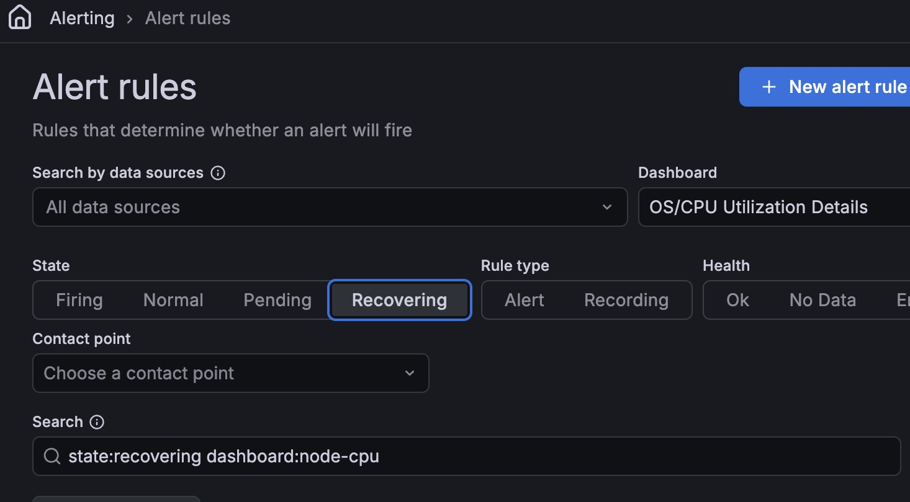
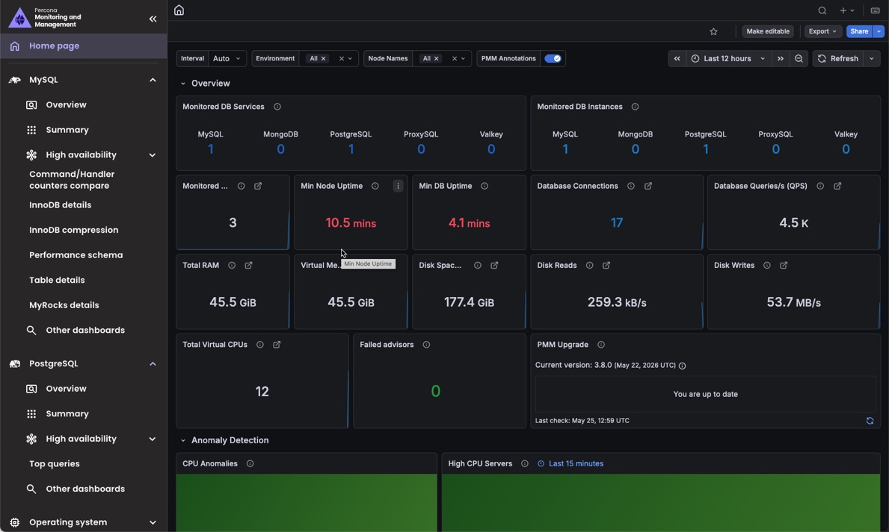
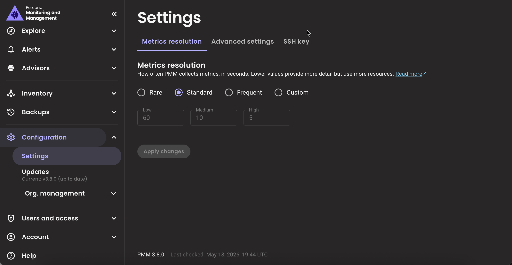
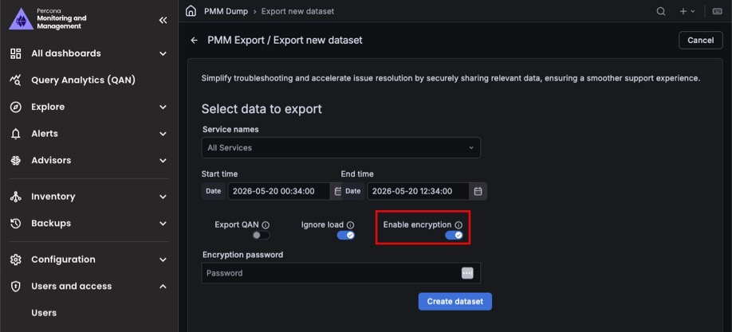

# Percona Monitoring and Management 3.8.0

**Release date**: May 28, 2026

Percona Monitoring and Management (PMM) is an open source database monitoring, management, and observability solution for MySQL, PostgreSQL, MongoDB, Valkey and Redis. PMM empowers you to:

- monitor the health and performance of your database systems
- identify patterns and trends in database behavior
- diagnose and resolve issues faster with actionable insights
- manage databases across on-premises, cloud, and hybrid environments

## 📋 Release summary

PMM 3.8.0 upgrades Grafana to 12.4, adds encrypted PMM dumps for safer data sharing, and continues the native PMM UI migration with an updated **Settings** page and refreshed visual identity.

This release also improves dashboard readability and navigation across PostgreSQL, MongoDB, and Home dashboards, includes security hardening updates, and announces the deprecation of UI-based upgrades ahead of their removal in PMM 3.9.0.

## ✨ Release highlights

### Grafana 12.4 upgrade

PMM 3.8.0 ships with [Grafana 12.4](https://grafana.com/docs/grafana/latest/whatsnew/whats-new-in-v12-0/), so you will notice several day-to-day monitoring improvements right away:

**Less alert noise**: Alert rules now support a [**Recovering** state](https://grafana.com/docs/grafana/latest/whatsnew/whats-new-in-v12-0/#recovering-state-for-alert-rules). This helps avoid repeated fire/resolved notifications when a metric keeps moving above and below an alert threshold, so you get fewer noisy alerts for spiky metrics like replication lag, query response time, and connection counts.

#### Faster monitoring dashboards
Tables in PMM dashboards load, sort, and filter significantly faster. This affects dashboards across PMM including **Nodes Overview**, **MySQL User Details**, **PostgreSQL Instances Overview**, MongoDB, and HA/PXC **Cluster Summary**.

#### Explore metrics now opt-in
Starting with Grafana 12, **Explore metrics** is disabled by default. If you used it to visually browse metrics without writing queries, you need to re-enable it. Go to the **Home** page, type **plugins** in the search bar and install **Grafana Metrics Drilldown**. Once enabled, **Explore metrics** will reappear under **Explore** in the left sidebar. 

#### Recording rules
Alert rules now support [recording rules](https://grafana.com/docs/grafana/latest/alerting/alerting-rules/create-recording-rules/). A recording rule runs a query on a schedule and saves the result as a new metric, so your alerts reference the pre-computed result instead of re-running the full query on every evaluation cycle. 

This is especially useful when the same query powers multiple alert rules, for example, average CPU load across all nodes or replication lag across a cluster.

#### More changes in Grafana 12
Grafana 12 removes Angular support. If you have custom dashboards using legacy **Graph (old)** or **Table (old)** panels, they are automatically converted to **Time series** and **Table** panels the first time you open them after upgrading to PMM 3.8.0. 

For the full list of changes, see the [Grafana 12 release notes](https://grafana.com/docs/grafana/latest/whatsnew/whats-new-in-v12-0/).

### Refreshed look and feel

PMM 3.8.0 introduces a new visual identity reflecting Percona's [commitment to open, lock-in-free data infrastructure](https://www.percona.com/press/percona-declares-the-way-is-open-in-bold-rebrand-as-the-industrys-loudest-challenger/). You'll notice an updated logo, new technology icons for MySQL, PostgreSQL, MongoDB, and Valkey, and a cleaner color palette across the UI.

### Settings page now in native PMM UI

Building on the [native PMM navigation introduced in 3.6.0](3.6.0.md#new-native-pmm-navigation-and-revamped-user-interface), the **Settings** page now also runs in native PMM UI. You get the same settings with **Metrics resolution**, **Advanced settings**, and **SSH key** tabs in a page that loads faster and looks consistent with the rest of the new interface. 
Access it at **Configuration > Settings** in the left sidebar.

### Encrypted PMM data dumps

PMM Dump now supports encrypting dump files with AES-256-CTR, so you can safely share them externally without exposing your monitoring data. When creating a dataset under **Help > PMM Dump > Create dataset**, toggle on **Enable encryption** and enter a password. Encrypted files are saved with an `.enc` suffix. 

For details on encrypting and decrypting dumps, see [Encrypted dumps](../troubleshoot/pmm_dump.md#encrypted-dumps).
## 🔒 Security updates

### Zero vulnerabilities in PMM's own components

PMM's own components have zero known vulnerabilities in this release. Any remaining risks are in third-party dependencies where upstream fixes are not yet available, and none are exploitable in a typical PMM deployment.

### Remaining third-party security risks

Some vulnerabilities in third-party dependencies could not be fixed in this release because upstream fixes were not yet available. Percona assessed each one and considers the risk low for typical PMM deployments. Affected dependencies will be updated as fixes become available.

#### Docker engine vulnerabilities ([CVE-2026-34040](https://nvd.nist.gov/vuln/detail/CVE-2026-34040), [CVE-2026-41567](https://nvd.nist.gov/vuln/detail/CVE-2026-41567), [CVE-2026-42306](https://nvd.nist.gov/vuln/detail/CVE-2026-42306))

##### Affected component
The `moby/moby` Docker engine library, included in the Grafana and Nomad components shipped with PMM Server.

##### Why this is hard to exploit in PMM
These vulnerabilities target Docker engine features such as authorization bypass and container file operations. PMM does not run a Docker daemon, so none of these attack paths can be triggered. The `moby/moby` library is present in Grafana and Nomad only because those components require it at build time, not because PMM uses Docker. PMM itself does not use Docker.

##### Mitigating factors

The following factors further reduce the risk:

- PMM Server does not run a Docker daemon or expose any Docker API endpoints.
- The Docker-related code in Grafana and Nomad is never executed during PMM operation.
- No part of PMM interacts with Docker containers at runtime.

##### Risk decision
We're accepting this risk for PMM 3.8.0 and will fix it through upstream dependency updates in a future release.

#### Grafana Tempo denial of service and information disclosure ([CVE-2026-21728](https://nvd.nist.gov/vuln/detail/CVE-2026-21728), [CVE-2026-28377](https://nvd.nist.gov/vuln/detail/CVE-2026-28377))

##### Affected component
The Grafana component shipped with PMM Server, which includes Grafana Tempo as a built-in optional datasource plugin.

##### Why this is hard to exploit in PMM
Tempo is a distributed tracing backend. PMM does not use Tempo, does not set up a Tempo datasource, and does not handle tracing data. Because of this, neither the denial of service attack nor the information disclosure can be triggered in a PMM deployment.

##### Mitigating factors

The following factors reduce the risk:

- PMM does not configure or enable the Tempo datasource.
- No PMM component sends or receives tracing data through Tempo.
- The vulnerable endpoints are not exposed in PMM's Grafana configuration.

##### Risk decision
We're accepting this risk for PMM 3.8.0 and will fix it through upstream dependency updates in a future release.

#### Apache Thrift integer overflow ([CVE-2026-41602](https://nvd.nist.gov/vuln/detail/CVE-2026-41602))

##### Affected component
The Grafana component shipped with PMM Server, which includes Apache Thrift as an unused build dependency.

##### Why this is hard to exploit in PMM
This CVE allows an attacker to send a value too large for Thrift to handle correctly, potentially causing a crash or unexpected behavior. PMM does not use Thrift for any communication between its components, so this vulnerability cannot be triggered in PMM.    
##### Mitigating factors

The following factors further reduce the risk:

- PMM uses gRPC and HTTP/JSON for all inter-component communication, not Thrift.
- The Thrift library is an unused dependency in the Grafana component.

##### Risk decision
We're accepting this risk for PMM 3.8.0 and will fix it through upstream dependency updates in a future release.

#### Prometheus library vulnerabilities ([CVE-2026-42151](https://nvd.nist.gov/vuln/detail/CVE-2026-42151), [CVE-2026-42154](https://nvd.nist.gov/vuln/detail/CVE-2026-42154))

##### Affected component
The Grafana component shipped with PMM Server, which uses the Prometheus client library for PromQL query evaluation.

##### Why this is hard to exploit in PMM
PMM uses VictoriaMetrics as its metrics backend, not Prometheus. The Prometheus library is present in Grafana for PromQL query evaluation. To exploit these vulnerabilities, an attacker would need to already be authenticated in PMM and craft specific PromQL queries through Grafana.

##### Mitigating factors

The following factors reduce the risk:

- PMM authentication is required to access Grafana and execute queries.
- PMM does not expose Grafana query endpoints to unauthenticated users.
- The Prometheus library is used for query parsing only, not as a metrics storage backend.

##### Risk decision
We're accepting this risk for PMM 3.8.0. The potential impact is limited to authenticated users executing crafted queries. We'll update the dependency in a future release.

#### OpenTelemetry vulnerabilities ([CVE-2026-29181](https://nvd.nist.gov/vuln/detail/CVE-2026-29181), [CVE-2026-24051](https://nvd.nist.gov/vuln/detail/CVE-2026-24051), [CVE-2026-39883](https://nvd.nist.gov/vuln/detail/CVE-2026-39883))

##### Affected component
The Grafana component shipped with PMM Server, which includes the OpenTelemetry SDK for telemetry collection.

##### Why this is hard to exploit in PMM
Two of these CVEs involve PATH hijacking, where an attacker places a malicious program in a location that gets run instead of the intended one. This requires already having shell access to the PMM Server container and the ability to modify the `$PATH` variable. The third is a denial of service that requires sending crafted OpenTelemetry baggage headers to Grafana from an untrusted source.

##### Mitigating factors

The following factors further reduce the risk:

- PMM Server containers run as non-root with restricted filesystem access.
- PMM does not accept inbound OpenTelemetry traffic.
- PATH hijacking is only possible if an attacker has already taken control of the container, which is not a realistic attack scenario for most PMM deployments.

##### Risk decision
We're accepting this risk for PMM 3.8.0 and will fix it through upstream dependency updates in a future release.

#### Go standard library vulnerabilities in Grafana ClickHouse Datasource plugin

The following CVEs are present in the Grafana ClickHouse Datasource plugin because Grafana Labs has not yet released an updated build:
[CVE-2026-25679](https://nvd.nist.gov/vuln/detail/CVE-2026-25679), [CVE-2026-27137](https://nvd.nist.gov/vuln/detail/CVE-2026-27137), [CVE-2026-32280](https://nvd.nist.gov/vuln/detail/CVE-2026-32280), [CVE-2026-32281](https://nvd.nist.gov/vuln/detail/CVE-2026-32281), [CVE-2026-32283](https://nvd.nist.gov/vuln/detail/CVE-2026-32283), [CVE-2026-33810](https://nvd.nist.gov/vuln/detail/CVE-2026-33810), [CVE-2026-33811](https://nvd.nist.gov/vuln/detail/CVE-2026-33811), [CVE-2026-33814](https://nvd.nist.gov/vuln/detail/CVE-2026-33814), [CVE-2026-39820](https://nvd.nist.gov/vuln/detail/CVE-2026-39820), [CVE-2026-39836](https://nvd.nist.gov/vuln/detail/CVE-2026-39836) and [CVE-2026-42499](https://nvd.nist.gov/vuln/detail/CVE-2026-42499).
##### Affected component
The Grafana ClickHouse Datasource plugin, which ships with PMM Server and is maintained by Grafana Labs. Its current build uses Go 1.26.0, and fixing these vulnerabilities requires Grafana Labs to release a new version built with Go 1.26.1 or later.

##### Why this is hard to exploit in PMM
These vulnerabilities are in the Go standard library and affect areas such as certificate validation, TLS key handling, URL and email parsing, and HTTP/2 frame processing.

The ClickHouse datasource only communicates with PMM's internal ClickHouse instance over a trusted network. The TLS and certificate issues require a connection to a malicious endpoint, which does not happen in PMM's setup. The parsing issues require untrusted input, which cannot reach the datasource without PMM authentication. 

One CVE is Windows-specific and does not apply to PMM Server, which runs on Linux.

##### Mitigating factors

The following factors further reduce the risk:

- The ClickHouse datasource connects only to PMM's internal ClickHouse instance.
- PMM Server runs on Linux, so the Windows-specific CVE does not apply.
- Untrusted input cannot reach the ClickHouse datasource without PMM authentication.

##### Risk decision
We're accepting this risk for PMM 3.8.0. A fix depends on Grafana Labs rebuilding the plugin with Go 1.26.3 or later. We'll update it once that  release is available.

#### How to reduce risk

To lower your exposure in the meantime:

- Restrict network access to PMM Server to trusted networks and users.
- Minimize the number of PMM administrators and enforce strong authentication.
- Apply resource limits to PMM Server containers where supported.
- Keep Nomad disabled unless you specifically need it.

## ⚠️ Deprecations
 
- [PMM-14968](https://perconadev.atlassian.net/browse/PMM-14968): UI-based upgrades are now officially deprecated and will be removed in PMM 3.9.0 (July 2026). PMM now shows a warning on all pages where UI-based upgrades were available. Switch to [Docker](../pmm-upgrade/upgrade_docker.md), [Podman](../pmm-upgrade/upgrade_podman.md), or [Helm](../pmm-upgrade/upgrade_helm.md) before then. 

    If you use Watchtower, remove it before switching to avoid conflicts.

## 📈 Improvements

- [PMM-15005](https://perconadev.atlassian.net/browse/PMM-15005): Removed a shared self-signed TLS certificate from the PMM Server image that CVE scanners flagged as a security risk. The certificate was only used to suppress ClickHouse startup log noise, which is now handled without needing a certificate at all.

- [PMM-12392](https://perconadev.atlassian.net/browse/PMM-12392): Improved how PMM collects processlist data on MySQL 5.7.39+ and 8.0.22+ by switching from Information Schema to Performance Schema. On busy MySQL instances, this reduces the chance of query blocking and deadlocks, lowering the overall monitoring impact on your MySQL server workload.

- [PMM-14937](https://perconadev.atlassian.net/browse/PMM-14937): When adding a MySQL, PostgreSQL, MongoDB, ProxySQL, Valkey, Amazon RDS, or Azure service, you can now set a **Connection timeout** to control how long PMM waits before giving up on a connection attempt. This is useful when monitoring remote or high-latency databases where the default timeout is too short.

- [PMM-14068](https://perconadev.atlassian.net/browse/PMM-14068): The [PostgreSQL Instance Summary](../reference/dashboards/dashboard-postgresql-instance-summary.md) dashboard is now easier to read: summary panels use a consistent color scheme to help you spot issues faster, the layout fits laptop screens without cutting off panels, and tables no longer require horizontal scrolling to see all data.

- [PMM-14930](https://perconadev.atlassian.net/browse/PMM-14930): The **Settings** page now runs in native PMM UI for a faster and more consistent experience. See [Settings page now in native PMM UI](#settings-page-now-in-native-pmm-ui).

- [PMM-14994](https://perconadev.atlassian.net/browse/PMM-14994), [PMM-14995](https://perconadev.atlassian.net/browse/PMM-14995), [PMM-14996](https://perconadev.atlassian.net/browse/PMM-14996), [PMM-14998](https://perconadev.atlassian.net/browse/PMM-14998): Updated PMM's logo, technology icons, and color palette as part of Percona's brand refresh.

- [PMM-14977](https://perconadev.atlassian.net/browse/PMM-14977): Home dashboard tooltips across all panels now explain what each value means and what to investigate when something looks off. Technology counts in **Monitored DB Services** are now clickable, taking you directly to the MySQL, MongoDB, PostgreSQL, ProxySQL, or Valkey overview dashboard. Also fixed an inverted query in **Read Latency Anomaly** where positive bars incorrectly indicated latency had decreased.

- [PMM-15012](https://perconadev.atlassian.net/browse/PMM-15012): Improved the **Fragmentation Analysis** panel tooltip on the **MongoDB Cluster Summary** and **MongoDB ReplSet Summary** dashboards to explain what the metric measures and what action to take.

- [PMM-14337](https://perconadev.atlassian.net/browse/PMM-14337): If you upgraded to MongoDB 8.0.13 and noticed missing query planner metrics, this is now fixed. PMM's MongoDB exporter can now collect the new histogram metrics MongoDB 8.0.13 introduced, which were previously causing scraping errors and silently dropping data.

- [PMM-14441](https://perconadev.atlassian.net/browse/PMM-14441): PMM Dump now encrypts exports by default. When importing a dump, PMM expects an encrypted file. If your dump was created without encryption, add the `--no-encryption` flag when importing.

- [PMM-14718](https://perconadev.atlassian.net/browse/PMM-14718): Improved documentation for accessing PMM Server logs. This includes the `line-count` parameter for the log download endpoint, log file locations inside the container, and how to monitor component logs live. See [Accessing logs](../troubleshoot/config_issues.md#log-file-locations).

- [PMM-9966](https://perconadev.atlassian.net/browse/PMM-9966): Clarified in [Connect MySQL databases to PMM](../install-pmm/install-pmm-client/connect-database/mysql/mysql.md) and [Connect PostgreSQL databases to PMM](../install-pmm/install-pmm-client/connect-database/postgresql.md) that using `pmm-admin` is the recommended way to add a service, as it also collects node-level metrics. The UI method is now listed as a secondary option for cases where PMM Client cannot be installed on the database host.       

## ✅ Fixed issues

- [PMM-14906](https://perconadev.atlassian.net/browse/PMM-14906): PMM was flooding your PostgreSQL logs with thousands of entries per hour since 3.6.0 if you had query logging enabled (`log_min_duration_statement = 0`), filling them with monitoring noise that buried your actual database activity. This is now fixed.

- [PMM-14748](https://perconadev.atlassian.net/browse/PMM-14748): Fixed dashboards resetting the time zone to the browser default when navigating between pages. All dashboards now respect the time zone set in your profile preferences.

- [PMM-14791](https://perconadev.atlassian.net/browse/PMM-14791): Resolved an issue in the **Disk Space** graphs on the **Disk Details** dashboard where values were hard to read, legend labels were missing, and charts were displayed incorrectly.

- [PMM-14512](https://perconadev.atlassian.net/browse/PMM-14512): Fixed the **BP Data Dirty** panel on the **MySQL InnoDB Details** dashboard showing no data after upgrading from PMM 2. The panel now correctly displays the ratio of dirty to data pages in the InnoDB buffer pool.

- [PMM-14851](https://perconadev.atlassian.net/browse/PMM-14851): Fixed a bug in the PMM Helm chart that could cause `ClusterRole` to fail when deploying PMM on Kubernetes. The chart now deploys without RBAC errors.

- [PMM-14934](https://perconadev.atlassian.net/browse/PMM-14934): Fixed an issue where the `GF_SECURITY_ADMIN_USER` and `GF_SECURITY_ADMIN_PASSWORD` environment variables were ignored when starting PMM Server with a named Docker volume (`-v pmm-data:/srv`). You can now use these variables to set the admin username and password at first start, regardless of how the data volume is mounted.

    As part of this fix, **the first start after upgrading takes about 20–30 seconds longer** than usual while PMM initializes. Subsequent starts are unaffected. PMM HA deployments are unimpacted.

- [PMM-15042](https://perconadev.atlassian.net/browse/PMM-15042): Fixed a broken **Read more** link on the **Settings > SSH key** tab.

- [PMM-11487](https://perconadev.atlassian.net/browse/PMM-11487): Fixed the **Explain** tab in Query Analytics getting stuck in an endless loading state when no query example is available. PMM also no longer shows repeated error notifications in the upper right corner in this situation.

## 🚀 Ready to upgrade to PMM 3.8.0?

Choose an upgrade path based on your current setup:

- [New installation](../quickstart/quickstart.md)
- [Upgrading from PMM 3](../pmm-upgrade/index.md)
- [Upgrading from PMM 2](../pmm-upgrade/migrating_from_pmm_2.md)
