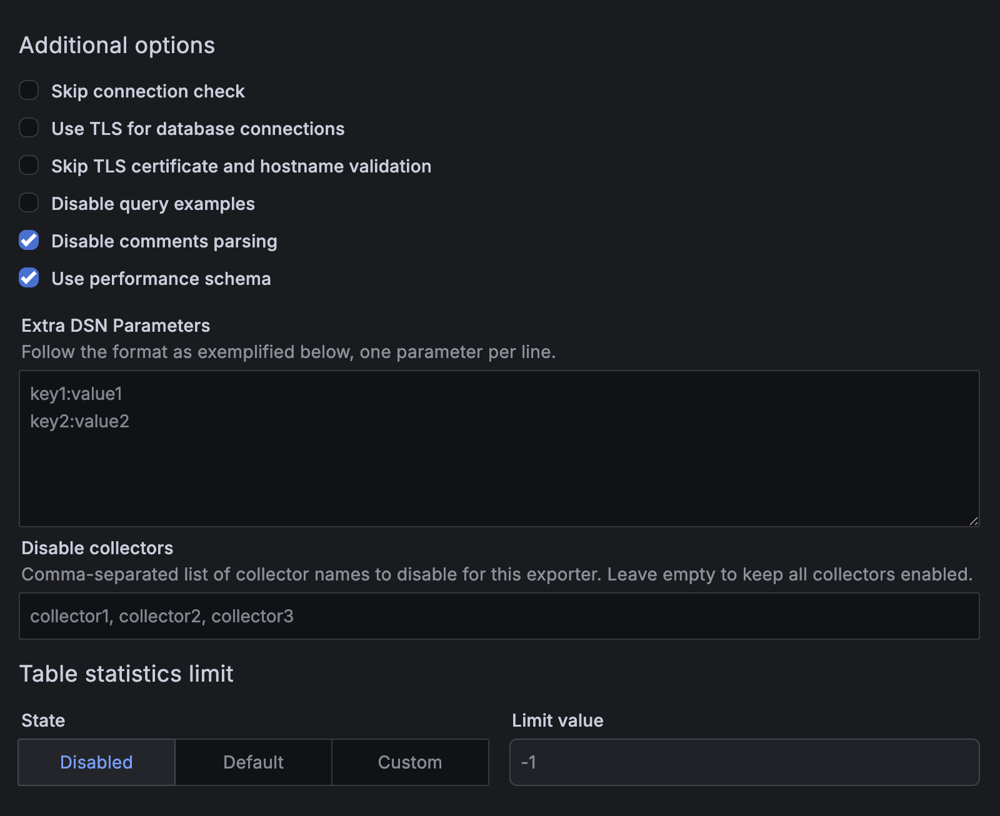

# Percona Monitoring and Management 3.9.0

**Release date**: July 2026

Percona Monitoring and Management (PMM) is an open source database monitoring, management, and observability solution for MySQL, PostgreSQL, MongoDB, Valkey and Redis. PMM empowers you to:

- monitor the health and performance of your database systems
- identify patterns and trends in database behavior
- diagnose and resolve issues faster with actionable insights
- manage databases across on-premises, cloud, and hybrid environments

## 📋 Release summary

!!! note
    Release summary to be added.

## ✨ Release highlights

### Data size monitoring for MongoDB replica sets and sharded clusters

You can now monitor data growth across your MongoDB deployments and plan capacity from the [MongoDB ReplSet Summary](https://docs.percona.com/percona-monitoring-and-management/3/reference/dashboards/dashboard-mongodb-replset-summary.html) and [MongoDB Sharded Cluster Summary](https://docs.percona.com/percona-monitoring-and-management/3/reference/dashboards/dashboard-mongodb-cluster-summary.html) dashboards. Each dashboard includes two new panels for tracking data size:

- **Total data size**: shows how much space your data and indexes currently occupy, so you know exactly where your deployment stands at any point in time.
- **Data size over time**: plots the same total over the selected time range, so you can spot growth trends and make informed capacity decisions.

These panels require the `dbstats` collector on the MongoDB exporter. To enable it, pass [`--enable-all-collectors`](https://docs.percona.com/percona-monitoring-and-management/3/use/commands/pmm-admin/add.html) when adding your MongoDB service with `pmm-admin add mongodb`, or update an existing service with `pmm-admin inventory change agent`.

### Disable individual metric collectors per service

PMM 3.9.0 adds a **Disable collectors** field to the Add service form for MySQL, PostgreSQL, MongoDB, and ProxySQL. You can now exclude specific metric collectors from collection without removing the service or modifying the exporter configuration.

This is useful when certain collectors generate metrics you don't need, add overhead on resource-constrained hosts, or cause issues with specific database configurations.

To use it, go to **PMM Configuration > Add Service**, expand **Additional options**, and enter a comma-separated list of collector names in the **Disable collectors** field.

For the full list of available collectors per database type, see [Connect MySQL databases to PMM](../install-pmm/install-pmm-client/connect-database/mysql/mysql.md) and [Connect PostgreSQL databases to PMM](../install-pmm/install-pmm-client/connect-database/postgresql.md).

## 📈 Improvements

- [PMM-14931](https://perconadev.atlassian.net/browse/PMM-14931): PMM Server now includes a built-in ClickHouse configuration optimized for low-memory hosts. While we recommend at least 16 GB RAM for stable operation, if you must run PMM Server on a host with less than 16 GB, set `PMM_CLICKHOUSE_CONFIG=low-memory` when starting PMM Server to reduce ClickHouse memory consumption and prevent *"memory limit exceeded"* errors in Query Analytics (QAN). The setting persists across container restarts and upgrades.

If you currently use the `switch-config.sh` script to manage this setting, switch to the environment variable instead. The script is deprecated and will be removed in a future release.

For hardware requirements, see [Hardware and system requirements](../install-pmm/plan-pmm-installation/hardware_and_system.md).
([PMM-13306](https://perconadev.atlassian.net/browse/PMM-13306)): Added data size panels to the **MongoDB ReplSet Summary** and **MongoDB Sharded Cluster Summary** dashboards to help you monitor data growth and plan capacity. 

## ✅ Fixed issues

- [PMM-14661](https://perconadev.atlassian.net/browse/PMM-14661): Fixed PMM Server becoming unresponsive when viewing stored metrics in Query Analytics for data older than one week.

- [PMM-15029](https://perconadev.atlassian.net/browse/PMM-15029): Fixed an issue where the auto-generated PostgreSQL password for PMM HA could contain `:` or `@` characters, producing an invalid URI and preventing Grafana from connecting to the database on startup.

- [PMM-15030](https://perconadev.atlassian.net/browse/PMM-15030): Fixed missing metrics data when PMM is configured to use an external VictoriaMetrics instance via `PMM_VM_URL`. If you saw gaps in your dashboards or vmagent errors after setting this variable, this fix resolves the issue.