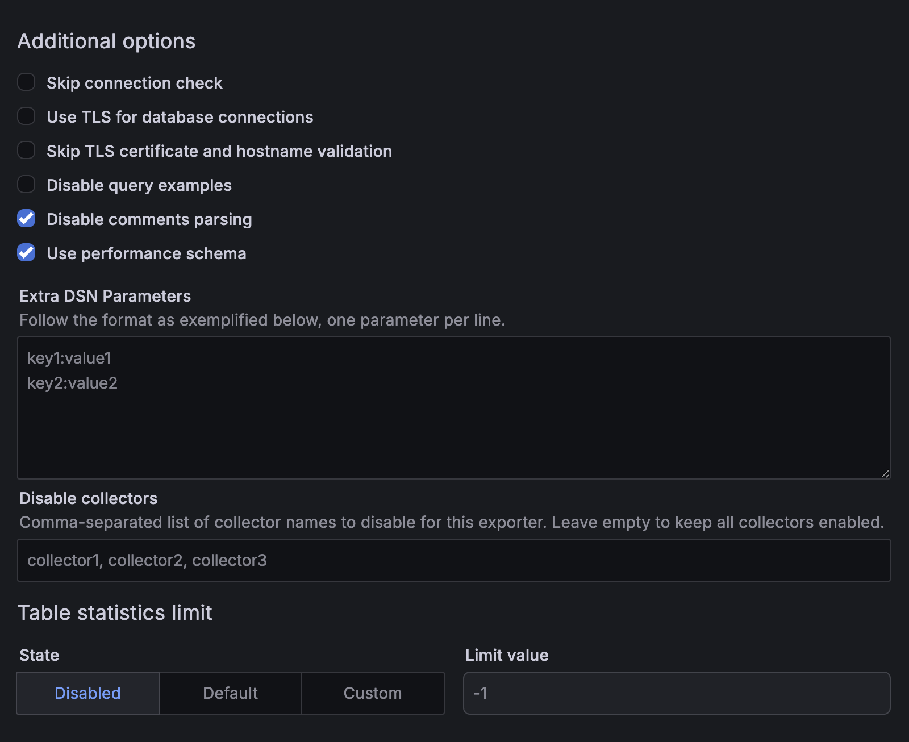

# Percona Monitoring and Management 3.9.0

**Release date**: July 2026

Percona Monitoring and Management (PMM) is an open source database monitoring, management, and observability solution for MySQL, PostgreSQL, MongoDB, Valkey and Redis. PMM empowers you to:

- monitor the health and performance of your database systems
- identify patterns and trends in database behavior
- diagnose and resolve issues faster with actionable insights
- manage databases across on-premises, cloud, and hybrid environments

## 📋 Release summary

!!! note
    Release summary to be added.

### Removed provisioned PostgreSQL datasource ([PMM-15139](https://perconadev.atlassian.net/browse/PMM-15139))

PMM no longer includes a preconfigured PostgreSQL datasource for internal dashboard panels. 

This change prevents authenticated users, including users with the **Viewer** role, from using the datasource to run arbitrary or destructive SQL queries against PMM's internal database. 

Since the Grafana PostgreSQL datasource does not support a read-only mode, removing the provisioned datasource is the most effective way to eliminate this risk. If you need it, you can [add it manually](../admin/security/index.md#postgresql-datasource).

This update completes the security hardening that began in [PMM 3.7.0](3.7.0.md), which addressed a remote code execution vulnerability in the same datasource ([CVE-2026-25212](https://nvd.nist.gov/vuln/detail/CVE-2026-25212)).

### Data size monitoring for MongoDB replica sets and sharded clusters

You can now monitor data growth across your MongoDB deployments and plan capacity from the [MongoDB ReplSet Summary](https://docs.percona.com/percona-monitoring-and-management/3/reference/dashboards/dashboard-mongodb-replset-summary.html) and [MongoDB Sharded Cluster Summary](https://docs.percona.com/percona-monitoring-and-management/3/reference/dashboards/dashboard-mongodb-cluster-summary.html) dashboards. Each dashboard includes two new panels for tracking data size:

- **Total data size**: shows how much space your data and indexes currently occupy, so you know exactly where your deployment stands at any point in time.
- **Data size over time**: plots the same total over the selected time range, so you can spot growth trends and make informed capacity decisions.

These panels require the `dbstats` collector on the MongoDB exporter. To enable it, pass [`--enable-all-collectors`](https://docs.percona.com/percona-monitoring-and-management/3/use/commands/pmm-admin/add.html) when adding your MongoDB service with `pmm-admin add mongodb`, or update an existing service with `pmm-admin inventory change agent`.

### Disable individual metric collectors per service

PMM 3.9.0 adds a **Disable collectors** field to the Add service form for MySQL, PostgreSQL, MongoDB, and ProxySQL. You can now exclude specific metric collectors from collection without removing the service or modifying the exporter configuration.

This is useful when certain collectors generate metrics you don't need, add overhead on resource-constrained hosts, or cause issues with specific database configurations.

To use it, go to **PMM Configuration > Add Service**, expand **Additional options**, and enter a comma-separated list of collector names in the **Disable collectors** field.

For the full list of available collectors per database type, see [Connect MySQL databases to PMM](../install-pmm/install-pmm-client/connect-database/mysql/mysql.md) and [Connect PostgreSQL databases to PMM](../install-pmm/install-pmm-client/connect-database/postgresql.md).

### Export Real-Time Analytics (RTA) data to CSV 

You can now export a snapshot of the RTA view to a CSV file. Because QAN only records queries after they complete, this gives you a way to preserve data from long-running queries that are killed before finishing.

See [Export RTA data](../use/qan/QAN-realtime-analytics.md#export-data) for step-by-step instructions and a reference of all exported fields.

### Added support and deprecations

#### Ubuntu 26.04 LTS support for PMM Client

PMM Client now supports Ubuntu 26.04 LTS (Resolute) on AMD64 and ARM64. You can use PMM to monitor Percona Distribution for PostgreSQL 18, Percona Server for MySQL 8.4, and Valkey 9.1 databases running on Ubuntu 26.04.

To get started, [install PMM Client](../install-pmm/install-pmm-client/package_manager.md) on your Ubuntu 26.04 system.

## 🔒 Security updates

### Go standard library symlink traversal vulnerability (CVE-2026-39822)

HIGH severity. Fixed in `percona-telemetry-agent` by rebuilding on Go 1.26.5.

### Remaining third-party security risks

PMM, like all complex software, includes third-party components. Some vulnerabilities in those components couldn't be fixed in this release because upstream fixes weren't yet available. 

Percona assessed each one and considers the risk low for typical PMM deployments. Affected dependencies will be updated as fixes become available.

### Go standard library symlink traversal in ClickHouse Datasource (CVE-2026-39822)

#### Affected component
Grafana ClickHouse Datasource plugin (third-party, not Percona-maintained). Built on Go 1.26.4. Fix requires Go 1.26.5 or later.

#### Why this is hard to exploit in PMM
The plugin only connects to PMM's internal ClickHouse instance over localhost. No external or user-controlled file paths reach this code path in a standard PMM deployment.

#### Mitigating factors
•  The plugin only connects to ClickHouse within the PMM Server container.
•  No untrusted external input reaches the ClickHouse datasource without prior PMM authentication.

#### Risk decision
We're accepting this risk for PMM 3.9.0. The fix requires an upstream rebuild of the plugin with Go 1.26.5 or later. We'll address it once it is available.

### Grafana Tempo denial of service and information disclosure (CVE-2026-21728 & CVE-2026-28377)

#### Affected component
Grafana binary (Tempo is compiled into Grafana as an optional datasource plugin).

#### Why this is hard to exploit in PMM
Tempo is a distributed tracing backend. PMM does not use Tempo, does not configure a Tempo datasource, and does not accept tracing data. 

The denial of service via large queries and S3 encryption key disclosure via status endpoint cannot be triggered in a PMM deployment.

#### Mitigating factors
•  PMM does not configure or enable the Tempo datasource.
•  No PMM component sends or receives tracing data through Tempo.
•  The vulnerable endpoints are not exposed in PMM's Grafana configuration.

#### Risk decision
We're accepting this risk for PMM 3.9.0 and will fix it in a future dependency update.

### Prometheus library vulnerability (CVE-2026-42151)

#### Affected component
Affects the Prometheus library embedded in Grafana for PromQL evaluation.

#### Why this is hard to exploit in PMM
PMM uses VictoriaMetrics as its metrics backend, not Prometheus, so the affected code paths are rarely reached. This CVE discloses Azure OAuth client secrets via the Prometheus config API. 

PMM does not use Azure OAuth for Prometheus.

#### Mitigating factors
•  PMM authentication is required to access Grafana and execute queries.
•  PMM does not use Azure OAuth or Prometheus remote read.

#### Risk decision
We're accepting this risk for PMM 3.9.0 and will fix it in a future dependency update.

#### How to reduce risk

To lower your exposure in the meantime:

•  Restrict network access to PMM Server to trusted networks and users.
•  Keep the number of PMM admins small and enforce strong authentication.
•  Apply resource limits to PMM Server containers where possible.

## 📈 Improvements

- [PMM-14502](https://perconadev.atlassian.net/browse/PMM-14502): Added a dedicated topic for [running custom queries on MySQL](../install-pmm/install-pmm-client/connect-database/mysql/custom_queries.md) so that you can collect any MySQL metric accessible via SQL and monitor it in PMM alongside your standard dashboards.
- [PMM-13306](https://perconadev.atlassian.net/browse/PMM-13306): Added data size panels to the **MongoDB ReplSet Summary** and **MongoDB Sharded Cluster Summary** dashboards to help you monitor data growth and plan capacity.
- [PMM-14609](https://perconadev.atlassian.net/browse/PMM-14609): Added CSV export option under **Query Analytics > Real-Time** to preserve a snapshot of in-progress query data that would otherwise be lost when queries are killed before completing.

- [PMM-15082](https://perconadev.atlassian.net/browse/PMM-15082): Added PMM Client support for Ubuntu 26.04 LTS (Resolute) on AMD64 and ARM64, including monitoring support for Percona Distribution for PostgreSQL 18, Percona Server for MySQL 8.4, and Valkey 9.1.

## ✅ Fixed issues

- [PMM-14717](https://perconadev.atlassian.net/browse/PMM-14717): Fixed a documentation issue in the [MongoDB connection guide](../install-pmm/install-pmm-client/connect-database/mongodb.md) where the `createRole` command was missing the `find` permission on `system.profile`, causing QAN to show no query data. If you set up MongoDB monitoring using the previous instructions, re-run the role creation with the corrected command.
- [PMM-15130](https://perconadev.atlassian.net/browse/PMM-15130): Fixed an issue where `pmm-admin inventory change agent` would save new database credentials without validating them. When rotating credentials from the command line. PMM now returns an error if the credentials are invalid. To bypass validation when the database is temporarily unreachable, use [--skip-connection-check](../use/commands/pmm-admin/inventorymd#connection-and-authentication).
- [PMM-14921](https://perconadev.atlassian.net/browse/PMM-14921): Clarified the [Configure Nomad](../reference/nomad.md) instructions. Nomad won't start if `PMM_ENABLE_NOMAD=1` is set without `PMM_PUBLIC_ADDRESS`. The prerequisites section and Docker examples now show that both variables are required together.

- [PMM-14661](https://perconadev.atlassian.net/browse/PMM-14661): Fixed PMM Server becoming unresponsive when viewing stored metrics in Query Analytics for data older than one week.

- [PMM-15029](https://perconadev.atlassian.net/browse/PMM-15029): Fixed an issue where the auto-generated PostgreSQL password for PMM HA could contain `:` or `@` characters, producing an invalid URI and preventing Grafana from connecting to the database on startup.

- [PMM-15030](https://perconadev.atlassian.net/browse/PMM-15030): Fixed missing metrics data when PMM is configured to use an external VictoriaMetrics instance via `PMM_VM_URL`. If you saw gaps in your dashboards or `vmagent` errors after setting this variable, this fix resolves the issue.

- [PMM-14576](https://perconadev.atlassian.net/browse/PMM-14576): Fixed an issue where MongoDB backups completed successfully in PBM but PMM failed to detect this, reporting them as failed in the **Status** column on the **Backup > All Backups** page.

- [PMM-14193](https://perconadev.atlassian.net/browse/PMM-14193), [PMM-15145](https://perconadev.atlassian.net/browse/PMM-15145): Fixed the built-in **MySQL Down**, **MongoDB Down**, **PostgreSQL Down**, **Valkey Down**, and **Redis Down** alerts incorrectly resolving to **Normal** when both the database and its PMM agent go down at the same time. The alert now correctly stays in **Firing** state even when metrics stop being reported.

- [PMM-14519](https://perconadev.atlassian.net/browse/PMM-14519): Fixed MySQL services failing to connect when `--tls-skip-verify` was set on a database server with TLS disabled. PMM incorrectly treated `tls_skip_verify: true` as a request to use TLS, causing the agent to report `TLS requested but server does not support TLS` and stop collecting metrics.

- [PMM-13910](https://perconadev.atlassian.net/browse/PMM-13910): Fixed **Top Hottest Collections by Read** and **Top Hottest Collections by Write** panels in the **MongoDB Sharded Cluster Summary** and **MongoDB Collections Overview** dashboards showing only internal collections instead of the busiest user collections.

- [PMM-14193](https://perconadev.atlassian.net/browse/PMM-14193), [PMM-15145](https://perconadev.atlassian.net/browse/PMM-15145): Fixed built-in **MySQL Down**, **MongoDB Down**, **PostgreSQL Down**, **Valkey Down**, and **Redis Down** alerts incorrectly resolving to **Normal** when the monitored database service and its PMM agent went down at the same time. These alerts now correctly remain in **Firing** state when database availability metrics stop being reported.

- [PMM-15118](https://perconadev.atlassian.net/browse/PMM-15118): Fixed the **Oplog GB/Hour** panels in the **MongoDB ReplSet Summary**, **MongoDB Sharded Cluster Summary**, and **MongoDB Oplog Details** dashboards showing an empty metric name in the legend instead of the service name.   

- [PMM-15114](https://perconadev.atlassian.net/browse/PMM-15114): Fixed the **Scanned and Moved Objects** panel in the **MongoDB Instance Summary** dashboard showing blank labels in the legend instead of the operation type (`scanned`, `scanned_objects`).  

## 🚀 Ready to upgrade to PMM 3.9.0?

- [New installation](../quickstart/quickstart.md)
- [Upgrading from PMM 3](../pmm-upgrade/index.md)
- [Upgrading from PMM 2](../pmm-upgrade/migrating_from_pmm_2.md)
                
