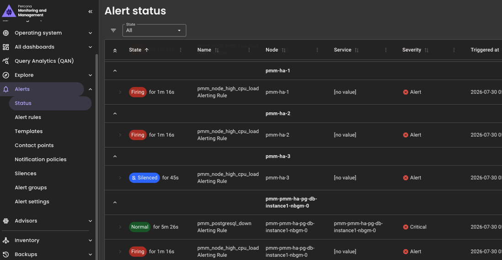
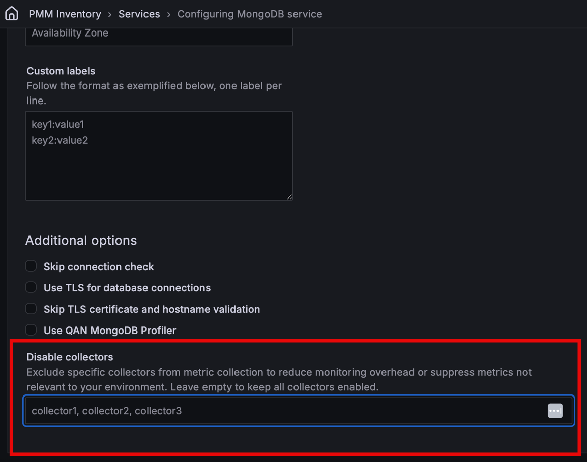
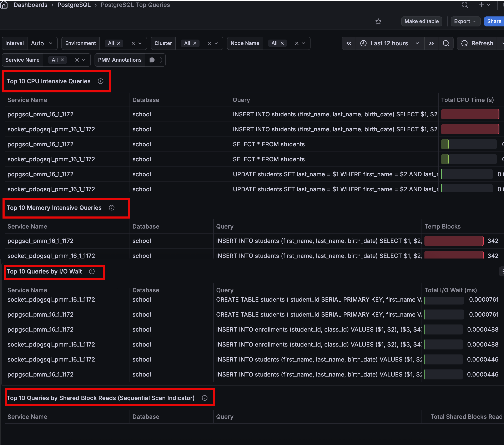
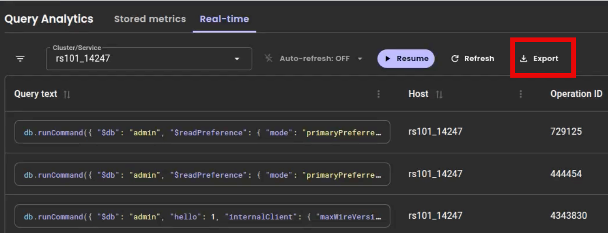

# Percona Monitoring and Management 3.9.0

**Release date**: 30 July 2026

Percona Monitoring and Management (PMM) is an open source database monitoring, management, and observability solution for MySQL, PostgreSQL, MongoDB, Valkey and Redis. PMM empowers you to:

- monitor the health and performance of your database systems
- identify patterns and trends in database behavior
- diagnose and resolve issues faster with actionable insights
- manage databases across on-premises, cloud, and hybrid environments

## 📋 Release summary

PMM 3.9.0 introduces the **Alert Status** page for viewing all active alerts by node or service, new MongoDB and PostgreSQL dashboard panels, and CSV export for Real-Time Analytics data. 

This release also removes the provisioned PostgreSQL datasource as a security measure, adds Ubuntu 26.04 LTS support for PMM Client, and includes a large number of dashboard, UI, and stability fixes.

### Alert Status page: view alerts by node or service

You can now check the full alert picture for any node or service in a single view. Go to **Alerts > Status** and filter by service or group by node to see every associated alert rule and its current state, so you don't have to piece together the situation from alerts grouped by alert name.

All built-in PMM alert templates work with this view automatically. If you use custom templates, you can add `node_name` and `service_name` labels to make your alerts appear here too. To learn how, see [View alert status by node or service](../alert/alert_status.md).

### Removed provisioned PostgreSQL datasource

PMM no longer includes a preconfigured PostgreSQL datasource for internal dashboard panels. 

This change prevents authenticated users, including users with the **Viewer** role, from using the datasource to run arbitrary or destructive SQL queries against PMM's internal database. 

Since the Grafana PostgreSQL datasource does not support a read-only mode, removing the provisioned datasource is the most effective way to eliminate this risk. If you need it, you can [add it manually](../admin/security/index.md#postgresql-datasource).

This update completes the security hardening that began in [PMM 3.7.0](3.7.0.md), which addressed a remote code execution vulnerability in the same datasource ([CVE-2026-25212](https://nvd.nist.gov/vuln/detail/CVE-2026-25212)).

### Data size monitoring for MongoDB replica sets and sharded clusters

You can now monitor data growth across your MongoDB deployments and plan capacity from the [MongoDB ReplSet Summary](https://docs.percona.com/percona-monitoring-and-management/3/reference/dashboards/dashboard-mongodb-replset-summary.html) and [MongoDB Sharded Cluster Summary](https://docs.percona.com/percona-monitoring-and-management/3/reference/dashboards/dashboard-mongodb-cluster-summary.html) dashboards. Each dashboard includes two new panels for tracking data size:

- **Total data size**: shows how much space your data and indexes currently occupy, so you know exactly where your deployment stands at any point in time.
- **Data size over time**: plots the same total over the selected time range, so you can spot growth trends and make informed capacity decisions.

These panels require the `dbstats` collector on the MongoDB exporter. To enable it, pass [`--enable-all-collectors`](https://docs.percona.com/percona-monitoring-and-management/3/use/commands/pmm-admin/add.html) when adding your MongoDB service with `pmm-admin add mongodb`, or update an existing service with `pmm-admin inventory change agent`.

### Disable individual metric collectors per service

PMM 3.9.0 adds a **Disable collectors** field to the Add service form for MySQL, PostgreSQL, MongoDB, and ProxySQL. You can now exclude specific metric collectors from collection without removing the service or modifying the exporter configuration.

This is useful when certain collectors generate metrics you don't need, add overhead on resource-constrained hosts, or cause issues with specific database configurations.

To use it, go to **PMM Configuration > Add Service**, expand **Additional options**, and enter a comma-separated list of collector names in the **Disable collectors** field.

For the full list of available collectors per database type, see [Connect MySQL databases to PMM](../install-pmm/install-pmm-client/connect-database/mysql/mysql.md) and [Connect PostgreSQL databases to PMM](../install-pmm/install-pmm-client/connect-database/postgresql.md).

### New panels on the PostgreSQL Top Queries dashboard

The [PostgreSQL Top Queries](../reference/dashboards/dashboard-postgresql-topqueries.md) dashboard now includes four new panels to help you pinpoint queries that are putting the most pressure on your database:

- **Top 10 CPU Intensive Queries**: identifies queries consuming the most CPU time (requires pg_stat_monitor)
- **Top 10 Memory Intensive Queries**: surfaces queries that write the most to temporary blocks (requires pg_stat_statements or `pg_stat_monitor`)
- **Top 10 Queries by I/O Wait**: highlights queries spending the most time waiting on disk reads and writes (requires track_io_timing = on)
- **Top 10 Queries by Shared Block Reads**: ranks queries by average shared blocks read per execution, serving as a sequential scan indicator (requires `pg_stat_statements` or `pg_stat_monitor`)

### Export Real-Time Analytics (RTA) data to CSV 

You can now export a snapshot of the RTA view to a CSV file. Because QAN only records queries after they complete, this gives you a way to preserve data from long-running queries that are killed before finishing.

See [Export RTA data](../use/qan/QAN-realtime-analytics.md#export-data) for step-by-step instructions and a reference of all exported fields.

### PMM Server UI upgrade removed

As announced in [PMM 3.7.0](../release-notes/3.7.0.md#added-support-and-deprecations), PMM 3.9.0 removes the **Upgrade Now** button, UI-based upgrade functionality, and Watchtower from the PMM Server image.

PMM still notifies you when a new version is available, but you must now upgrade from the command line using one of the supported methods:

* **[Docker upgrade](../pmm-upgrade/upgrade_docker.md) (recommended)**: pull the latest image and restart the container
* [Podman upgrade](../pmm-upgrade/upgrade_podman.md): same container workflow with rootless execution
* [Helm upgrade](../pmm-upgrade/upgrade_helm.md): Kubernetes-native upgrade path

If you were running Watchtower as a standalone container, you can remove it.

### Added support and deprecations

#### Ubuntu 26.04 LTS support for PMM Client

PMM Client now supports Ubuntu 26.04 LTS (Resolute) on AMD64 and ARM64. You can use PMM to monitor Percona Distribution for PostgreSQL 18, Percona Server for MySQL 8.4, and Valkey 9.1 databases running on Ubuntu 26.04.

To get started, [install PMM Client](../install-pmm/install-pmm-client/package_manager.md) on your Ubuntu 26.04 system.

## 🔒 Security updates

### Go standard library symlink traversal vulnerability ([CVE-2026-39822](https://nvd.nist.gov/vuln/detail/CVE-2026-39822))

HIGH severity. Fixed in `percona-telemetry-agent` by rebuilding on Go 1.26.5.

### Remaining third-party security risks

PMM, like all complex software, includes third-party components. Some vulnerabilities in those components couldn't be fixed in this release because upstream fixes weren't yet available.

Percona assessed each one and considers the risk low for typical PMM deployments. Affected dependencies will be updated as fixes become available.

### gRPC-Go xDS RBAC and HTTP/2 vulnerabilities ([GHSA-hrxh-6v49-42gf](https://github.com/advisories/GHSA-hrxh-6v49-42gf))

#### Affected components
Nomad, VictoriaMetrics, Grafana, and Grafana ClickHouse Datasource plugin (third-party dependencies using `google.golang.org/grpc` < 1.82.1).

#### Why this is hard to exploit in PMM
This advisory covers three issues: an xDS RBAC authorization bypass, an HTTP/2 Rapid Reset DoS bypass, and an xDS RBAC panic via crafted policies. The two xDS issues require an xDS management server delivering RBAC policies — PMM does not use xDS service discovery or RBAC policies in any component, so those attack paths do not exist in a PMM deployment. The HTTP/2 DoS requires direct access to a gRPC server port. In PMM, all affected components communicate internally within the PMM Server container and are not directly exposed to external networks. Nomad is disabled by default.

#### Mitigating factors
- PMM does not configure xDS or xDS-based RBAC policies in any component.
- All affected components are bound to internal interfaces within the PMM Server container.
- Nomad is disabled by default and requires explicit enablement.

#### Risk decision
This will be addressed in a future dependency update once upstream ships the fix.

### kin-openapi authentication bypass ([GHSA-r277-6w6q-xmqw](https://github.com/advisories/GHSA-r277-6w6q-xmqw))

#### Affected component
Grafana binary (third-party dependency, `github.com/getkin/kin-openapi` v0.133.0, fixed in v0.144.0).

#### Why this is hard to exploit in PMM
This vulnerability causes `ValidationHandler.Load()` to fail open, defaulting to `NoopAuthenticationFunc` when loading OpenAPI specs, potentially bypassing authentication. In PMM, Grafana's OpenAPI validation is not exposed as a standalone endpoint. Access to Grafana requires PMM authentication, and the vulnerable code path is not reachable without prior authenticated access.

#### Mitigating factors
- PMM authentication is required before any Grafana endpoint is reachable.
- The vulnerable `ValidationHandler.Load()` path is not invoked by PMM's Grafana configuration.

#### Risk decision
This will be addressed in a future dependency update once upstream ships the fix.

### Go standard library symlink traversal in ClickHouse Datasource ([CVE-2026-39822](https://nvd.nist.gov/vuln/detail/CVE-2026-39822))

#### Affected component
Grafana ClickHouse Datasource plugin (third-party, not Percona-maintained). Built on Go 1.26.4. Fix requires Go 1.26.5 or later.

#### Why this is hard to exploit in PMM
The plugin only connects to PMM's internal ClickHouse instance over localhost. No external or user-controlled file paths reach this code path in a standard PMM deployment.

#### Mitigating factors
- The plugin only connects to ClickHouse within the PMM Server container.
- No untrusted external input reaches the ClickHouse datasource without prior PMM authentication.

#### Risk decision
This will be addressed once the upstream plugin is rebuilt with Go 1.26.5 or later.

### Grafana Tempo denial of service and information disclosure ([CVE-2026-21728](https://nvd.nist.gov/vuln/detail/CVE-2026-21728) & [CVE-2026-28377](https://nvd.nist.gov/vuln/detail/CVE-2026-28377))

#### Affected component
Grafana binary (Tempo is compiled into Grafana as an optional datasource plugin).

#### Why this is hard to exploit in PMM
Tempo is a distributed tracing backend. PMM does not use Tempo, does not configure a Tempo datasource, and does not accept tracing data. The denial of service via large queries and S3 encryption key disclosure via status endpoint cannot be triggered in a PMM deployment.

#### Mitigating factors
- PMM does not configure or enable the Tempo datasource.
- No PMM component sends or receives tracing data through Tempo.
- The vulnerable endpoints are not exposed in PMM's Grafana configuration.

#### Risk decision
This will be addressed in a future dependency update once upstream ships the fix.

### Prometheus library information disclosure ([CVE-2026-42151](https://nvd.nist.gov/vuln/detail/CVE-2026-42151))

#### Affected component
Affects the Prometheus library embedded in Grafana for PromQL evaluation.

#### Why this is hard to exploit in PMM
PMM uses VictoriaMetrics as its metrics backend, not Prometheus. This CVE discloses Azure OAuth client secrets via the Prometheus config API. PMM does not use Azure OAuth for Prometheus, and the config API is not exposed externally.

#### Mitigating factors
- PMM authentication is required to access Grafana and execute queries.
- PMM does not use Azure OAuth or Prometheus remote read.

#### Risk decision
This will be addressed in a future dependency update once upstream ships the fix.

### How to reduce risk

To lower your exposure in the meantime:

- restrict network access to PMM Server to trusted networks and users.
- keep the number of PMM admins small and enforce strong authentication.
- apply resource limits to PMM Server containers where possible.

## 📈 Improvements

- [PMM-14931](https://perconadev.atlassian.net/browse/PMM-14931): You can now set ClickHouse memory configuration using the `PMM_CLICKHOUSE_CONFIG` environment variable instead of running `switch-config.sh` manually after each restart or upgrade. The `switch-config.sh` script is now deprecated.
- [PMM-14502](https://perconadev.atlassian.net/browse/PMM-14502): Added a dedicated topic for [running custom queries on MySQL](../install-pmm/install-pmm-client/connect-database/mysql/custom_queries.md) so that you can collect any MySQL metric accessible via SQL and monitor it in PMM alongside your standard dashboards.
- ([PMM-13306](https://perconadev.atlassian.net/browse/PMM-13306)): Added data size panels to the **MongoDB ReplSet Summary** and **MongoDB Sharded Cluster Summary** dashboards to help you monitor data growth and plan capacity.
- ([PMM-14609](https://perconadev.atlassian.net/browse/PMM-14609)): Added CSV export option under **Query Analytics > Real-Time** to preserve a snapshot of in-progress query data that would otherwise be lost when queries are killed before completing.
- [PMM-14969](https://perconadev.atlassian.net/browse/PMM-14969): Removed the UI-based upgrade functionality and Watchtower from PMM Server. PMM Server can now only be upgraded via CLI or container runtime.
- [PMM-14610](https://perconadev.atlassian.net/browse/PMM-14610): You can now export a snapshot of the Real-Time Analytics (RTA) view to a CSV file. This lets you preserve data from long-running queries that are killed before finishing, which QAN would otherwise not record.
- [PMM-13306](https://perconadev.atlassian.net/browse/PMM-13306): Added data size panels to the **MongoDB ReplSet Summary** and **MongoDB Sharded Cluster Summary** dashboards to help you monitor data growth and plan capacity.
- [PMM-14618](https://perconadev.atlassian.net/browse/PMM-14618): Added a **Disable collectors** field to the **Add service** page for MySQL, PostgreSQL, MongoDB, ProxySQL, and RDS instances. You can now exclude specific metric collectors without modifying the exporter configuration.
- [PMM-15082](https://perconadev.atlassian.net/browse/PMM-15082): Added PMM Client support for Ubuntu 26.04 LTS (Resolute) on AMD64 and ARM64, including monitoring support for Percona Distribution for PostgreSQL 18, Percona Server for MySQL 8.4, and Valkey 9.1.
- [PMM-15139](https://perconadev.atlassian.net/browse/PMM-15139): PMM no longer ships a provisioned PostgreSQL datasource. Viewer-role users could use it to run arbitrary SQL against PMM's internal database. You can still [add the datasource manually](../admin/security/index.md#postgresql-datasource) if you need it.
- [PMM-14076](https://perconadev.atlassian.net/browse/PMM-14076): Added four new panels to the **PostgreSQL Top Queries** dashboard to help you identify queries causing high CPU, memory, and I/O pressure: **Top 10 CPU Intensive Queries** (requires `pg_stat_monitor`), **Top 10 Memory Intensive Queries**, **Top 10 Queries by I/O Wait** (requires `track_io_timing = on`), and **Top 10 Queries by Shared Block Reads** as a sequential scan indicator.
- [PMM-14969](https://perconadev.atlassian.net/browse/PMM-14969): Removed the UI-based upgrade functionality and Watchtower from PMM Server. PMM Server must be upgraded via CLI or container runtime.
- [PMM-15246](https://perconadev.atlassian.net/browse/PMM-15246): MongoDB diagnostic data histograms are now disabled due to performance issues. The next PMM release will add a new flag to force-enable them.
- [PMM-15095](https://perconadev.atlassian.net/browse/PMM-15095): The `get-pmm.sh` migration script now detects your installed PMM version. If you are running PMM 2, it downloads PMM 3.8.1, the last version that supports migration from PMM 2, after which you can upgrade to the latest PMM 3 using the standard upgrade method. If you are already on PMM 3, it downloads the latest release.
- [PMM-14895](https://perconadev.atlassian.net/browse/PMM-14895): Updated the **Replication Roles** section of the [Valkey/Redis Cluster Details](../reference/dashboards/dashboard-valkey-redis-cluster-details.md) dashboard to use `Primary` and `Replica` instead of the outdated `master`/`slave` terminology.
- [PMM-14896](https://perconadev.atlassian.net/browse/PMM-14896): Valkey dashboards now show PMM event annotations on graphs, consistent with MySQL, MongoDB, and PostgreSQL dashboards.
- [PMM-14911](https://perconadev.atlassian.net/browse/PMM-14911): Added the **Alert Status** page (**Alerts > Status**) for viewing all active alerts grouped by node or service. Use it to see every alert affecting a specific node or service in a single view, filter by state, and silence alerts directly from the table.

## ✅ Fixed issues

- [PMM-14717](https://perconadev.atlassian.net/browse/PMM-14717): Fixed a documentation issue in the [MongoDB connection guide](../install-pmm/install-pmm-client/connect-database/mongodb.md) where the `createRole` command was missing the `find` permission on `system.profile`, causing QAN to show no query data. If you set up MongoDB monitoring using the previous instructions, re-run the role creation with the corrected command.
- [PMM-15130](https://perconadev.atlassian.net/browse/PMM-15130): Fixed an issue where `pmm-admin inventory change agent` would save new database credentials without validating them. When rotating credentials from the command line, PMM now returns an error if the credentials are invalid. To bypass validation when the database is temporarily unreachable, use [--skip-connection-check](../use/commands/pmm-admin/inventory.md#connection-and-authentication).
- [PMM-14921](https://perconadev.atlassian.net/browse/PMM-14921): Clarified the [Configure Nomad](../reference/nomad.md) instructions. Nomad won't start if `PMM_ENABLE_NOMAD=1` is set without `PMM_PUBLIC_ADDRESS`. The prerequisites section and Docker examples now show that both variables are required together.

- [PMM-14661](https://perconadev.atlassian.net/browse/PMM-14661): Fixed PMM Server becoming unresponsive when viewing stored metrics in Query Analytics for data older than one week.

- [PMM-15029](https://perconadev.atlassian.net/browse/PMM-15029): Fixed an issue where the auto-generated PostgreSQL password for PMM HA could contain `:` or `@` characters, producing an invalid URI and preventing Grafana from connecting to the database on startup.

- [PMM-15030](https://perconadev.atlassian.net/browse/PMM-15030): Fixed missing metrics data when PMM is configured to use an external VictoriaMetrics instance via `PMM_VM_URL`. If you saw gaps in your dashboards or `vmagent` errors after setting this variable, this fix resolves the issue.

- [PMM-14576](https://perconadev.atlassian.net/browse/PMM-14576): Fixed an issue where MongoDB backups completed successfully in PBM but PMM failed to detect this, reporting them as failed in the **Status** column on the **Backup > All Backups** page.

- [PMM-14193](https://perconadev.atlassian.net/browse/PMM-14193), [PMM-15145](https://perconadev.atlassian.net/browse/PMM-15145): Fixed the built-in **MySQL Down**, **MongoDB Down**, **PostgreSQL Down**, **Valkey Down**, and **Redis Down** alerts incorrectly resolving to **Normal** when both the database and its PMM agent go down at the same time. The alert now correctly stays in **Firing** state even when metrics stop being reported.

- [PMM-14519](https://perconadev.atlassian.net/browse/PMM-14519): Fixed MySQL services failing to connect when `--tls-skip-verify` was set on a database server with TLS disabled. PMM incorrectly treated `tls_skip_verify: true` as a request to use TLS, causing the agent to report `TLS requested but server does not support TLS` and stop collecting metrics.

- [PMM-13910](https://perconadev.atlassian.net/browse/PMM-13910): Fixed **Top Hottest Collections by Read** and **Top Hottest Collections by Write** panels in the **MongoDB Sharded Cluster Summary** and **MongoDB Collections Overview** dashboards showing only internal collections instead of the busiest user collections.

- [PMM-15118](https://perconadev.atlassian.net/browse/PMM-15118): Fixed the **Oplog GB/Hour** panels in the **MongoDB ReplSet Summary**, **MongoDB Sharded Cluster Summary**, and **MongoDB Oplog Details** dashboards showing an empty metric name in the legend instead of the service name.   

- [PMM-13911](https://perconadev.atlassian.net/browse/PMM-13911): Fixed misleading API documentation that caused `data_retention` requests to fail. If you set data retention via the [Change Settings](https://percona-pmm.readme.io/reference/changesettings) API, use seconds only (for example, `2592000s` for 30 days). Hours and minutes are not accepted. 

- [PMM-15242](https://perconadev.atlassian.net/browse/PMM-15242): When you ran `pmm-admin` on the command line without any arguments, PMM Client crashed or showed nothing instead of displaying the available commands. This is now fixed.

- [PMM-15200](https://perconadev.atlassian.net/browse/PMM-15200): PMM Client now automatically reconnects to PMM Server after a silent network drop, instead of staying disconnected until you restart it manually.

- [PMM-15174](https://perconadev.atlassian.net/browse/PMM-15174): Fixed broken **Read more** links in advisor check results that were returning 404 errors.

- [PMM-15165](https://perconadev.atlassian.net/browse/PMM-15165): The **Cluster** filter in the [MongoDB Router Summary](../reference/dashboards/dashboard-mongodb-router-summary.md) dashboard was empty and returned no data. This is now fixed.
- [PMM-15164](https://perconadev.atlassian.net/browse/PMM-15164): The left navigation menu was missing when accessing PMM in anonymous mode. This is now fixed.

- [PMM-15163](https://perconadev.atlassian.net/browse/PMM-15163): MongoDB physical backup restores failed because PMM could not restart the mongod service after restoring, leaving the replica set down. This is now fixed.

- [PMM-15155](https://perconadev.atlassian.net/browse/PMM-15155): After upgrading PMM, the [PostgreSQL Overview](../reference/dashboards/dashboard-postgresql-instances-overview.md) dashboard showed a `Datasource not found` error. This is now fixed.

- [PMM-15138](https://perconadev.atlassian.net/browse/PMM-15138): Users with the **Viewer** role could create, update, and delete alert templates, which is an Admin-only operation. This is now fixed.
- [PMM-15076](https://perconadev.atlassian.net/browse/PMM-15076): The [NUMA Details dashboard](../reference/dashboards/dashboard-numa-details.md) only showed NUMA Node 0 instead of all available nodes. You can now select individual nodes or view all nodes at once from the **Node** dropdown.
- [PMM-15074](https://perconadev.atlassian.net/browse/PMM-15074): Custom labels added to an existing service through the PMM UI were not saved or visible in metrics, Explore, or QAN. This is now fixed.
- [PMM-15050](https://perconadev.atlassian.net/browse/PMM-15050): Large PMM deployments could not be restarted or upgraded without causing a flood of buffered data from reconnecting agents, overwhelming the server. You can now control the ingestion rate by setting the `VM_maxIngestionRate` environment variable on PMM Server.
- [PMM-14971](https://perconadev.atlassian.net/browse/PMM-14971): After changing a user's password, the left navigation menu remained visible on the login page instead of PMM redirecting you to a full-screen login page. This is now fixed.

- [PMM-14947](https://perconadev.atlassian.net/browse/PMM-14947): Typing in the search filter on the **Nodes** or **Services** page caused records to flicker and the page to become unresponsive. This is now fixed.
- [PMM-14885](https://perconadev.atlassian.net/browse/PMM-14885): The **Replicas** panel in the [PostgreSQL Replication Overview](../reference/dashboards/dashboard-postgresql-replication.md) dashboard showed no data due to an invalid query. This is now fixed.
- [PMM-14734](https://perconadev.atlassian.net/browse/PMM-14734): The HA status badge in the navigation always showed **Healthy** even when nodes were down. It now correctly shows **Healthy**, **Degraded**, **Critical**, or **Unreachable** based on the actual number of available nodes.
- [PMM-14360](https://perconadev.atlassian.net/browse/PMM-14360): The **Disk I/O Total** panel on MongoDB dashboards showed only disk writes instead of the sum of disk reads, disk writes, swap in, and swap out. This is now fixed.
- [PMM-15079](https://perconadev.atlassian.net/browse/PMM-15079): Graph panel legends were no longer sorted by average by default after a Grafana plugin update. This is now fixed.

## Known issues

### UI upgrade progress bar stops when upgrading to PMM 3.9.0 ([PMM-15266](https://perconadev.atlassian.net/browse/PMM-15266))

When upgrading to PMM 3.9.0 through the UI, the progress bar stops at `Restarting PMM...` and displays an `Endpoint not found: /v1/server/updates:getStatus` error. This is because PMM 3.9.0 no longer supports UI-based upgrades.

The upgrade completes successfully in the background. Refresh the page to confirm it finished. For future upgrades, see [PMM Server UI upgrade removed](#pmm-server-ui-upgrade-removed).

## 🚀 Ready to upgrade to PMM 3.9.0?

- [New installation](../quickstart/quickstart.md)
- [Upgrading from PMM 3](../pmm-upgrade/index.md)
- [Upgrading from PMM 2](../pmm-upgrade/migrating_from_pmm_2.md)
                
