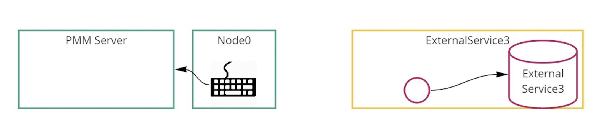
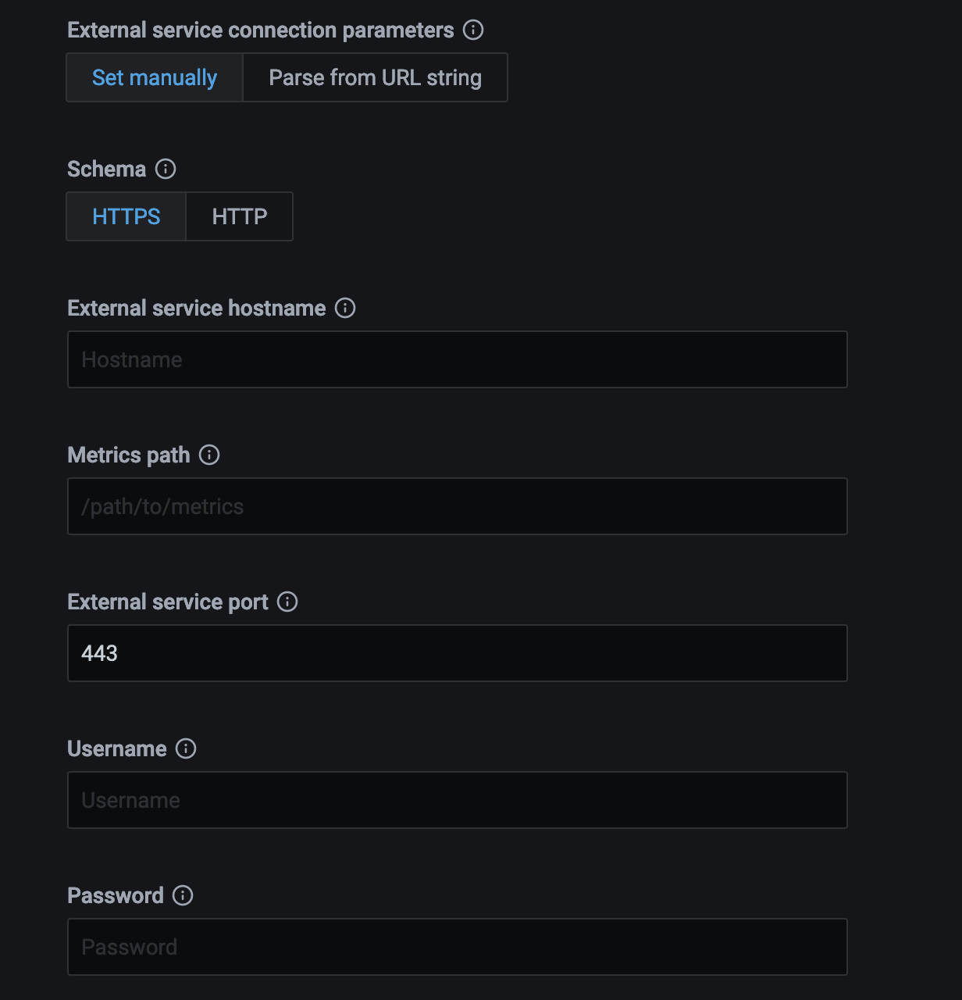

# External Services

## Adding general external services

You can collect metrics from an external (custom) exporter on a node when:

- there is already a PMM Agent instance running and,
- this node has been [configured](index.md) using the `pmm-admin config` command.

### Usage

```sh
pmm-admin add external --service-name=<service-name> --listen-port=<listen-port> --metrics-path=<metrics-path> --scheme=<scheme>
```

```sh
pmm-admin add external-serverless --external-name=<external-service-name> --host=<hostname> --listen-port=<listen-port> --metrics-path=<metrics-path> --scheme=<scheme>
```

## Getting data from external exporters

There two ways to get metrics from other exporters:

- `external` will collect metrics from the exporter that is run on the same host as PMM Client's connection to it by a port. (See more details with `pmm-admin add external --help`.)

- `external-serverless` is useful for collecting metrics from cloud services. You need a host and port number to add it to PMM Server. (See more details with `pmm-admin add external-serverless --help`.)

Here are the differences between `external` and `external-serverless` types.

Connection schema of external exporter:


Connection schema of external serverless exporter:



## How I can add something not supported by PMM

PMM can collect any metrics in [Open metrics](https://openmetrics.io) or [Prometheus exposition](https://prometheus.io/docs/instrumenting/exposition_formats/) format. You must specify the host and port of these metrics using the `pmm-admin add external` or `pmm-admin add external-serverless` commands.

From this point, PMM will collect and store available metrics.

To browse and visualize collected metrics as a first step, we can look at the Advanced Data Exploration dashboard and select informative services and metrics.


Another way is to create a [new Grafana Dashboard to PMM as needed](https://grafana.com/docs/grafana/latest/best-practices/best-practices-for-creating-dashboards/).

One more way is to search for an already created dashboard at <https://grafana.com/grafana/dashboards> for the added exporter and import it into PMM.

### Third-party exporters

You can find more exporters on the [official Prometheus page](https://prometheus.io/docs/instrumenting/exporters/).

### Custom exporter

You can write a custom external exporter or extend your application to expose metrics in Prometheus format.

For more details see <https://prometheus.io/docs/instrumenting/writing_exporters/>.

### Examples

```sh
root@mysql1:~# pmm-admin add external --group=processes  --listen-port=9256
External Service added.
Service ID  : /service_id/6485f4fd-745b-4dfb-8b72-328e300f8b50
Service name: mysql1-processes
Group       : processes
```

- Add an exporter running on local port 9256 to the group called `processes`.
- Use the group and host names to automatically generate a service name.
- Use the default scheme and metrics path.

## Adding an External service via UI

1. In the PMM web interface, go to {{icon.configuration}} *Configuration* → {{icon.inventory}} *PMM Inventory* → {{icon.addinstance}} *Add Instance*.

2. Select *External Service -- Add a remote instance*.

    

3. Fill the form and set the external service endpoint.

    The endpoint can be set manually:

    

    or by parsing required data from a URL string, in which case you only need to pass a valid URL.

    
