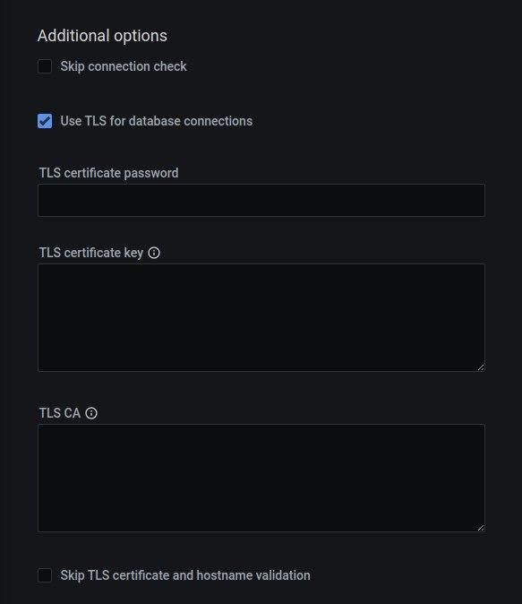

# MongoDB

How to set up PMM to monitor a [MongoDB] or [Percona Server for MongoDB] database instance.

## Before you start

Check that:

- [PMM Server is installed](../server/index.md) and running with a known IP address or hostname accessible from the client node.
- [PMM Client is installed](index.md) and the [node is registered with PMM Server](index.md#register).
- You have superuser (root) access on the client host.
- You have `adminUserAnyDatabase` or superuser role privilege to any database servers that you want to monitor.
- Your MongoDB server is version 4.0 or higher.

## Create PMM account and set permissions

We recommend using a dedicated account to connect PMM Client to the monitored database instance.

Run the example codes below in a `mongo` session to:

-  create custom roles with the privileges required for creating/restoring backups and working with Query Analytics (QAN)
-  create/update a database user with these roles above, plus the built-in  `clusterMonitor` role
  
!!! caution alert alert-warning "Important"
    Values for username (`user`) and password (`pwd`) are examples. Replace them before using these code snippets.

### Create roles with privileges for backups and QAN

```{.javascript data-prompt=">"}
 db.getSiblingDB("admin").createRole({
   "role": "explainRole",
   "privileges": [
      {
         "resource": {
            "db": "",
            "collection": ""
         },
         "actions": [
            "collStats",
            "dbHash",
            "dbStats",
            "find",
            "listIndexes",
            "listCollections"
         ]
     },
     {
         "resource": {
            "db": "",
            "collection": "system.profile"
         },
         "actions": [
            "dbStats",
            "collStats",
            "indexStats"
         ]
      },
      {
         "resource": {
            "db": "",
            "collection": "system.version"
         },
         "actions": [
            "find"
         ]
      }
   ],
   "roles": []
})
```    

```{.javascript data-prompt=">"}
 db.getSiblingDB("admin").createRole({
    "role": "pbmAnyAction",
    "privileges": [{
        "resource": {
            "anyResource": true
        },
        "actions": [
            "anyAction"
        ]
    }],
    "roles": []
});
```

### Create/update user and assign created roles

```{.javascript data-prompt=">"}
 db.getSiblingDB("admin").createUser({
    user: "pmm",
    pwd: "pmm",
    roles: [
        { role: "explainRole", db: "admin" },
        { role: "clusterMonitor", db: "admin" },
        { role: "read", db: "local" },
        { "db" : "admin", "role" : "readWrite", "collection": "" },
        { "db" : "admin", "role" : "backup" },
        { "db" : "admin", "role" : "clusterMonitor" },
        { "db" : "admin", "role" : "restore" },
        { "db" : "admin", "role" : "pbmAnyAction" }
    ]
})
```

### Permissions for advanced metrics

To fetch advanced metrics like usage statistics for collection and indexes, use the following to provide additional privileges to an existing PMM user:

```{.javascript data-prompt=">"}
db.getSiblingDB("admin").updateRole(
  "explainRole",
  {
    privileges: [
      {
        resource: { db: "", collection: "" },
        actions: ["collStats", "dbStats", "indexStats"]
      }
    ]
  }
)
```

## Profiling

To use PMM Query Analytics, you must turn on MongoDB's [profiling feature].

You can set profiling:

- permanently, by editing the MongoDB configuration file  and restarting the database instance (recommended);
- when starting MongoDB, by passing arguments to `mongod` on the command line;
- until the next database instance restart, by running a command in a `mongo` session.

!!! note alert alert-primary "Important"
    
    Profiling is disabled by default as it may negatively impact the performance of the database server under specific circumstances, such as when busy servers are profiling all queries.

### Set profiling in the configuration file

1. Edit the configuration file (usually `/etc/mongod.conf`).

2. Create or add this to the `operationProfiling` section. ([Read more][MONGODB_CONFIG_OP_PROF].)

    ```yml
    operationProfiling:
      mode: all
      slowOpThresholdMs: 200
      rateLimit: 100 # (Only available with Percona Server for MongoDB.)
    ```

    !!! caution alert alert-warning "Important"
        This is a [YAML] file. Indentation matters.

3. Restart the `mongod` service. (Example for `systemd`.)

    ```sh
    systemctl restart mongod
    ```

### Set profiling on the command Line

```sh
mongod --dbpath=DATABASEDIR --profile 2 --slowms 200 --rateLimit 100
```

- `--dbpath`: The path to database files (usually `/var/lib/mongo`).
- `--profile`: The MongoDB profiling level. A value of `2` tells the server to collect profiling data for *all* operations. To lower the load on the server, use a value of `1` to only record slow operations.
- `--slowms`: An operation is classified as *slow* if it runs for longer than this number of milliseconds.
- `--rateLimit`: (Only available with Percona Server for MongoDB.) The sample rate of profiled queries. A value of `100` means sample every 100th fast query. ([Read more][PSMDB_RATELIMIT].)

    !!! caution alert alert-warning "Caution"
        Smaller values improve accuracy but can adversly affect the performance of your server.

### Set profiling in a `mongo` session

In a `mongo` session, the profiler should be enabled **per** database.
For example, to enable the profiler in the `testdb`, run this:

```{.javascript data-prompt=">"}
> use testdb
> db.setProfilingLevel(2, {slowms: 0})
```

!!! note alert alert-primary "Important"

    If you have already [added the MongoDB service to PMM](#add-service), make sure to restart the PMM agent service after adjusting the profiling level.

## Add service

After configuring your database server, you can add a MongoDB service either through the user interface or via the command line.

!!! caution alert alert-warning "Important"

    To monitor MongoDB sharded clusters, PMM requires access to all cluster components. Make sure to add all the config servers, shards, and at least 1-2 mongos routers. Otherwise, PMM will not be able to correctly collect metrics and populate dashboards. 
    Keep in mind that adding all mongos routers may cause excessive overhead.

### On the command line

Use `pmm-admin` to add the database server as a service using one of these example commands.

When successful, PMM Client will print `MongoDB Service added` with the service's ID and name. Use the `--environment` and `-custom-labels` options to set tags for the service to help identify them.

!!! hint alert alert-success "Tips"
    - When adding nodes to a sharded cluster, ensure to add each node separately using the `--cluster mycluster` option. This allows the [MongoDB Cluster Summary](../../details/dashboards/dashboard-mongodb-cluster-summary.md) dashboard to populate correctly. 
    - You can also use the `--replication-set` option to specify a replication set, altough they are automatically detected. For instance, you can use `--replication-set config` for your config servers; `--replication-set rs1` for your servers in the first replica set, `--replication-set rs2` for your servers in the second replica set, and so on.

### Examples

```sh
pmm-admin add mongodb \
--username=pmm_mongodb --password=password \
--query-source=profiler --cluster=mycluster
```

```sh
pmm-admin add mongodb \
--username=pmm_mongodb --password=password \
--service-name=mymongosvc --host=127.0.0.1 --port=27017 \
--enable-all-collectors
```

#### Connecting via SSL/TLS

```sh
pmm-admin add mongodb --tls \
--tls-certificate-key-file=PATHTOCER \
--tls-certificate-key-file-password=IFPASSWORDTOCERTISSET \
--tls-ca-file=PATHTOCACERT \
--authentication-mechanism=AUTHENTICATION-MECHANISM \
--authentication-database=AUTHENTICATION-DATABASE \
--cluster=mycluster \
--enable-all-collectors
```

where:

- `PATHTOCERT`: Path to TLS certificate file.
- `IFPASSWORDTOCERTISSET`: Password for TLS certificate file.
- `PATHTOCACERT`: Path to certificate authority file.
- `AUTHENTICATION-MECHANISM`: Authentication mechanism. Default is empty. Use `MONGODB-X509` for SSL certificates.
- `AUTHENTICATION-DATABASE`: Authentication database. Default is empty. Use `$external` for SSL certificates.

### With the PMM interface

Use this option when you don't have direct access to the underlying host to install pmm-agent locally.

1. Select {{icon.configuration}} *Configuration* → {{icon.inventory}} *Inventory*.

2. Select *MongoDB -- Add a remote instance*.

3. Enter or select values for the fields.

4. Click *Add service*.

## Check the service

### On the command line

Look for your service in the output of this command.

```sh
pmm-admin inventory list services --service-type=mongodb
```

### With the PMM interface

1. Select {{icon.configuration}} *Configuration* → {{icon.inventory}} *Inventory*.
2. In the *Services* tab, verify the *Service name*, *Addresses*, and any other relevant values used when adding the service.
3. In the *Options* column, expand the *Details* section and check that the Agents are using the desired data source.
4. If your MongoDB instance is configured to use TLS, click on the **Use TLS for database connection** check box and fill in TLS certificates and keys.
If you use TLS, the authentication mechanism is automatically set to `MONGODB-X509`.



### Check data

1. Open the *MongoDB Instances Overview* dashboard.
2. Set the *Service Name* to the newly-added service.

#### Query Analytics

1. Open *PMM Query Analytics*.
2. In the *Filters* panel:
    1. Under *Service Name*, select your service.
    2. Under *Service Type* select `mongodb`.

## Remove service

### On the command line

```sh
pmm-admin remove mongodb SERVICE_NAME
```

- `SERVICE_NAME`: The name the service was added as. (Find it with `pmm-admin list`.)
  
### With the PMM interface

Use this option only top remove agents installed through the PMM interface.

1. Select {{icon.configuration}} *Configuration* → {{icon.inventory}} *Inventory*.
2. In the first column, click the tick box for the service you want to remove.
3. Click <i class="uil uil-trash-alt"></i> *Delete*.
4. On the *Confirm action* dialog window:
    1. (Optional) Select *Force mode* to also delete associated agents.
    2. Click *Proceed*.

!!! seealso alert alert-info "See also"
    - [`pmm-admin add mongodb`](../../details/commands/pmm-admin.md#mongodb)
    - [Troubleshooting connection difficulties]

[MongoDB]: https://www.mongodb.com/
[Percona Server for MongoDB]: https://www.percona.com/software/mongodb/percona-server-for-mongodb
[profiling feature]: https://docs.mongodb.com/manual/tutorial/manage-the-database-profiler/
[YAML]: http://yaml.org/spec/
[MONGODB_CONFIG_OP_PROF]: https://docs.percona.com/percona-server-for-mongodb/LATEST/rate-limit.html
[PSMDB_RATELIMIT]: https://www.percona.com/doc/percona-server-for-mongodb/LATEST/rate-limit.html#enabling-the-rate-limit
[PMM_ADMIN_MAN_PAGE]: ../../details/commands/pmm-admin.md
[Troubleshooting connection difficulties]: ../../how-to/troubleshoot.md#connection-difficulties
