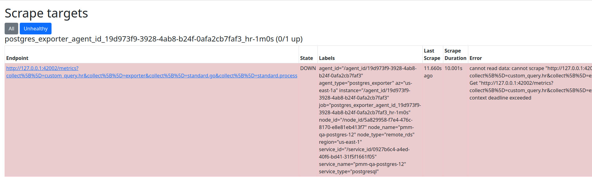

# Remote instances

## Recommended settings

When monitoring remote instances including RDS and Google instances, network latency might affect the scrape process and throw timeout errors.
For this reason, it is recommended to [lower the metrics resolution](../../how-to/configure.md#metrics-resolution).

Starting with PMM 2.18, the scrape timeout has been updated according to the following rules:

- For resolutions <= 2 seconds, scrape timeout is 1 second.
- For resolutions <= 10 seconds, timeout is set to resolution minus 1 second. For example, for 10 second resolution, timeout will be set at 9 seconds.
- For lower resolutions (values > 10 seconds), the scrape timeout is set to 90% of the resolution time. For example, for 60 second resolution, the scrape timeout will be set to 54 seconds.

## How to check for scrape timeouts

Sometimes it is hard to check if you are using the correct values to scrape or if there some other reason why there is no data in a dashboard even when the instance has been added correctly and the agent is running.

One additional step you can do is to check for scrape target statuses. Browse to `http://<your-pmm-server-address>/prometheus/targets` and then click on the Unhealthy button.

The page will show only agents having issues while scrapping and the scrape result including the error messages.

In the example here, there is a message that says: *context deadline exceeded* and the scrape duration column says the scrape took 10 seconds; this means that the exporter didn't respond in the 10 seconds the scrape process was allowed to run due to the configured metric resolutions and their timeouts.

In this case, we can lower the metric resolutions increasing these values as shown in the image below.

