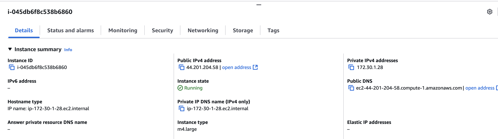
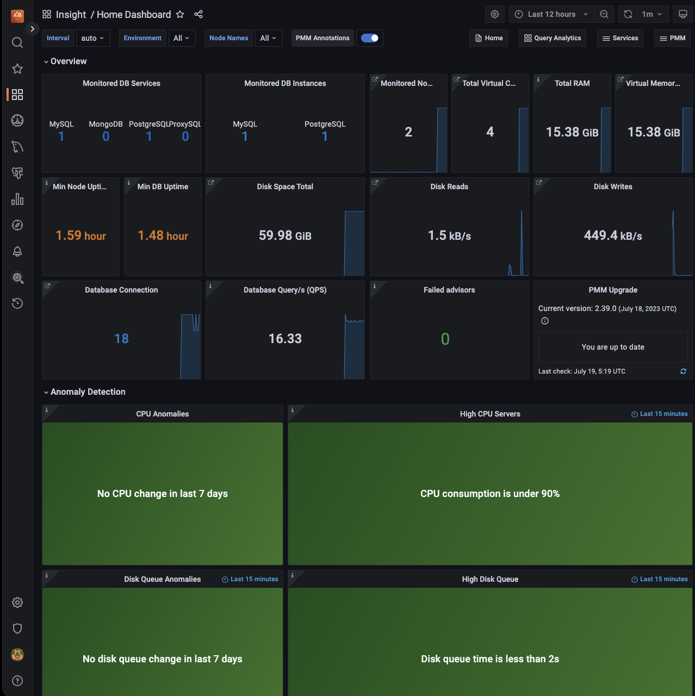
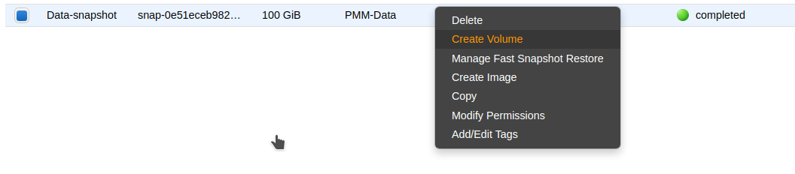
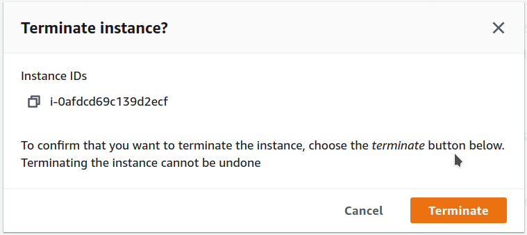

# AWS Marketplace

You can run an instance of PMM Server hosted at AWS Marketplace.

Assuming that you have an AWS (Amazon Web Services) account, locate *Percona Monitoring and Management Server* in [AWS Marketplace](https://aws.amazon.com/marketplace) or use [this link](https://aws.amazon.com/marketplace/pp/B077J7FYGX).


Selecting a region and instance type in the *Pricing Information* section will give you an estimate of the costs involved. This is only an indication of costs. You will choose regions and instance types in later steps.

Percona Monitoring and Management Server is provided at no cost, but you may need to pay for infrastructure costs.

!!! note alert alert-primary ""
    Disk space consumed by PMM Server depends on the number of hosts being monitored. Although each environment will be unique, you can consider the data consumption figures for the [PMM Demo](https://pmmdemo.percona.com/) web site which consumes approximately 230 MB per host per day, or approximately 6.9 GB per host at the default 30 day retention period.

    For more information, see our blog post [How much disk space should I allocate for Percona Monitoring and Management?](https://www.percona.com/blog/2017/05/04/how-much-disk-space-should-i-allocate-for-percona-monitoring-and-management/).

1. Click *Continue to Subscribe*.

2. **Subscribe to this software**: Check the terms and conditions and click *Continue to Configuration*.

3. **Configure this software**:

    1. Select a value for *Software Version*. (The latest is {{release}}.)
    2. Select a region. (You can change this in the next step.)
    3. Click *Continue to Launch*.

4. **Launch this software**:

    1. **Choose Action**: Select a launch option. *Launch from Website* is a quick way to make your instance ready. For more control, choose *Launch through EC2*.

    2. **EC2 Instance Type**: Select an instance type.

    3. **VPC Settings**: Choose or create a VPC (virtual private cloud).

    4. **Subnet Settings**: Choose or create a subnet.

    5. **Security Group Settings**: Choose a security group or click *Create New Based On Seller Settings

    6. **Key Pair Settings**: Choose or create a key pair.

    7. Click *Launch*.

## Limiting Access to the instance: security group and a key pair

In the *Security Group* section, which acts like a firewall, you may use the preselected option `Create new based on seller settings` to create a security group with recommended settings. In the *Key Pair* select an already set up EC2 key pair to limit access to your instance.


!!! caution alert alert-warning "Important"
    The security group should allow communication via the the following ports: *22*, *80*, and *443*. PMM should also be able to access port *3306* on the RDS that uses the instance.

    

## Applying settings

Scroll up to the top of the page to view your settings. Then, click the *Launch with 1 click* button to continue and adjust your settings in the EC2 console.

Your instance settings are summarized in a special area. Click the Launch with 1 click button to continue.


!!! note alert alert-primary ""
    The *Launch with 1 click* button may alternatively be titled as *Accept Software Terms & Launch with 1-Click*.

## Adjusting instance settings in the EC2 Console

Your clicking the *Launch with 1 click* button, deploys your instance. To continue setting up your instance, run the EC2 console. It is available as a link at the top of the page that opens after you click the *Launch with 1 click* button.

Your instance appears in the EC2 console in a table that lists all instances available to you. When a new instance is only created, it has no name. Make sure that you give it a name to distinguish it from other instances managed via the EC2 console.


## Running the instance

After you add your new instance ,it will take some time to initialize it. When the AWS console reports that the instance is now in a running state, you may continue with configuration of PMM Server.

!!! note alert alert-primary ""
    When started the next time after rebooting, your instance may acquire another IP address. You may choose to set up an elastic IP to avoid this problem.

With your instance selected, open its IP address in a web browser. The IP address appears in the *IPv4 Public IP* column or as value of the *Public IP* field at the top of the *Properties* panel.



To run the instance, copy and paste its public IP address into the location bar of your browser. In the *Percona Monitoring and Management* welcome page that opens, enter the instance ID.


You can copy the instance ID from the *Properties* panel of your instance, select the *Description* tab back in the EC2 console. Click the *Copy* button next to the *Instance ID* field. This button appears as soon as you hover the cursor of your mouse over the ID.

Hover the cursor over the instance ID for the Copy button to appear.


Paste the instance in the *Instance ID* field of the *Percona Monitoring and Management* welcome page and click *Submit*.

PMM Server provides user access control, and therefore you will need user credentials to access it:


- Default user name: `admin`
- Default password: `admin`

You will be prompted to change the default password every time you log in.

The PMM Server is now ready and the home page opens.



You are creating a username and password that will be used for two purposes:

1. authentication as a user to PMM - the credentials to log in to PMM.

2. authentication between PMM Server and PMM Clients - you will re-use these credentials on another host when configuring PMM Client for the first time on a server, for example (DO NOT RUN ON THIS PMM SERVER YOU JUST CREATED):

    ```sh
    pmm-admin config --server-insecure-tls --server-url=https://admin:admin@<IP Address>:443
    ```

    !!! note alert alert-primary ""
        For instructions about how to access your instances by using an SSH client, see [Connecting to Your Linux Instance Using SSH](http://docs.aws.amazon.com/AWSEC2/latest/UserGuide/AccessingInstancesLinux.html)

    Make sure to replace the user name `ec2-user` used in this document with `admin`.

## Resizing the EBS Volume

Your AWS instance comes with a predefined size which can become a limitation. To make more disk space available to your instance, you need to increase the size of the EBS volume as needed and then your instance will reconfigure itself to use the new size.

The procedure of resizing EBS volumes is described in the Amazon documentation: [Modifying the Size, IOPS, or Type of an EBS Volume on Linux](https://docs.aws.amazon.com/AWSEC2/latest/UserGuide/ebs-modify-volume.html).

After the EBS volume is updated, PMM Server instance will auto-detect changes in approximately 5 minutes or less and will reconfigure itself for the updated conditions.

## Upgrading PMM Server on AWS

### Change Public IP address

To assign a public IP address for an Amazon EC2 instance, follow these steps:

1. Allocate Elastic IP address

    

2. Associate Elastic IP address with a Network interface ID of your EC2 instance

    If you associate an Elastic IP address to an instance that already has an Elastic IP address associated, this previously associated Elastic IP address will be disassociated but still allocated to your account.

    

### Upgrading EC2 instance class

Upgrading to a larger EC2 instance class is supported by PMM provided you follow the instructions from the [AWS manual](https://docs.aws.amazon.com/AWSEC2/latest/UserGuide/ec2-instance-resize.html). The PMM AMI image uses a distinct EBS volume for the PMM data volume which permits independent resizing of the EC2 instance without impacting the EBS volume.

1. Open the Amazon EC2 console.

2. In the navigation pane, choose PMM Server Instances.

3. Select the instance and choose Actions, Instance state, Stop instance.

4. In the Change instance type dialog box, select the instance type that you want.

    

5. Choose Apply to accept the new settings and start the stopped instance.

### Expanding the PMM Data EBS Volume

The PMM data volume is mounted as an XFS formatted volume on top of an LVM volume. There are two ways to increase this volume size:

1. Add a new disk via EC2 console or API, and expand the LVM volume to include the new disk volume.

2. Expand existing EBS volume and grow the LVM volume.

### Expand existing EBS volume

To expand the existing EBS volume for increased capacity, follow these steps.

1. Expand the disk from AWS Console/CLI to the desired capacity.

2. Login to the PMM EC2 instance and verify that the disk capacity has increased. For example, if you have expanded your disk from 16G to 32G, `dmesg` output should look like below:

    ```txt
    [  535.994494] xvdb: detected capacity change from 17179869184 to 34359738368
    ```

3. You can check information about volume groups and logical volumes with the `vgs` and `lvs` commands:

    ```sh
    vgs
    ```

    ```txt
    VG     #PV #LV #SN Attr   VSize  VFree
    DataVG   1   2   0 wz--n- <16.00g    0
    ```

    ```sh
    lvs
    ```

    ```txt
    LV       VG     Attr       LSize   Pool Origin Data%  Meta% Move Log Cpy%Sync Convert
    DataLV   DataVG Vwi-aotz-- <12.80g ThinPool        1.74
    ThinPool DataVG twi-aotz--  15.96g 1.39  1.29
    ```

4. Now we can use the `lsblk` command to see that our disk size has been identified by the kernel correctly, but LVM2 is not yet aware of the new size. We can use `pvresize` to make sure the PV device reflects the new size. Once `pvresize` is executed, we can see that the VG has the new free space available.

    ```sh
    lsblk | grep xvdb
    ```

    ```txt
    xvdb                      202:16 0 32G 0 disk
    ```

    ```sh
    pvscan
    ```

    ```txt
    PV /dev/xvdb   VG DataVG    lvm2 [<16.00 GiB / 0    free]
    Total: 1 [<16.00 GiB] / in use: 1 [<16.00 GiB] / in no VG: 0 [0   ]
    ```

    ```sh
    pvresize /dev/xvdb
    ```

    ```txt
    Physical volume "/dev/xvdb" changed
    1 physical volume(s) resized / 0 physical volume(s) not resized
    ```

    ```sh
    pvs
    ```

    ```txt
    PV         VG     Fmt  Attr PSize   PFree
    /dev/xvdb  DataVG lvm2 a--  <32.00g 16.00g
    ```

5. We then extend our logical volume. Since the PMM image uses thin provisioning, we need to extend both the pool and the volume:

    ```sh
    lvs
    ```

    ```txt
    LV       VG     Attr       LSize   Pool    Origin Data%  Meta% Move Log Cpy%Sync Convert
    DataLV   DataVG Vwi-aotz-- <12.80g ThinPool        1.77
    ThinPool DataVG twi-aotz--  15.96g                 1.42   1.32
    ```

    ```sh
    lvextend /dev/mapper/DataVG-ThinPool -l 100%VG
    ```

    ```txt
    Size of logical volume DataVG/ThinPool_tdata changed from 16.00 GiB (4096 extents) to 31.96 GiB (8183 extents).
    Logical volume DataVG/ThinPool_tdata successfully resized.
    ```

    ```sh
    lvs
    ```

    ```txt
    LV       VG     Attr       LSize   Pool    Origin Data%  Meta% Move Log Cpy%Sync Convert
    DataLV   DataVG Vwi-aotz-- <12.80g ThinPool        1.77
    ThinPool DataVG twi-aotz--  31.96g                 0.71   1.71
    ```

6. Once the pool and volumes have been extended, we need to now extend the thin volume to consume the newly available space. In this example we’ve grown available space to almost 32GB, and already consumed 12GB, so we’re extending an additional 19GB:

    ```sh
    lvs
    ```

    ```txt
    LV       VG     Attr       LSize   Pool    Origin Data%  Meta% Move Log Cpy%Sync Convert
    DataLV   DataVG Vwi-aotz-- <12.80g ThinPool        1.77
    ThinPool DataVG twi-aotz--  31.96g                 0.71   1.71
    ```

    ```sh
    lvextend /dev/mapper/DataVG-DataLV -L +19G
    ```

    ```txt
    Size of logical volume DataVG/DataLV changed from <12.80 GiB (3276 extents) to <31.80 GiB (8140 extents).
    Logical volume DataVG/DataLV successfully resized.
    ```

    ```sh
    lvs
    ```

    ```txt
    LV       VG     Attr       LSize   Pool    Origin Data%  Meta% Move Log Cpy%Sync Convert
    DataLV   DataVG Vwi-aotz-- <31.80g ThinPool        0.71
    ThinPool DataVG twi-aotz--  31.96g                 0.71   1.71
    ```

7. We then expand the XFS file system to reflect the new size using `xfs_growfs`, and confirm the file system is accurate using the `df` command.

    ```sh
    df -h /srv
    ```

    ```txt
    Filesystem                  Size Used Avail Use% Mounted on
    /dev/mapper/DataVG-DataLV    13G 249M   13G   2% /srv
    ```

    ```sh
    xfs_growfs /srv
    ```

    ```txt
    meta-data=/dev/mapper/DataVG-DataLV isize=512    agcount=103, agsize=32752 blks
             =                          sectsz=512   attr=2, projid32bit=1
             =                          crc=1        finobt=0 spinodes=0
    data     =                          bsize=4096   blocks=3354624, imaxpct=25
             =                          sunit=16     swidth=16 blks
    naming   =version 2                 bsize=4096   ascii-ci=0 ftype=1
    log      =internal                  bsize=4096   blocks=768, version=2
             =                          sectsz=512   sunit=16 blks, lazy-count=1
    realtime =none                      extsz=4096   blocks=0, rtextents=0
    data blocks changed from 3354624 to 8335360
    ```

    ```sh
    df -h /srv
    ```

    ```txt
    Filesystem                 Size Used Avail Use% Mounted on
    /dev/mapper/DataVG-DataLV   32G 254M   32G   1% /srv
    ```

### Expand the Amazon EBS root volume

1. Expand the disk from AWS Console/CLI to the desired capacity.

2. Login to the PMM EC2 instance and verify that the disk capacity has increased. For example, if you have expanded disk from 8G to 10G, `dmesg` output should look like below:

    ```sh
    # dmesg | grep "capacity change"
    [63175.044762] nvme0n1: detected capacity change from 8589934592 to 10737418240
    ```

3. Use the `lsblk` command to see that our disk size has been identified by the kernel correctly, but LVM2 is not yet aware of the new size.

    ```sh
    # lsblk
    NAME                      MAJ:MIN RM   SIZE RO TYPE MOUNTPOINT
    nvme0n1                   259:1    0    10G  0 disk
    └─nvme0n1p1               259:2    0     8G  0 part /
    ...
    ```

4. For volumes that have a partition, such as the root volume shown in the previous step, use the `growpart` command to extend the partition.

    ```sh
    # growpart /dev/nvme0n1 1
    CHANGED: partition=1 start=2048 old: size=16775168 end=16777216 new: size=20969439 end=20971487
    ```

5. To verify that the partition reflects the increased volume size, use the `lsblk` command again.

    ```txt
    # lsblk
    NAME                      MAJ:MIN RM   SIZE RO TYPE MOUNTPOINT
    nvme0n1                   259:1    0    10G  0 disk
    └─nvme0n1p1               259:2    0    10G  0 part /
    ...
    ```

6. Extend the XFS file system on the root volume by `xfs_growfs` command. I

    ```sh
    # xfs_growfs -d /
    meta-data=/dev/nvme0n1p1         isize=512    agcount=4, agsize=524224 blks
             =                       sectsz=512   attr=2, projid32bit=1
             =                       crc=1        finobt=0 spinodes=0
    data     =                       bsize=4096   blocks=2096896, imaxpct=25
             =                       sunit=0      swidth=0 blks
    naming   =version 2              bsize=4096   ascii-ci=0 ftype=1
    log      =internal               bsize=4096   blocks=2560, version=2
             =                       sectsz=512   sunit=0 blks, lazy-count=1
    realtime =none                   extsz=4096   blocks=0, rtextents=0
    data blocks changed from 2096896 to 2621120
    ```

7. Verify that file system reflects the increased volume size

    ```sh
    # df -hT /
    Filesystem     Type  Size  Used Avail Use% Mounted on
    /dev/nvme0n1p1 xfs    10G  5,6G  4,5G  56% /
    ```

## Backup PMM Server

All data are stored in the `/srv` partition, so it's enough to back the PMM data volume.
You can create a point-in-time snapshot of the volume and use it for data backup.

The procedure of creating a snapshot is described in the Amazon documentation: [Create Amazon EBS snapshots](https://docs.aws.amazon.com/AWSEC2/latest/UserGuide/ebs-creating-snapshot.html)


## Restore PMM Server from a backup

1. Create a new volume by using the latest snapshot of the PMM data volume.

    

2. Stop the PMM Server instance.

3. Detach the current PMM data volume.

    

4. Attach the new volume.

    

5. Start the PMM Server instance.

## Remove PMM Server

1. Find the instance in the EC2 Console

    

2. Select "Instance state" menu and "Terminate instance"

    

3. Confirm termination operation

    

!!! seealso alert alert-info "See also"
    - [Improving Percona Monitoring and Management EC2 Instance Resilience Using CloudWatch Alarm Actions](https://www.percona.com/blog/2021/04/29/improving-percona-monitoring-and-management-ec2-instance-resilience-using-cloudwatch-alarm-actions/)  
    - [Simplify the Use of ENV Variables in Percona Monitoring and Management AMI](https://www.percona.com/blog/simplify-use-of-env-variables-in-percona-monitoring-and-management-ami/)
