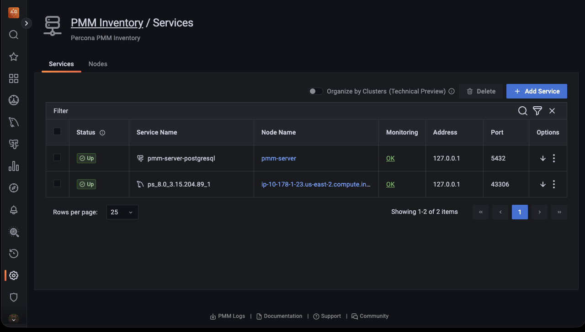
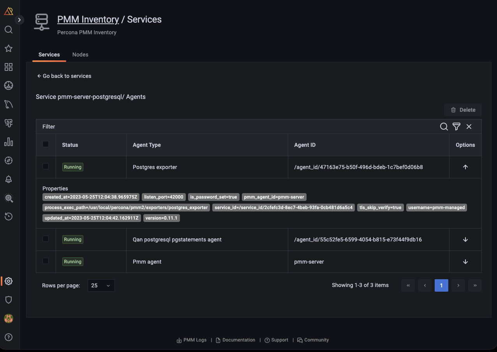
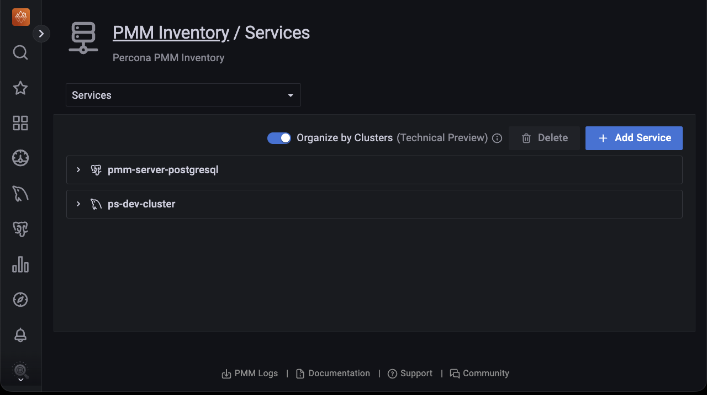
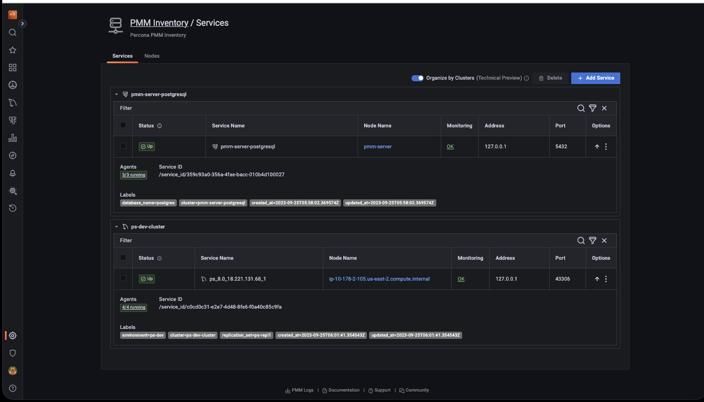
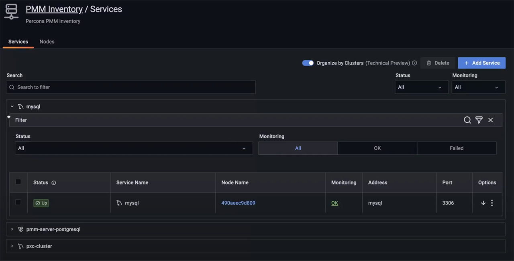
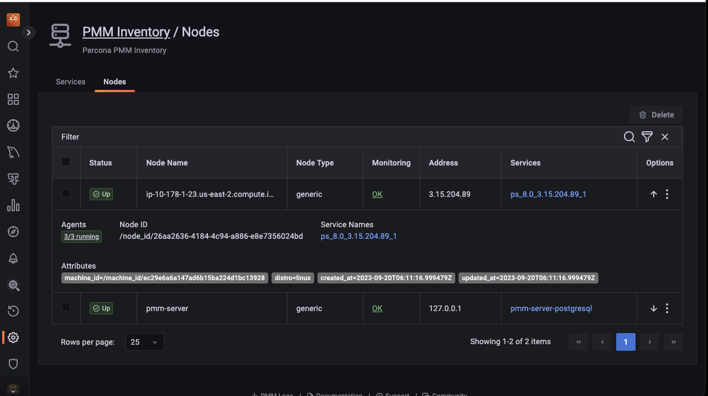
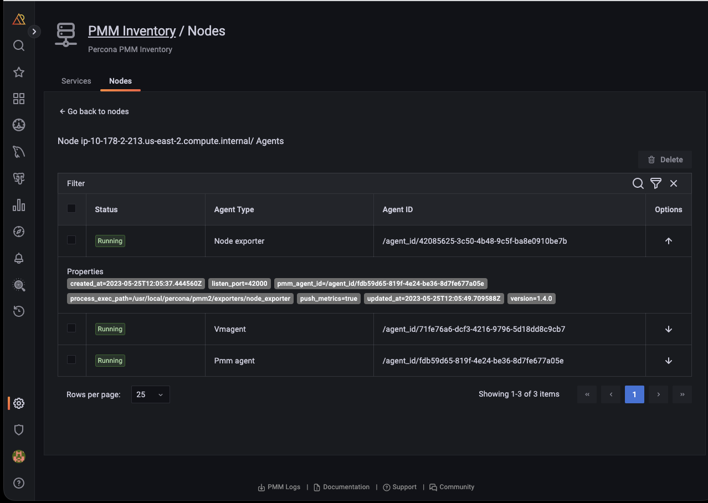
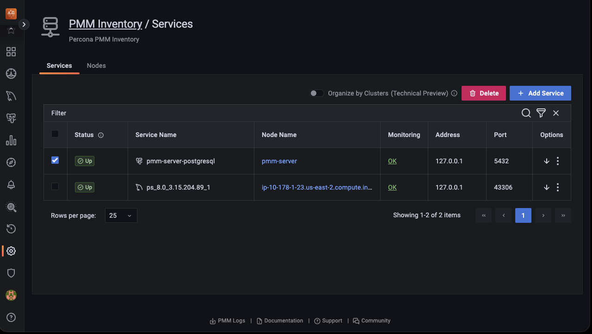

# About PMM Inventory

The **Inventory** dashboard is a high-level overview of all objects registered in PMM.

To check your inventory list, go to <i class="uil uil-cog"></i> **Configuration** > **Inventory**.

Inventory objects form a hierarchy with Node at the top, then Service and Agents assigned to a Node. This information is detailed in the two tabs available on this page.

### **Services** tab

The **Services** tab displays the individual services, the nodes on which they run, and the Agents that help collect the service metrics along with the following information:

| **Column Name**| **Description**|
|--------------|--------------------------------|
| Service name|The name or identifier associated with the service being monitored.|                                        
| Node name | Name or identifier associated with a specific node.| 
| Monitoring status| The **Monitoring** column summarizes the status of all the Agents assigned to the service.             | 
|  Address         | The IP address or DNS where the service is currently running. |
|  Port         | The port number on which the service is running. ||
|  Options |* You can check **QAN** information and the **Dashboard** for each service by clicking on the **<image src="../../images/dots-three-vertical.ico" width="15px" aria-label="triple dots"/>** icon     * You can also check additional information about the service, by clicking on the **<image src="../../images/arrow-downward.ico" width="15px" aria-label="downward arrow"/>** icon. This expands the service entry to show reference information like service labels and IDs.|

#### Attributes

These are some of the atributes for a service:

- Each instance of a service gets a `service_type` attribute so one can clearly tell what type of database it is, for instance: `mysql`, `postgresql`, `mongodb`, etc. 

- Every service is related to a certain node via its `node_id` attribute. This feature allows to support monitoring of multiple instances on a single node, with different service names, e.g. `mysql1-3306`, and `mysql1-3307`.

- Each instance of a service gets a `version` attribute to the response of the endpoint that provides a list of services being monitored by PMM. This makes it easy to visualize the database server version.

    However, following are the imitations:

    - The version is not captured for the internal PostgreSQL database.
    - The version is only captured when a new service is being added to PMM and the agent installed on the client side is equal to or greater than v2.41.0.
    - When a database is upgraded, you will not see the database version updated automatically. It will be updated if you remove and then re-add the service.

#### Agents

Each binary (exporter, agent) running on a client will get an `agent_type` value. 

Example

- `pmm-agent` is at the top of the tree, assigned to pmm-agent itself
- `node_exporter` is assigned to an agent that extracts the node metrics
- `mysqld_exporter` and `qan-mysql-perfschema-agent` are assigned to agents that extract metrics from mysql and its performance schema respectively.

To view the agents running on a service and their health status, click **OK** or **Failed** under the **Monitoring** column. Furthermore, you can also check the properties of a particular agent by clicking the <image src="../../images/arrow-downward.ico" width="15px" aria-label="downward arrow"/> icon under the **Options** column.

#### Node-service relationship

Click on the link in the **Node Name** column to view the node on which a specific service is running and analyze how node-level resource utilization impacts the performance of those services.

Understanding the relationship between nodes and services is key to gaining insights into the distribution and performance of individual services across nodes.

- **Deployment**: Services within PMM are deployed on nodes and rely on them for resources, such as CPU, memory, and storage, to execute tasks.

- **Resource allocation**: It is essential to know which nodes host which services to allocate resources appropriately to avoid underuse or overload.

- **Performance optimization**: By analyzing node and service-level metrics, you can pinpoint and resolve issues that impede service performance, such as resource limitations and performance bottlenecks.

- **Incident response**: When an issue or incident occurs, understanding the node-service relationship helps in troubleshooting. You can quickly identify which nodes and services are affected and focus your efforts on resolving the problem.

### Editing labels for a service

You can edit the labels as follows:

1. From the **Main** menu, go to **PMM Configuration > PMM Inventory > Services**.

2. Click on the three dots next to the service you want to edit labels for.

3. Click **Edit** to change the labels, then click **Save Changes**. 

    

5. Click **Confirm and save changes**. You will be taken back to the **Inventory/Services** page.

#### Effect of editing labels for a service

Editing existing labels can impact the following PMM functions:

- **Alerting** 

    Editing labels without updating alerting rules can lead to missed alerts. If an alert rule is based on specific labels that are changed or no longer apply, the alert may not trigger when it should.

    Update the alert rules promptly after editing the labels for a smooth alerting experience.

- **Scheduled backup**s: Editing the cluster label will remove all scheduled backups for the imapcted service or cluster.

    To prevent any issues, make sure to recreate your backups once you've configured the cluster.

- **Dashboard data**: Edited labels do not affect the existing time-series(metrics). It will only affect the new time-series(metrics).

#### Cluster view

!!! caution alert alert-warning "Disclaimer"
     This feature is still [technical preview](../reference/glossary.md#technical-preview) and is subject to change. We recommend that early adopters use this feature for testing purposes only.

**Organize by Clusters** toggle shows related services grouped into clusters based on their `cluster` label, giving you a consolidated view of your infrastructure.

Click the downward arrow to view cluster details, including the services running on that cluster, agents, and labels.

Furthermore, you can filter the clusters by criteria such as Cluster name, Status, Service name, Node name, Monitoring, Address, and Port. 

### **Nodes** tab

The **Nodes** tab helps you monitor where services and agents are running across your infrastructure. Each node has:

- A unique `node_id` linked to its `machine_id` (from `/etc/machine-id`)
- A `node_type` attribute (e.g., generic, container, remote, remote_rds) indicating its nature

To see node information:
- Click the expand icon in the **Options** column to see node labels and attributes.
- Click any node to view its connected agents.
- Click links in the **Services** column to see running services.

To see agent details:
{.power-number}

1. In the **Nodes** tab, under the **Monitoring** column, click **OK** or **Failed** based on the node’s status to view information about the total number of agents deployed on that node:
     
     

2. Click on the <image src="../images/arrow-downward.ico" width="15px" aria-label="downward arrow"/> icon under the **Options** column to view the properties of a specific agent.

3.  On the **Nodes** tab, under the **Options** column, click on the <image src="../images/arrow-downward.ico" width="15px" aria-label="downward arrow"/> icon for the selected node to check the properties and the current health status of an agent.       
     
     

## Remove items from the inventory

To remove items from the inventory:
{.power-number}

1. Go to  **PMM Configuration > PMM Inventory**.

2. In the first column, select the items to be removed.
        
    

3. Click **Delete** and confirm the removal.