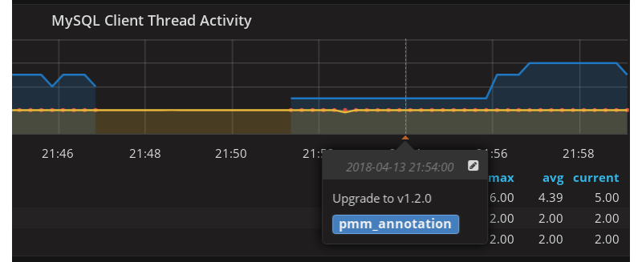
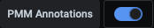

#  Annotation in dashboards

Annotations mark a moment in time. They are useful for marking system changes or other significant application events. They can be set globally or for specific nodes or services.

You create them on the command line with the [`pmm-admin annotate` command.](../../commands/pmm-admin.md#pmm-admin-annotate)

Annotations show as a vertical dashed line on a dashboard graph. Reveal the annotation text by mousing over the caret indicator below the line.

You turn annotations on or off with the **PMM Annotations** switch in the second row menu bar.

