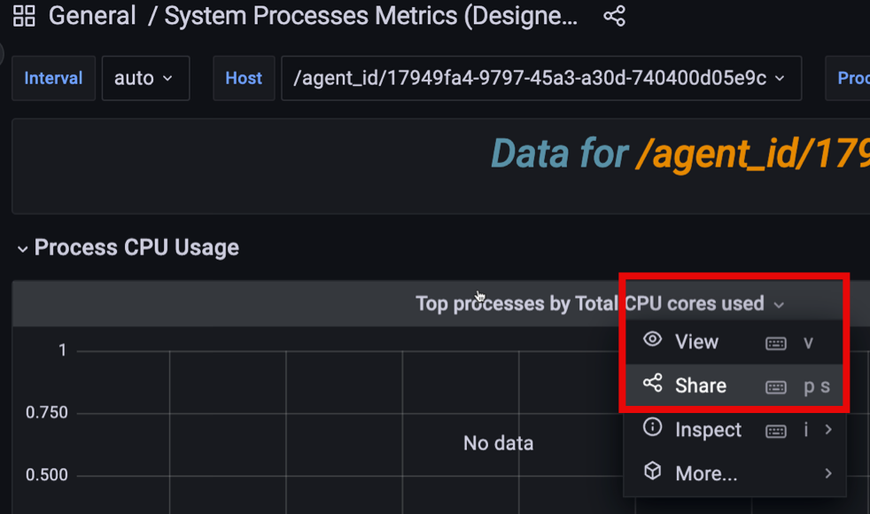

# Share dashboards and panels

When you need to share a dashboard with your team members, you can either send them a direct link to the dashboard, or render and send each panel as a .PNG image.

## Share panel via direct link

To share a panel via direct link:
{ .power-number }

1. Go to the dashboard with the panel that you want to share.
2. Click at the top of the panel to display the panel menu: 
   

3. Select **Share** to reveal the **Share Panel** window and either:


    - copy and send the full URL for the dashboard, OR
    - toggle the **Shorten URL** option to generate a simple link with a unique identifier

!!! hint alert alert-success "Tip"
       If your current domain is different than the one specified in the Grafana .INI configuration file, PMM will ask you to correct this mismatch before you can generate a short URL.

## Share a panel as a PNG file

To enable image rendering:
{ .power-number }

1. Deploy the Grafana Image Renderer container alongside PMM Server:
   
    ```sh
    docker run -d \
    --name renderer \
    -e IGNORE_HTTPS_ERRORS=true \
    grafana/grafana-image-renderer:latest
    ```

2. Stop your existing PMM Server container:

    ```sh 
    docker stop pmm-server
    docker rm pmm-server
    ```

3. Start a new PMM Server container with the required environment variables:

    ```sh
    docker run -d \
    --name pmm-server \
    --network=pmm-network \
    -p 8443:443 \
    -e GF_RENDERING_SERVER_URL=http://renderer:8081/render \
    -e GF_RENDERING_CALLBACK_URL=https://pmm-server:8443/graph/ \
    perconalab/pmm-server:3.0.0-beta
    ```

### Render panel image

To Render a panel image:
{ .power-number }

1. Go to the dashboard with the panel that you want to share.
2. Click at the top of the panel to display the panel menu.
3. Select **Share** to reveal the **Share Panel** window.
4. In the **Link** tab, click **Direct link rendered image**. This opens a new browser tab.
5. Wait for the image to be rendered, then use your browser's Image Save function to download the image.
