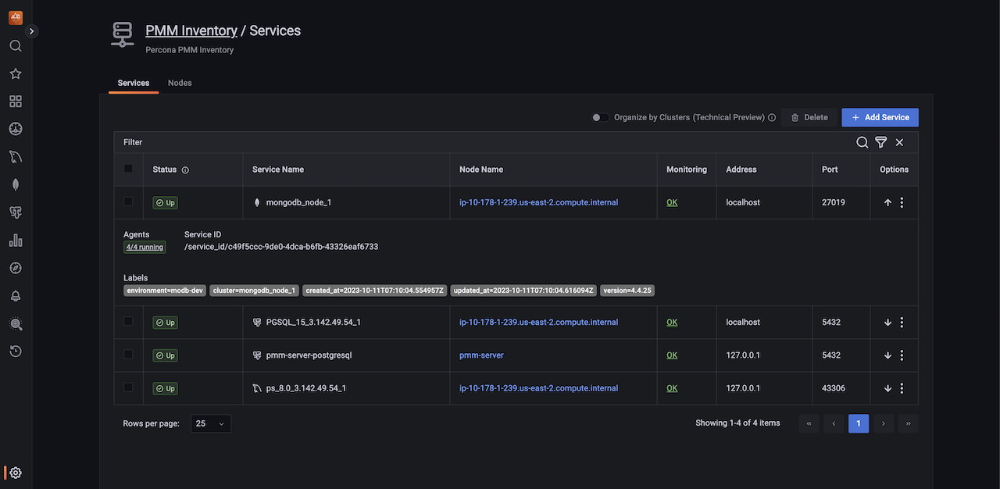

# About PMM Inventory

The **Inventory** dashboard is a high-level overview of all objects registered in PMM.

To check your inventory list, go to <i class="uil uil-cog"></i> **PMM Configuration** > **PMM Inventory**.

Inventory objects form a hierarchy with Node at the top, then Service and Agents assigned to a Node. This information is detailed in the two tabs available on this page.

### **Services** tab

Shows individual services, the nodes on which they run, and the Agents that help collect the service metrics.
The **Status** column shows the status of your databases based on metrics coming directly from the database.
The **Monitoring** column summarizes the status of all the Agents assigned to the service.

You can check Query Analytics information and the Service Overview Dashboard for each service by clicking on the <image src="../../images/dots-three-vertical.ico" width="15px" aria-label="triple dots"/> icon in the **Options** column.

From here you can also check additional information about the service, by clicking on the <image src="../../images/arrow-downward.ico" width="15px" aria-label="downward arrow"/> icon. This expands the service entry to show reference information like service labels and IDs.

Each instance of a service gets a `service_type` attribute so one can clearly tell what type of database it is, for instance: `mysql`, `postgresql`, `mongodb`, etc. Every service is related to a certain node via its `node_id` attribute. This feature allows to support multiple instances on a single node, with different service names, e.g. `mysql1-3306`, and `mysql1-3307`.

Each binary (exporter, agent) running on a client will get an `agent_type` value. Examples:

- `pmm-agent` is at the top of the tree, assigned to pmm-agent itself
- `node_exporter` is assigned to an agent that extracts the node metrics
- `mysqld_exporter` and `qan-mysql-perfschema-agent` are assigned to agents that extract metrics from mysql and its performance schema respectively.

To view the agents running on a service and their health status, click **OK** or **Failed** under the **Monitoring** column. Furthermore, you can also check the properties of a particular agent by clicking the <image src="../../images/arrow-downward.ico" width="15px" aria-label="downward arrow"/> icon under the **Options** column.

### **Nodes** tab

Shows where the service and agents run.

Each `node_id` is associated with a `machine_id` (from `/etc/machine-id`). Nodes also have `node_type` attributes, which give an idea about their nature. Some examples are: generic, container, remote, remote_rds, etc.

By expanding the entry from the options column, you can check the node labels and attributes.

You can see the number of agents running on any particular node. When you click on any node, the UI navigates to the view of agents, which is filtered to display only agents related to that specific node. 

To see the details of the agents running, do the following:

1. On the **Nodes** tab, under the **Monitoring** column, click **OK** or **Failed** depending on the status of the node that you have selected. A page that provides the user with information regarding the total number of agents deployed on that node is displayed.

2. Click on the <image src="../../images/arrow-downward.ico" width="15px" aria-label="downward arrow"/> icon under the **Options** column to view the properties of a specific agent.

3. On the **Nodes** tab, under the **Options** column, click on the <image src="../../images/arrow-downward.ico" width="15px" aria-label="downward arrow"/> icon for the selected node to check the properties and the current health status of an agent.

     

## Removing items from the inventory

To remove items from the inventory:

1. Go to **PMM Configuration** > <i class="uil uil-server-connection"></i> **PMM Inventory**.

2. In the first column, select the items to be removed.
3. Click **Delete** and confirm the removal.
