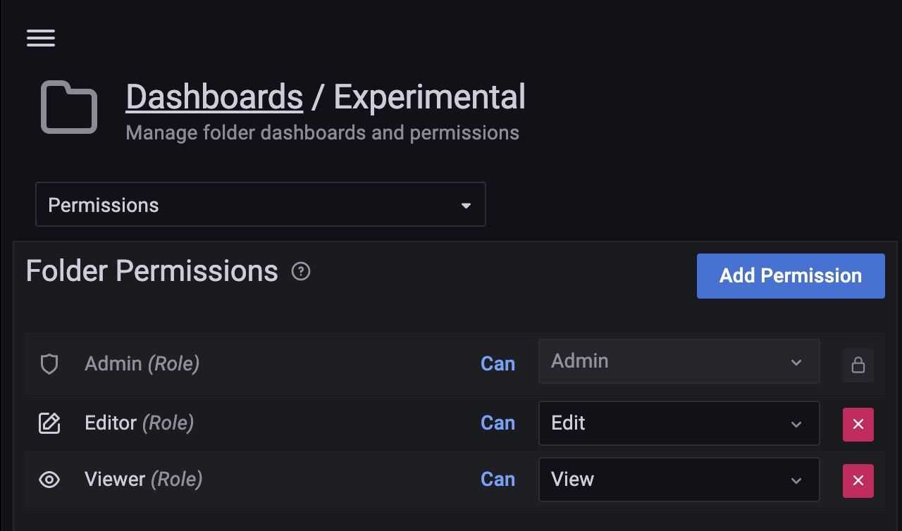

# Manage PMM dashboards

PMM offers various types of dashboards for monitoring and managing the performance of your databases:

1. **Standard dashboards**: include database overviews, database-specific dashboards, query analytics, system-level metrics, replication, and high availability dashboards. These offer comprehensive insights into various aspects of your database environment.
2. **Experimental dashboards**: newer, or less stable dashboards that usually introduce new metrics or visualizations or monitoring approaches.
3. **Custom dashboards**: user-created dashboards tailored to specific metrics or needs, allowing you to combine data from different sources for customized monitoring and analysis.

Standard and experimental dashboards are "provisioned dashboards", meaning they are:

- created by PMM out of the box based on predefined configurations to ensure consistency across deployments.
- protected from editing through the UI to prevent accidental modifications. Trying to modify these dashboards via the UI will result in a `Cannot save provisioned dashboard` error.
- replaced during PMM upgrades, to ensure they are always up-to-date with the latest version. Any manual changes will be overwritten.

Remember:

- Always work with cloned copies of PMM dashboards.
- Changes to original PMM dashboards will be lost during updates.
- Experimental dashboards may change more frequently, therefore consider re-cloning them after upgrades.

## Create dashboard folders

Folders help you organize and group PMM dashboards, making it easier to manage numerous dashboards and accommodate multiple teams using the same PMM instance.

To create a dashboard folder (requires **Admin** privileges):

1. From the side menu, go to <i class="uil uil-plus"></i> **Dashboards > New > New folder**.

2. Enter a unique name for your folder and click **Create**.

## Manage dashboard folders

### Delete multiple dashboards

To delete multiple dashboards at once:

1. From the side menu, go to <i class="uil uil-apps"></i> **Dashboards** page.
2. Select the dashboards that you want to delete, and click **Delete**.

### Move dashboards between folders

To move dashboards from one folder to another (requires **Editor** rights):

#### From the Dasboards page

1. On the **Dashboards** page, enter the name of the dashboard you want to move in the search bar.
2. Check the box next to the dashboard name.
3. Select the target folder then click **Move**.

    

#### From within the dashboard

The other way of moving dashboards from one folder to another is:

1. Open the dashboard that you want to move to another folder.
2. Click on {{icon.configuration}} icon at the top right of the page to open **Dashboard settings**.
3. On the **General** tab, under **Folder** select the folder name that you want to move from the drop-down.

    

4. Click **Save Dashboard** on the top right of the page.

### Navigate to a dashboard folder page to assign folder permissions

Fine-tune access control for your dashboard folders, ensuring team members have the right level of access to the dashboards they need. To set permissions for a dashboard folder:

1. Navigate to the **Dashboards** page.
2. Locate and click on the target folder.
3. In the top right corner, click **Folder actions**.
4. From the dropdown menu, select **Manage permissions**.
5. For each user, role, team, or service account, select the appropriate permission level from the dropdown next to it.

    

## Edit dashboards

You cannot directly edit provisioned dashboards. Instead, clone the dashboard and edit or move the cloned dashboard freely: 

1. Open the dashboard you wish to edit.
2. Click the {{icon.configuration}} icon at the top right of the page to open **Dashboard settings**.
3. Click **Make editable**, then at the top right of the page, click **Save as** to create a copy.
4. Name your copy and choose the location where you want to save it.

## Setting a custom Home dashboard

The Home dashboard you set is the dashboard all the users will see after logging in to PMM UI. You can set the home dashboard for a server, an organization, a team, or your user account.

### For your organization

Organization Admins can set the home dashboard for their organization. For information on managing users in an organization, see [Manage Users](../../how-to/manage-users.md)

1. Navigate to the dashboard that you want to set as the home dashboard.
2. Click the <i class="uil uil-star"></i> star next to the dashboard title to mark the dashboard as a favorite.
3. From the side menu, go to {{icon.configuration}} **Administration > General > Default preferences**.
4. In the **Home Dashboard** field, select the dashboard that you want to set as your home dashboard.
5. Click **Save** then confirm.

#### For a team

Organization and team Admins can set the home dashboard for their team:

1. Navigate to the dashboard that you want to set as your home dashboard.
2. Click <i class="uil uil-star"></i> star next to the dashboard to mark the dashboard as a favorite.
3. From the main menu, choose {{icon.configuration}} **Administration > Teams**. Grafana displays the team list.
4. Click on the team for whom you want to set the home dashboard and then navigate to the **Settings** tab.
5. In the **Home Dashboard** field, select the dashboard that you want to use for your home dashboard.
6. Click **Save**.

### Set your personal Home dashboard

1. From the main menu, go to <i class="uil uil-apps"></i> **Dashboards > Browse** and select the dashboard you want to set as your home dashboard.
2. Click the <i class="uil uil-star"></i> star next to the dashboard title to mark it as a favorite.
3. From the side menu go to {{icon.configuration}} **Administration > General > Default preferences**. In the **Home Dashboard** field, select the dashboard that you want to set as your home dashboard.

    

4. Click **Save**.
