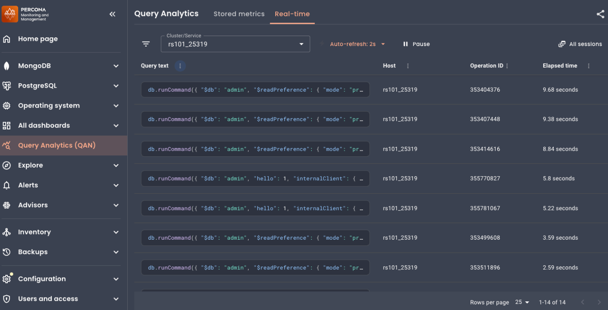
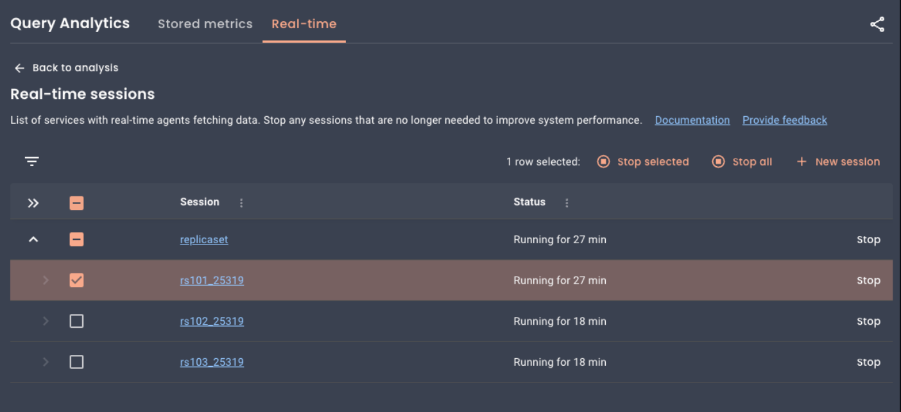
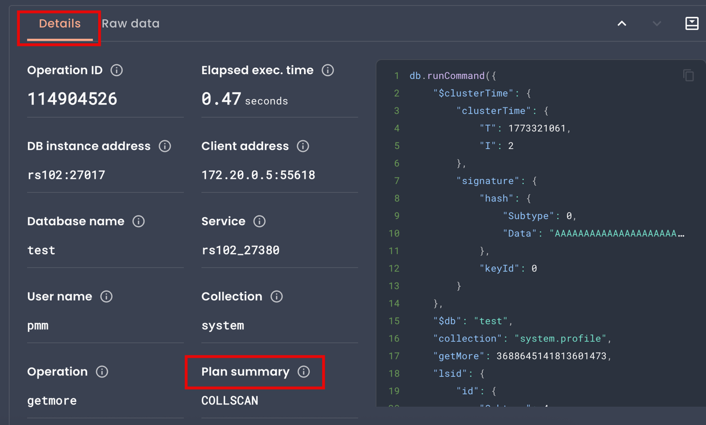
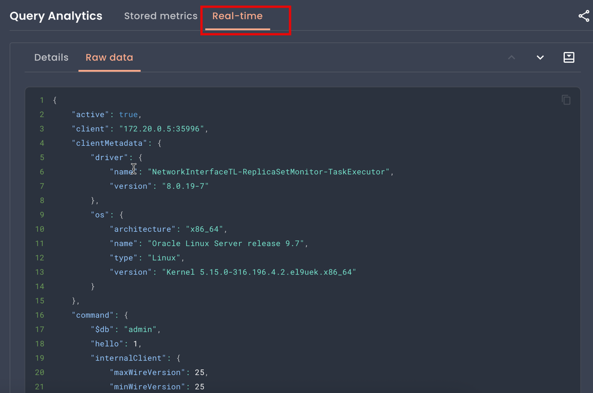

# Real-time Query Analytics for MongoDB

!!! warning "MongoDB only"
    Real-time Query Analytics (RTA) currently supports **MongoDB only**. Support for **MySQL** and **PostgreSQL** is planned for future releases.

While [Query Analytics (QAN) Stored metrics](../qan/QAN-stored-metrics.md) capture queries after they complete so you can analyze and optimize past performance, Real-time Query Analytics (RTA) displays queries as they execute. This allows you to identify problematic operations immediately and take action before they affect users.

RTA displays live query data, updated every 1-5 seconds. Data is held in memory only and refreshes with each update. 

Use the **Pause** button to freeze the view for investigation.

## Before you start

### Service requirements

RTA requires at least one MongoDB service monitored by PMM. If you haven't set this up yet, see [Connect MongoDB to PMM](../../install-pmm/install-pmm-client/connect-database/mongodb.md).

RTA reuses your existing MongoDB exporter credentials, so you don't need to configure anything else.

### Role requirements

Starting and stopping RTA sessions requires the **Admin** role. Users with other roles have View-only access to sessions that an Admin has already started.
For details on PMM roles, see [Standard role permissions](../../admin/roles/index.md).

## Start an RTA session

To start monitoring a MongoDB service:
{.power-number}

1. Go to **Query Analytics** in the sidebar.
2. Select the **Real-time** tab.
3. If no sessions are active, select a MongoDB service from the dropdown and click **Start session**.

The live operations table appears and begins updating automatically:


## Explore the Real-time view

### Filter by service

If you have multiple MongoDB services registered, click **+ New session** to run sessions simultaneously. This lets you monitor multiple replica set members at once or track several services during an incident.

Use the **Cluster/Service** drop-down to focus on specific MongoDB services. You can select multiple services to monitor activity across replica set members.

### Control the refresh rate

Use the **Auto-refresh** drop-down to adjust how often the view updates. By default, RTA updates every 2 seconds, but you can set it anywhere from 1 to 5 seconds. Faster updates show more activity but add a small load to your database.

### Pause the stream

Click **Pause** to freeze the current view. This lets you investigate a specific operation without it disappearing when the next refresh happens.

While paused, the display stops updating but the RTA agent continues collecting data in the background. Click **Resume** or use **Auto-refresh** for a one-time update while staying paused.

### Share your view

Click the **Share** icon to copy a link to your clipboard. The link preserves your selected cluster or service filter.

When someone opens your link, they see live data with your filters applied—not the exact operations you were viewing, since RTA data updates continuously.
### View all sessions

Click **All sessions** to see and manage all running RTA sessions. From here you can stop individual sessions or stop all sessions at once:



## Monitor and investigate operations

### Find slow operations

To identify operations that are taking too long:
{.power-number}

1. Click the **Elapsed time** column header to sort by duration, longest first.
2. Click an operation to open the **Details** tab, then check **Plan summary** for `COLLSCAN`. This means the query scanned the entire collection—often a sign that an index is missing.

    

Repeated slow queries on the same collection often indicate it needs better indexing.

### Trace an operation to its source

When you spot a problematic operation:
{.power-number}

1. Click the row to open the **Details** tab. 
2. Check **Client app name**, **User name**, and **Client address** to identify which application or server sent the query.
3. Check **Database name** and **Collection** to see which part of your database is affected. 

    If the same collection appears repeatedly in slow operations, it may be a hotspot that needs optimization.

### Understand workload patterns

In the **Details** tab, check the **Operation** field to see what type of action the database is performing: query, insert, update, or command. 

This helps you understand whether slow performance is caused by heavy writes, complex reads, or unexpected administrative commands.

### Check for lock contention

If operations seem stuck, open the **Raw data** tab and look for:

- `waitingForLock: true`: the operation is blocked waiting for a lock
- `locks`: shows which lock types the operation holds



Operations waiting for locks may indicate write contention or long-running operations blocking others.

### Correlate with other events

Use the timestamps in the **Details** tab to connect slow operations with other events:

- **Operation start time**: when the database started executing this operation
- **Data capture time**: when PMM captured this snapshot

Compare these with deployment times, traffic spikes, or alerts to understand what triggered the problem.

### Stop a problematic operation
!!! caution
    Killing operations can leave data in an inconsistent state. Use carefully, especially for Write operations.

If you need to kill a long-running operation:
{.power-number}

1. Click the operation to open the **Details** tab.
2. Copy the **Operation ID** value.
3. Connect to your MongoDB instance and run:
```javascript
db.killOp(<operation_id>)
```

### View raw data

The **Details** tab shows a reconstructed version of the query, which may differ slightly from what you originally sent. 

For the complete diagnostic information from MongoDB's currentOp command, click the **Raw data** tab.
The raw data also includes additional information not shown in the **Details** tab, such as driver version, platform details, and the full command structure. This can help identify issues caused by outdated drivers or specific client configurations.

## Privacy considerations

!!! caution "Sensitive data may be visible"

    RTA displays raw query data from MongoDB, which may include:
    
    - filter criteria and update values containing sensitive information
    - user credentials passed in queries
    - personal or confidential data used in query conditions
    
    This data is visible to any PMM user who can access the QAN Real-time page. Consider your security requirements before enabling RTA in production environments.

RTA displays exactly what MongoDB returns and does not expose any additional information beyond what `db.currentOp()` provides.

## Troubleshooting

### No data appears

In **Inventory > Services**, verify the RTA agent is running and the session shows **Running** status. Make sure your database has active queries since RTA won't display operations that finish between collection intervals.

### Some fields show "Unavailable"

Not all operations have all fields. For example, a `hello` command (like a ping) won't have a **Collection**, **User name**, or **Plan summary**.

### The query text looks different from what I sent

MongoDB's `currentOp()` doesn't return the original query text. RTA reconstructs it from the command structure, which may look different from your original query. 

Check the **Raw data** tab to see exactly what MongoDB returned.

### Session won't start

Check the following requirements:

- **PMM Client version**: 3.7.0 or later. Run `pmm-admin status` on the monitored host to check.
- **MongoDB exporter**: Must be configured and running. Go to **PMM Inventory > Services**, select your MongoDB service, and check that the MongoDB exporter shows **Running**.
- **Admin role**: Only users with the **Admin** [role](../../admin/roles/index.md) can start or stop sessions. Users with other roles can view live data from running sessions.

## See also

- [Query Analytics overview](index.md)
- [Connect MongoDB to PMM](../../install-pmm/install-pmm-client/connect-database/mongodb.md)
- [MongoDB dashboards](../../reference/dashboards/dashboard-mongodb-instance-summary.md)
- [Configuration issues](../../troubleshoot/config_issues.md)
