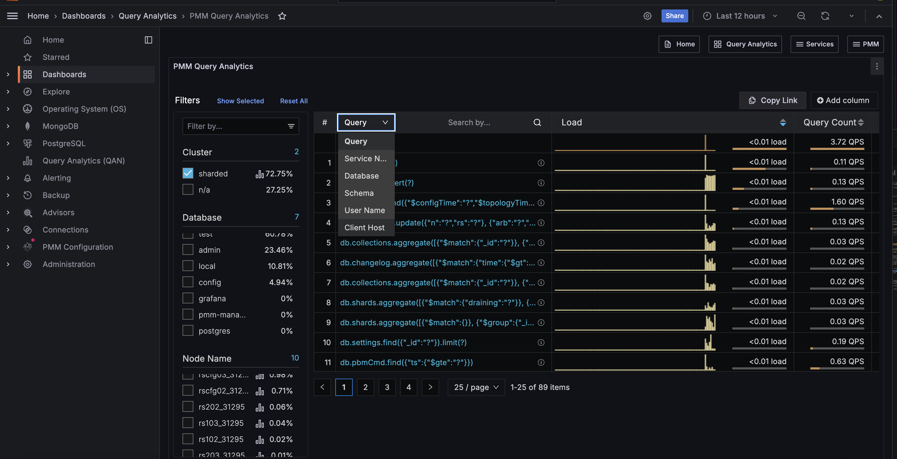

# About query analytics (QAN)

The Query Analytics dashboard shows how queries are executed and where they spend their time.  It helps you analyze database queries over time, optimize database performance, and find and remedy the source of problems.

## Supported databases
Query Analytics supports MySQL, MongoDB and PostgreSQL. The minimum requirements for MySQL are:

- MySQL 5.1 or later (if using the slow query log).
- MySQL 5.6.9 or later (if using Performance Schema).

Query Analytics displays metrics in both visual and numeric form. Performance-related characteristics appear as plotted graphics with summaries.

## Dashboard layout
The dashboard contains three panels:

- the [Filters Panel](panels/filters.md);
- the [Overview Panel](panels/overview.md);
- the [Details Panel](panels/details.md).

## Data availability

Query data retrieval may be delayed due to network conditions. During such delays, gaps may appear in visualizations until data is received.

## Label-based access control

Query Analytics integrates with PMM's[label-based access control (LBAC)](../../admin/roles/access-control/intro.md) to enforce data security and user permissions. 

When LBAC is enabled:
- users see only queries from databases and services permitted by their assigned roles
- filter dropdown options are dynamically restricted based on user permissions
- data visibility is controlled through Prometheus-style label selectors
