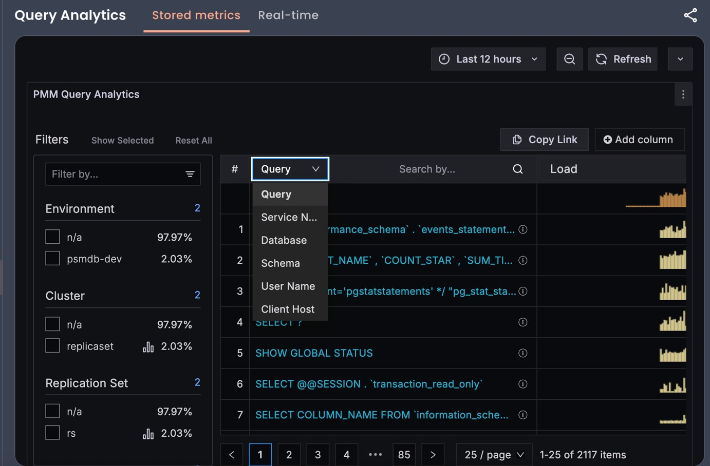

# About Query Analytics

Query Analytics (QAN) helps you find and fix slow queries. Use it to identify performance bottlenecks, understand query patterns, and track optimization progress.

## Stored metrics and Real-time QAN

Query Analytics offers two ways to analyze queries:

- **Stored metrics**: Choose stored metrics when you want to  analyze completed queries to identify patterns, find slow queries, and track optimization progress over time. 

- **Real-time**: Choose real-time when you need to identify problematic operations during an active incident.  

### Real-time vs. Stored metrics capabilities

| Feature | Real-time Analytics (RTA) | Stored metrics (QAN) |
|---------|---------------------------|------------------------|
| **Data type** | Currently executing queries | Completed queries |
| **Purpose** | Live troubleshooting | Performance optimization |
| **Time range** | Live data (updates every 1-5 seconds) | Historical data (configurable retention) |
| **Use case** | Spot problematic operations during incidents | Analyze trends and optimize past performance |
| **Database support** | MongoDB (Technical Preview) | MySQL, PostgreSQL, MongoDB |
| **Data retention** | Temporary (refreshes with new data) | Persistent (stored for analysis) |
| **Refresh rate** | Live updates (1-5 seconds, configurable) | Historical snapshots |
| **Query details** | Raw operation data from `db.currentOp()` (no aggregation, grouping, or processing) | Aggregated metrics and query fingerprints |
| **Best for** | "What's slowing down my database right now?" | "Which queries should I optimize?" |

### Requirements for Profiler

    - Profiling enabled for Query Analytics
    - Appropriate user roles: `clusterMonitor`, `read` (local), and custom monitoring roles. For MongoDB 8.0+: Additional `directShardOperations` role required for sharded clusters

    ### Requirements for Mongolog

    - MongoDB configured to log slow operations to a file
    - MongoDB server has write permissions to the log directory and file
    - PMM agent has read permissions to the MongoDB log file
    - Appropriate user roles: `clusterMonitor`, or custom monitoring roles (`getCmdLineOpts` privilege on `{ cluster: true }`)

## Dashboard components
Query Analytics displays metrics in both visual and numeric form. Performance-related characteristics appear as plotted graphics with summaries.

## Dashboard layout
The dashboard contains three panels:

- the [Filters panel](panels/filters.md)
- the [Overview panel](panels/overview.md)
- the [Details panel](panels/details.md)

### Data retrieval delays

Query Analytics data retrieval is not instantaneous because metrics are collected once per minute. When collection delays occur, no data is reported and gaps will appear in the sparkline.

## Label-based access control

Query Analytics integrates with PMM's [label-based access control (LBAC)](../../admin/roles/access-control/intro.md) to enforce data security and user permissions.

When LBAC is enabled:

- users see only queries from databases and services permitted by their assigned roles
- filter dropdown options are dynamically restricted based on user permissions
- data visibility is controlled through Prometheus-style label selectors

## Troubleshooting

If you experience Query Analytics performance issues in low-memory environments (less than 16 GB RAM), see [ClickHouse memory issues](../../troubleshoot/qan_issues.md#clickhouse-memory-issues-in-low-memory-environments).

## Get started

### Enable QAN for PMM Server
To include PMM Server’s own queries in QAN, enable the feature in the settings:
{.power-number}

1. Go to **PMM Configuration > Settings > Advanced Settings**.
2. Switch on the **QAN for PMM Server** option.
3. Open **PMM Query Analytics (QAN)** from the main menu and filter by the `pmm-server-postgresql` service to view queries.

When enabled, QAN displays queries related to PMM’s internal operations—such as inventory, settings, advisor checks, alerts, backups, and authentication. 

These are usually lightweight, but unusual spikes in volume, latency, or unexpected queries may indicate performance issues or misuse of the database.

!!! warning
    Do not use the default PostgreSQL database for application workloads. PMM monitors it for visibility, but applications should always run on dedicated databases.

## AI-assisted query tuning

When ADRE and HolmesGPT are configured, you can use **[QAN AI Insights](../ai-features/qan-ai-insights.md)** for AI-guided query optimisation and tuning from QAN.

- [Stored metrics QAN](../qan/QAN-stored-metrics.md)
- [Real-time analytics for MongoDB](../qan/QAN-realtime-analytics.md)
