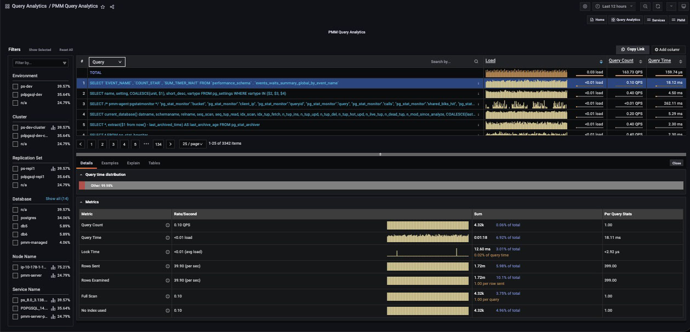
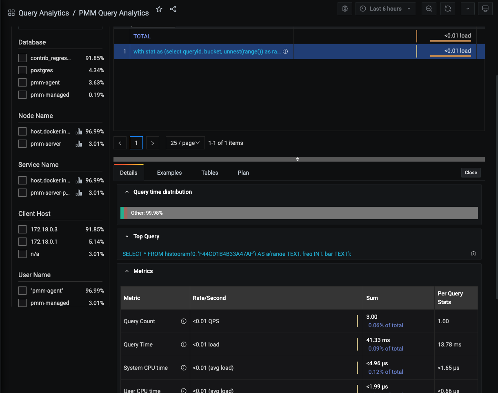
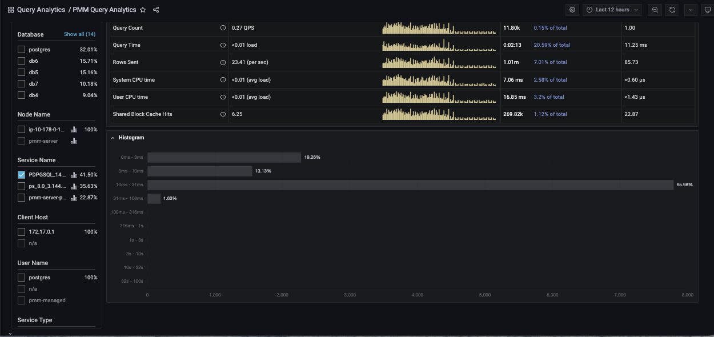
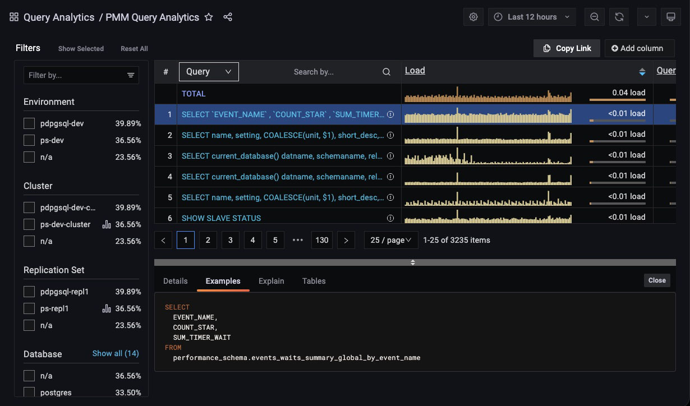
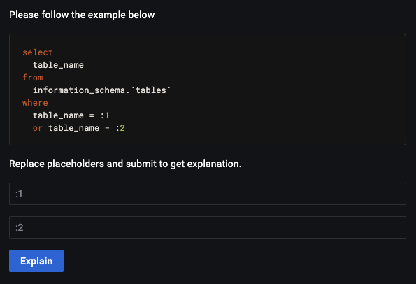
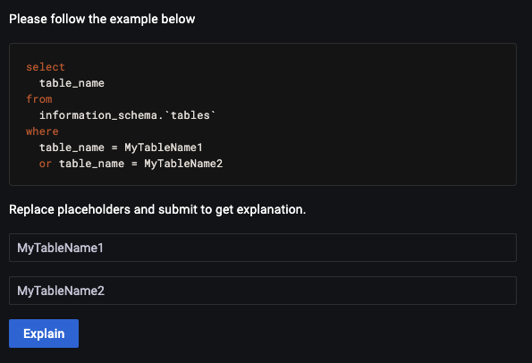
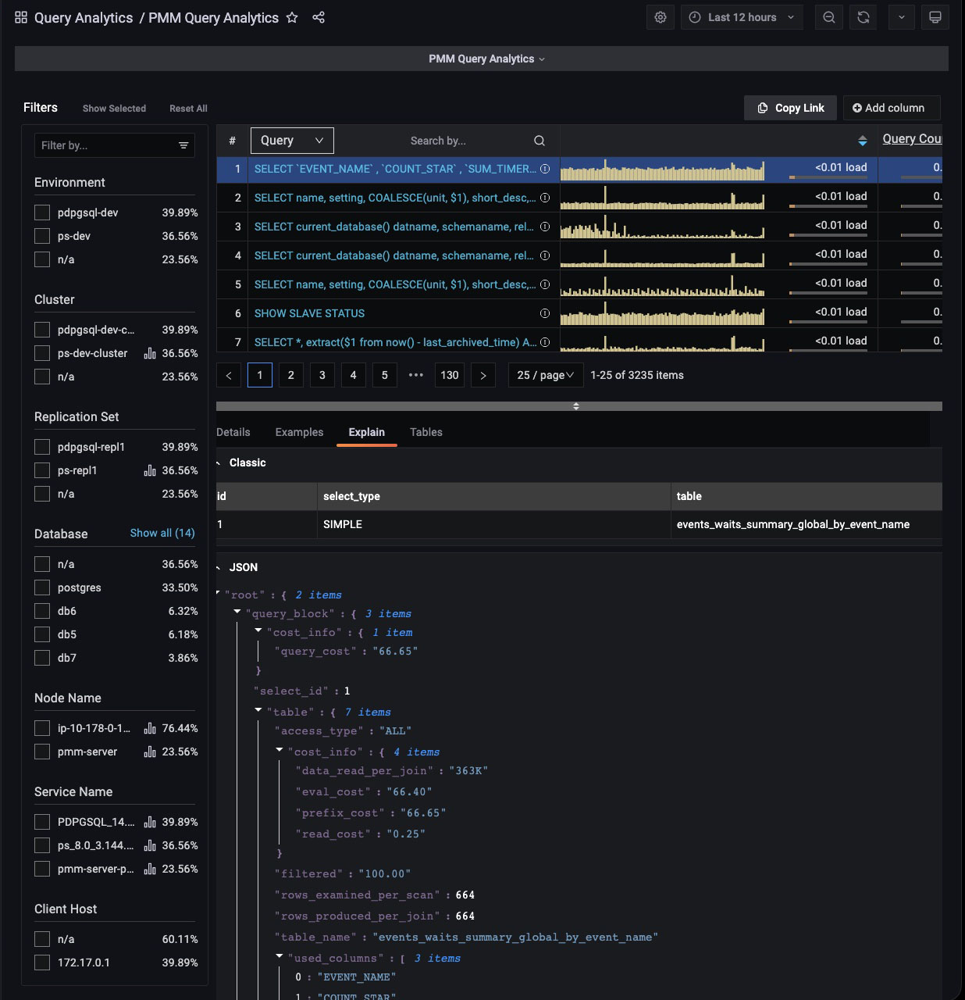
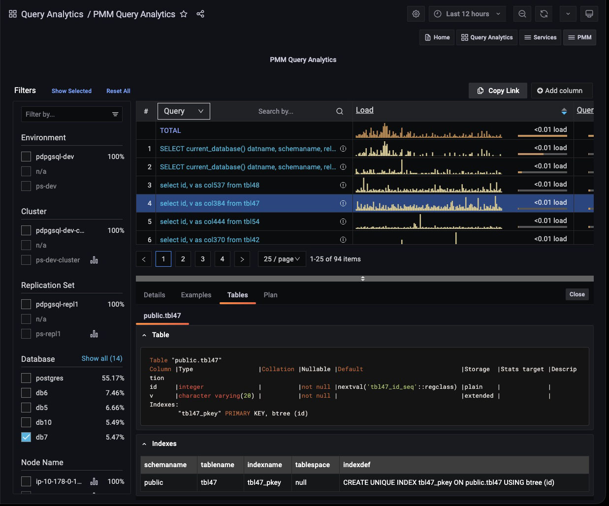
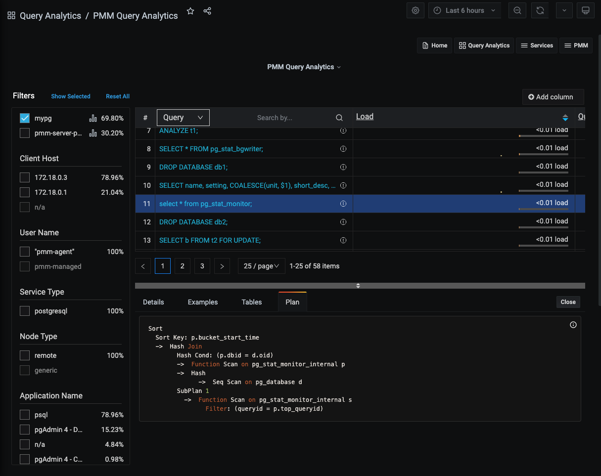

# Details panel

- Selecting an item in the Overview panel opens the **Details panel** with a [Details Tab](#details-tab).
- If the dimension is **Query**, the panel also contains the [Examples Tab](#examples-tab), [Explain Tab](#explain-tab), and [Tables Tab](#tables-tab).

## Details Tab

The **Details** tab contains a **Query time distribution** bar (only for MySQL databases) and a set of **Metrics** in collapsible subpanels.



- The **Query time distribution** bar shows a query’s total time made up of colored segments, each segment representing the proportion of time spent on a named activity.

    - `query_time`: Statement execution time.
    - `lock_time`: Time to acquire locks.
    - `blk_read_time`: Total time the statement spent reading blocks (if `track_io_timing` is enabled, otherwise zero).
    - `blk_write_time`: Total time the statement spent writing blocks (if `track_io_timing` is enabled, otherwise zero).
    - `innodb_io_r_wait`: Time for InnoDB to read the data from storage.
    - `innodb_queue_wait`: Time the query spent either waiting to enter the InnoDB queue, or in it pending execution.
    - `innodb_rec_lock_wait`: Time the query waited for row locks.
    - `other`: Remaining uncategorized query time.

- **Metrics** is a table with headings:

    - **Metric**: The Metric name, with a question-mark tool-tip that reveals a description of the metric on mouse-over;
    - **Rate/Second**: A sparkline chart of real-time values per unit time;
    - **Sum**: A summation of the metric for the selected query, and the percentage of the total;
    - **Per Query Stats**: The value of the metric per query.

- Each row in the table is a metric. The contents depends on the chosen dimension.

For PostgreSQL queries (when using `pg_stat_monitor`) the top query will also be shown in the details section if the query was called by an outer query.



Other useful metrics (when using **pg_stat_monitor**) to monitor PostgreSQL Server performance are [Histograms](https://github.com/percona/pg_stat_monitor/blob/master/docs/USER_GUIDE.md#histogram). 
**Histograms** provide more explicit information about number of queries for fingerprint (`queryid`). Ranges are from 0 seconds up to 100 seconds.  

Here is picture of **histogram** in graph:



## Examples Tab

(For **Query** dimension.)

The **Examples** tab shows an example of the selected query’s fingerprint or table element.



!!! note alert alert-primary ""
    Query example and fingerprint can be truncated to 1024 long to reduce space usage. In this case, the query explains section will not work.

## Explain Tab

(For **Query** dimension.)

The **Explain** tab shows the `explain` output for the selected query, in Classic or JSON formats.

- MySQL: Classic and JSON.
- MongoDB: JSON only.
- PostgreSQL: Not supported.

The **Explain** tab for MySQL queries works without enabling **Examples**. For security, sensitive data appears as placeholders that you must fill in before running Explain:



Below is an illustration of the same query using values instead of placeholders.



The image shown above illustrates a query with two placeholders. Therefore, you must enter the correct values in both fields. After filling in these values, click *Explain* to get the results like in the previous PMM versions without data leaks.
You will get result like in previous PMM versions. This method of `explain` prevents data leak.

!!! note alert alert-primary "'Explain' for MongoDB"

    To run Explain you need the same permissions as for executing the original query. For example, to run explain on `updates` you need update permissions.  

    Example: Grant the `explainRole` with update permissions.

    ```
    db.grantPrivilegesToRole( "explainRole", [ { resource: { db: "", collection: "" }, actions: [ "update" ] } ])
    ```



## Tables Tab

(For **Query** dimension.)

The **Tables** tab shows information on the tables and indexes involved in the selected query.



## Plan Tab

(For **Query** dimension.)

The **Plan** tab shows the plan for PostgreSQL queries (only available when using *pg_stat_monitor*).

