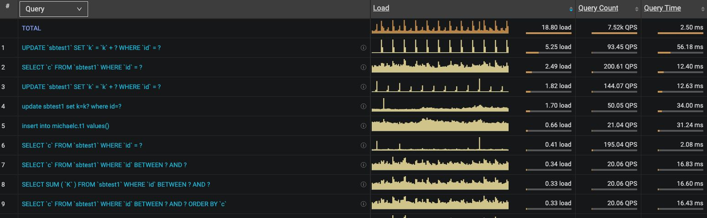
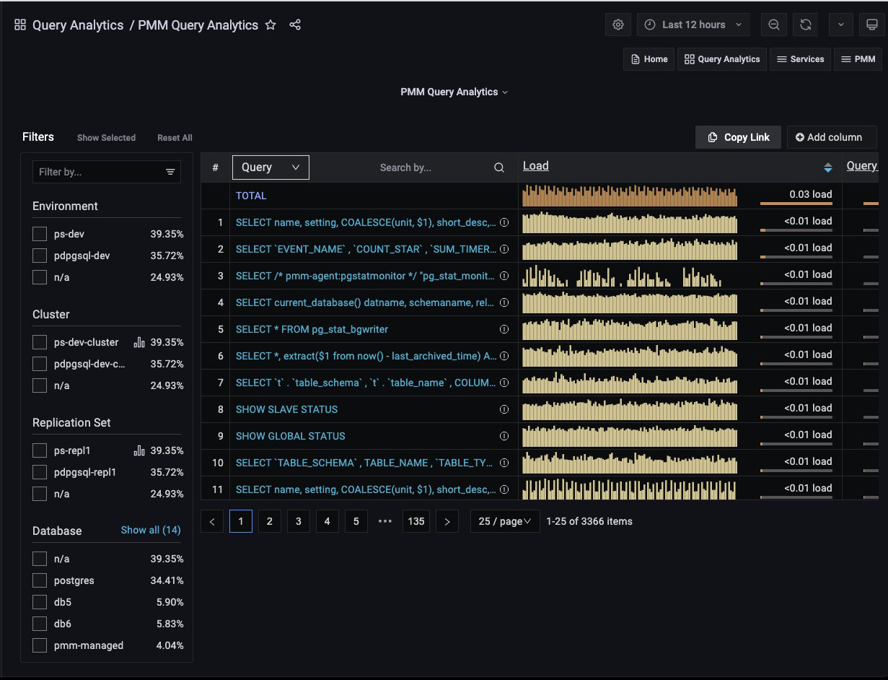
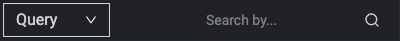
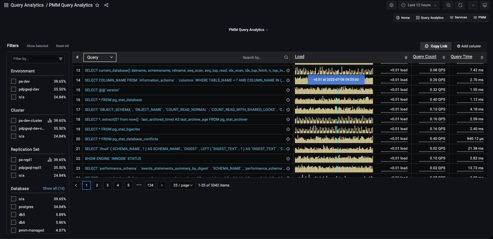
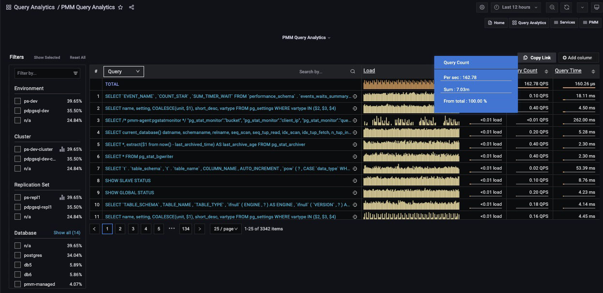

# Overview Panel

To the right of the Filters panel and occupying the upper part of the dashboard is the Overview panel.

Each row of the table represents the metrics for a chosen object type, one of:

- Query;
- Service Name;
- Database;
- Schema;
- User Name;
- Client Host.

At the top of the second column is the **dimension** menu. Use this to choose the object type.

On the right side of the dimension column is the **Dimension Search** bar.

Enter a string and press Enter to limit the view to queries containing only the specified keywords.

Delete the search text and press Enter to see the full list again.

## Columns

- The first column is the object’s identifier. For **Query**, it is the query’s [Fingerprint](../../../reference/glossary.md#fingerprint).
- The second column is the **Main metric**, containing a reduced graphical representation of the metric over time, called a **sparkline**, and a horizontal meter, filled to reflect a percentage of the total value.
- Additional values are revealed as mouse-over tooltips.

## Tooltips

- For the **Query** dimension, hovering over the information icon :material-information: reveals the query ID and its example.
- Hovering on a column header reveals an informative tooltip for that column.
- Hovering on the main metric sparkline highlights the data point and a tooltip shows the data value under the cursor.

- Hovering on the main metric meter reveals the percentage of the total, and other details specific to the main metric.

    

- Hovering on column values reveals more details on the value. The contents depends on the type of value.

    

## Adding and removing columns

- Metrics columns are added with the **Add column** button.

    

- When clicked, a text field and list of available metrics are revealed. Select a metric or enter a search string to reduce the list. Selecting a metric adds it to the panel.
- A metric column is removed by clicking on the column heading and selecting **Remove column**.
- The value plotted in the **main metric** column can be changed by clicking a metric column heading and selecting **Swap with main metric**.

## Sorting

- The entire list is sorted by one of the columns.
- Click either the up or down caret to sort the list by that column’s ascending or descending values.

## Pagination

- The pagination device lets you move forwards or backwards through pages, jump to a specific page, and choose how many items are listed per page.

    

- Queries are grouped into pages of 25, 50 or 100 items.
