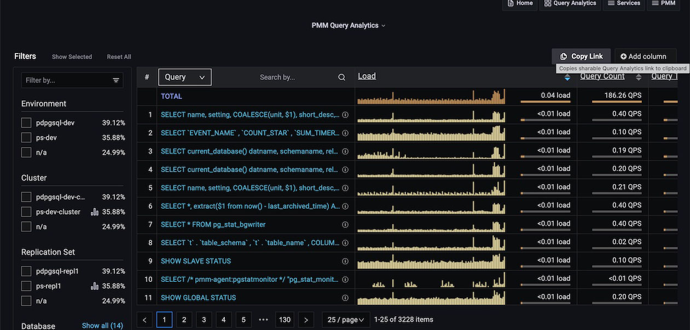

# Share a link for Query Analytics

To share a link for Query Analytics, use **Copy Link**. It copies the link to the clipboard with all the relevant information such as selected query, table page, selected filters, details tab, and time range. Thus, when you open the link, it will display the exact information.

!!! caution alert alert-warning "Important"
    Ensure that you use **Copy Link** to copy the link instead of using the browser address bar or the standard Grafana functionality (to share a dashboard). Otherwise, Query Analytics might not display the exact information that existed while sharing the link.
    
    By default, Grafana uses a relative time range and not an absolute range, so it will have a different timestamp when this link is opened.

[SLOW_QUERY_LOG]: ../../install-pmm/install-pmm-client/connect-database/mysql.md#slow-query-log
[PERFORMANCE_SCHEMA]: ../../install-pmm/install-pmm-client/connect-database/mysql.md#performance-schema

