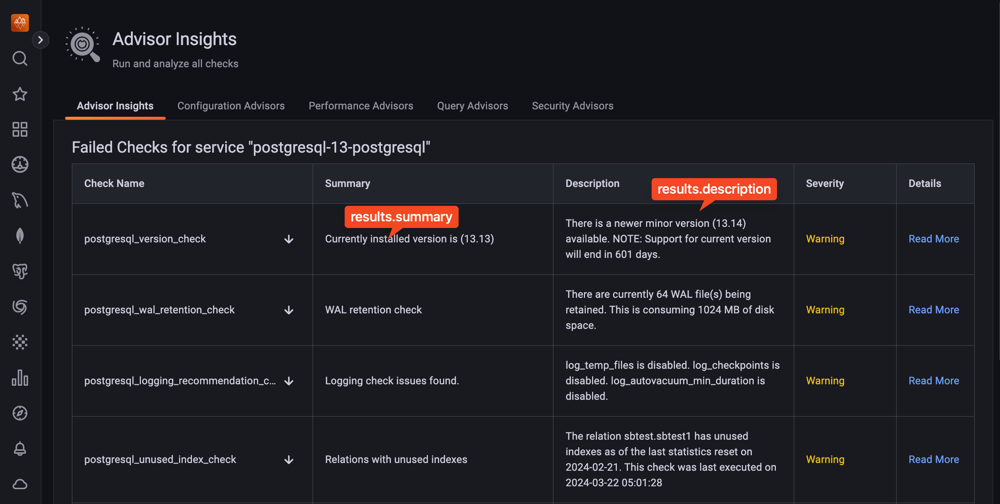

# Contributing notes

**pmm-managed** is a core component of PMM Server. As such, its development and testing is best done inside of a PMM Server container, which we call "devcontainer". You can take a look at PMM's architecture [here](https://docs.percona.com/percona-monitoring-and-management/3/reference/index.html).

# Devcontainer setup

Install Docker and Docker Compose.

Checkout `main` branch which is the main branch for PMM 2.x development.

Run `make` to see a list of targets that can be run on host:

```
$ make
Please use `make <target>` where <target> is one of:
  env-up                    Start devcontainer.
  env-down                  Stop devcontainer.
  env                       Run `make TARGET` in devcontainer (`make env TARGET=help`); TARGET defaults to bash.
  release                   Build pmm-managed release binaries.
  help                      Display this help message.
```

`make env-up` starts a devcontainer with all tools and mounts the source code from the host. You can write code using your IDE of choice as usual, or run an editor inside the devcontainer (see below how you can leverage VSCode). To run make targets inside the devcontainer, use `make env TARGET=target-name`. For example:

```
$ make env TARGET=help
docker exec -it --workdir=/root/go/src/github.com/percona/pmm-managed pmm-server make help
Please use `make <target>` where <target> is one of:
  gen                       Generate files.
  install                   Install pmm-managed binary.
  install-race              Install pmm-managed binary with race detector.
  test                      Run tests.
...
```

To run tests, use `make env TARGET=test`, etc.

Alternatively, it is possible to run `make env` to get inside the devcontainer and run make targets as usual:

```
$ make env
docker exec -it --workdir=/root/go/src/github.com/percona/pmm-managed pmm-server make _bash
/bin/bash
[root@pmm-server pmm-managed]# make test
make[1]: Entering directory `/root/go/src/github.com/percona/pmm-managed'
go test -timeout=30s -p 1 ./...
...
```

`run-managed` target replaces `/usr/sbin/pmm-managed` and restarts pmm-managed with `supervisorctl`. As a result, it will use regular filesystem locations (`/etc/victoriametrics-promscrape.yml`, `/etc/supervisord.d`, etc.) and `pmm-managed` PostgreSQL database. Other locations (inside `testdata`) and `pmm-managed-dev` database are used for unit tests.

# Advanced Setup

## Available test environment variables:

| Variable                                 | Description                                                                                                         | Default                                  |
|------------------------------------------|---------------------------------------------------------------------------------------------------------------------|------------------------------------------|
| PMM_DEV_ADVISOR_STARLARK_ALLOW_RECURSION | Allows recursive functions in checks scripts                                                                        | false                                    |
| PMM_DEV_ADVISOR_CHECKS_FILE              | Specifies path to local checks file and disables downloading checks files from Percona Platform                     | none                                     |
| PMM_ADVISOR_CHECKS_DISABLE_START_DELAY   | Disables checks service startup delay                                                                               | false                                    |
| PMM_DEV_TELEMETRY_INTERVAL               | Sets telemetry reporting interval                                                                                   | 24h                                      |
| PMM_DEV_TELEMETRY_DISABLE_SEND           | Disables sending of telemetry data to SaaS. This param doesn't affect telemetry data gathering from the datasources | false                                    |
| PMM_DEV_TELEMETRY_FILE                   | Sets path for telemetry config file                                                                                 |                                          |
| PMM_DEV_TELEMETRY_DISABLE_START_DELAY    | Disable the default telemetry execution start delay, so that telemetry gathering is run immediately upon system     | false                                    |
| PMM_DEV_TELEMETRY_RETRY_BACKOFF          | Sets telemetry reporting retry backoff time                                                                         | 1h                                       |
| PMM_DEV_PERCONA_PLATFORM_ADDRESS         | Sets Percona Platform address                                                                                       | https://check.percona.com                |
| PMM_DEV_PERCONA_PLATFORM_INSECURE        | Allows insecure TLS connections to Percona Platform                                                                 | false                                    |
| PMM_DEV_PERCONA_PLATFORM_PUBLIC_KEY      | Sets Percona Platform public key (Minisign)                                                                         | set of keys embedded into managed binary |

## Add instances for monitoring

`make env-up` just starts the PMM server but it doesn't setup anything to be monitored. We can use [pmm-admin](https://github.com/percona/pmm-admin) and [pmm-agent](https://github.com/percona/pmm-agent) to add instances to be monitored to pmm-managed.

- Clone the pmm-admin [repo](https://github.com/percona/pmm-admin/) and install it by running `make install`.
- Clone the pmm-agent [repo](https://github.com/percona/pmm-agent).
- Run database instances to be monitored, you can either run your own or use the [`docker-compose.yml`](https://github.com/percona/pmm-agent/blob/master/docker-compose.yml) file provided by pmm-agent to run MySQL, PostgreSQL and MongoDB containers using `make env-up` in the pmm-agent repo (make sure to comment out the `pmm-server` service in the docker-compose file since we are already running pmm-managed in devcontainer).
- Open another shell session and `cd` into the pmm-agent repo, run `make setup-dev` and `make run` to setup and run pmm-agent and connect it to pmm-managed
- In another shell use pmm-admin to add agents to the database instances and start monitoring them using `pmm-admin add mysql --username=root --password=root-password`, `pmm-admin add postgresql --username=pmm-agent --password=pmm-agent-password` and `pmm-admin add mongodb --username=root --password=root-password`.
- Now pmm-managed has started monitoring the databases, login to the web client in your browser to verify. The number of monitored instances will have increased.

## Working with Advisors

- Setup the devcontainer using `make env-up` and run your changes inside by running `make env` and then `make run`.
- Follow the steps described in [Add Instances for Monitoring](#add-instances-for-monitoring) to set up instances for monitoring.
- Follow the guide in the [Developing Advisors](https://docs.percona.com/percona-monitoring-and-management/3/advisors/develop-advisor-checks.html) page in the PMM documentation.
- Any failed Advisor checks will produce check results on the dashboard.

## Contributing to Advisors

Advisors are located in the `data/advisors` folder. If you want to change Advisor names and descriptions, please make changes to the files in this folder and submit a pull request.
You can read more about the [Advisors file format in our documentation](https://docs.percona.com/percona-monitoring-and-management/3/advisors/develop-advisor-checks.html).

If there is a need to change the logic of Advisor checks (actual logic executed in advisors), then it's in the `checks` folder in `data/checks`. Please make changes to the files in this folder and submit a pull request.

Changes to Advisors will be most visible in the list of all advisors by categories, such as https://pmmdemo.percona.com/graph/advisors/configuration.


``advisors.summary`` = https://github.com/percona/pmm/blob/b951d3c14eb1d5e4d716a61811da599af869054b/managed/data/advisors/example.yml.example#L5

``advisors.description`` = https://github.com/percona/checked/blob/223ae162ced83793bc00e5e6c29edfbf1bf5e27e/data/advisors/example.yml.example#L6

### Advisor Checks

Advisors checks refer to the list of Advisors categorized by specific topics available on https://pmmdemo.percona.com/graph/advisors/configuration. It provides detailed information in the Insights section, which can be accessed by expanding the Advisor.


``checks.summary`` = https://github.com/percona/checked/blob/223ae162ced83793bc00e5e6c29edfbf1bf5e27e/data/checks/exampleV2.yml.example#L5
``chcks.description`` = https://github.com/percona/checked/blob/223ae162ced83793bc00e5e6c29edfbf1bf5e27e/data/checks/exampleV2.yml.example#L6


When an Advisor check identifies an issue in the user's infrastructure, it displays insights on the https://pmmdemo.percona.com/graph/advisors/insights page.



``results.summary`` = https://github.com/percona/checked/blob/223ae162ced83793bc00e5e6c29edfbf1bf5e27e/data/checks/exampleV2.yml.example#L51
``results.descrioption`` = https://github.com/percona/checked/blob/223ae162ced83793bc00e5e6c29edfbf1bf5e27e/data/checks/exampleV2.yml.example#L52

Please note, there might be several results[] in one check file.


## Working with Percona Alerting

Please go through the Percona Alerting section in our [user documentation](https://docs.percona.com/percona-monitoring-and-management/3/alert/index.html).

### Contributing to Percona Alerting Templates

Alert Templates are located in the `data/templates` folder. If you want to contribute to this section, please make changes to the files in this folder and submit a pull request.
You can read more about the [Alert Templates format in our documentation]https://docs.percona.com/percona-monitoring-and-management/3/alert/alert_rules.html#add-an-alert-rule-based-on-a-template).


# Internals

There are three makefiles: `Makefile` (host), `Makefile.devcontainer`, and `Makefile.include`. `Makefile.devcontainer` is mounted on top of `Makefile` inside the devcontainer (see `docker-compose.yml`) to enable `make env TARGET=target-name` usage.

Devcontainer initialization code is located in `.devcontainer/setup.py`. It provisions several binaries required for code development.

## Code Structure

```
.
├── bin - binaries
├── cmd - code for any scripts run by managed
├── data - alerting templates and generated code
├── models - database helpers and types, the database schema can be found in models/database.go file
├── services - contains all the APIs for interacting with services like checks service, victoriametrics, etc
├── testdata - dummy data files used in unit tests
├── utils - utilities
```

# How to make a Pull Request (PR)

- If the changes require multiple PRs spanning multiple repos, make sure to keep the branch names the same.
- If the PR requires any API changes, make sure to contribute to the API docs (/docs/api).
- If the PR changes any of `deps.go` files, make sure to run `make gen` to generate mock clients.

Before making a PR, please run these commands locally:
- `make env TARGET=check-all` to run all checkers and linters.
- `make env TARGET=test-race` to run tests.
- For help, please post on the [PMM 3.x Forums](https://forums.percona.com/c/percona-monitoring-and-management-pmm/pmm-3/)

## VSCode

VSCode provides first-class support for devcontainers. See:

- https://code.visualstudio.com/docs/remote/remote-overview
- https://code.visualstudio.com/docs/remote/containers
