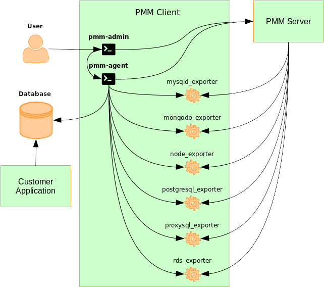
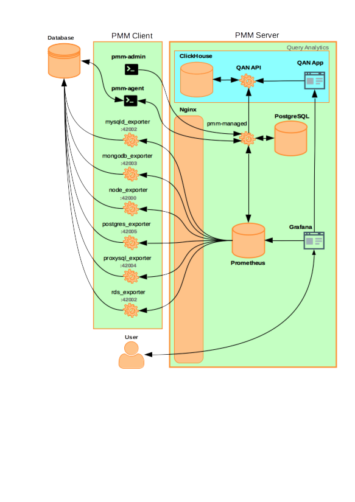

.. _pmm.architecture:

--------------------------------------------------------------------------------
Client/Server Architecture - an Overview
--------------------------------------------------------------------------------

The PMM platform is based on a client-server model that enables scalability.
It includes the following modules:

* :ref:`pmm-client` installed on every database host that you want to monitor.
  It collects server metrics, general system metrics, and Query Analytics data
  for a complete performance overview.

* :ref:`pmm-server` is the central part of PMM that aggregates collected data
  and presents it in the form of tables, dashboards, and graphs in a web
  interface.

* :ref:`pmm-platform` provides value-added services for PMM.

.. image:: ../.res/graphics/png/diagram.pmm.client-server-platform.png

The modules are packaged for easy installation and usage. It is assumed that
the user should not need to understand what are the exact tools that make up
each module and how they interact. However, if you want to leverage the full
potential of PMM, the internal structure is important.

.. contents::
   :local:
   :depth: 1

PMM is a collection of tools designed to seamlessly work together.  Some are
developed by Percona and some are third-party open-source tools.

.. note:: The overall client-server model is not likely to change, but the set
   of tools that make up each component may evolve with the product.

The following sections illustrates how PMM is currently structured.

.. _pmm-client:

`PMM Client <architecture.html#pmm-client>`_
================================================================================

Each PMM Client collects various data about general system and database
performance, and sends this data to the corresponding PMM Server.

The PMM Client package consist of the following:

* ``pmm-admin`` is a command-line tool for managing PMM Client,
  for example, adding and removing database instances
  that you want to monitor.
  For more information, see :ref:`pmm.ref.pmm-admin`.
* ``pmm-agent`` is a client-side component a minimal command-line interface,
  which is a central entry point in charge for bringing the client
  functionality: it carries on client's authentication, gets the client
  configuration stored on the PMM Server, manages exporters and other agents.
* ``node_exporter`` is a Prometheus exporter that collects general system
  metrics.
* ``mysqld_exporter`` is a Prometheus exporter that collects MySQL server
  metrics.
* ``mongodb_exporter`` is a Prometheus exporter that collects MongoDB server
  metrics.
* ``postgres_exporter`` is a Prometheus exporter that collects PostgreSQL
  performance metrics.
* ``proxysql_exporter`` is a Prometheus exporter that collects ProxySQL
  performance metrics.

To make data transfer from PMM Client to PMM Server secure, all exporters are
able to use SSL/TLS encrypted connections, and their communication with the PMM
server is protected by the HTTP basic authentication.

.. note:: Credentials used in communication between the exporters and the PMM
   Server are the following ones:

   * login is ``pmm``

   * password is equal to Agent ID, which can be seen e.g. on the Inventory
     Dashboard.

.. seealso::

   How to install PMM Client
      :ref:`deploy-pmm.client.installing`

.. _pmm-server:

`PMM Server <architecture.html#pmm-server>`_
================================================================================

PMM Server runs on the machine that will be your central monitoring host.
It is distributed as an appliance via the following:

* Docker image that you can use to run a container
* OVA (Open Virtual Appliance) that you can run in VirtualBox or another
  hypervisor
* AMI (Amazon Machine Image) that you can run via Amazon Web Services

For more information, see `Installing PMM Server <https://www.percona.com/doc/percona-monitoring-and-management/2.x/install/index-server.html>`_.

PMM Server includes the following tools:

* Query Analytics (QAN) enables you to analyze MySQL query performance over periods of
  time. In addition to the client-side QAN agent, it includes the following:

  * QAN API is the backend for storing and accessing query data collected by
    the QAN agent running on a :ref:`pmm-client`.

  * QAN Web App is a web application for visualizing collected Query Analytics
    data.

* Metrics Monitor provides a historical view of metrics
  that are critical to a MySQL or MongoDB server instance.
  It includes the following:

  * Prometheus is a third-party time-series database that connects to
    exporters running on a :ref:`pmm-client` and aggregates metrics collected by
    the exporters.  For more information, see `Prometheus Docs`_.

  * ClickHouse is a third-party column-oriented database that facilitates
    the Query Analytics functionality. For more information, see
    `ClickHouse Docs <https://clickhouse.yandex/>`_.

  * Grafana is a third-party dashboard and graph builder for visualizing data
    aggregated by Prometheus in an intuitive web interface.  For more
    information, see `Grafana Docs`_.

    * Percona Dashboards is a set of dashboards for Grafana developed by
      Percona.

All tools can be accessed from the PMM Server web interface (landing page).
For more information, see :ref:`using`.

.. _pmm-platform:

`Percona Platform <architecture.html#percona-platform>`_
================================================================================

Percona Platform provides the following value-added services to PMM.

Security Threat Tool
-----------------------------------------------

Security Threat Tool checks registered database instances for a range of common security issues.
This service requires the :guilabel:`Telemetry` setting to be on.

.. seealso::

   - :ref:`Security Threat Tool main page <platform.stt>`

   - :ref:`Security Threat Tool settings <server-admin-gui-stt>`

.. _`Prometheus Docs`: https://prometheus.io/docs/introduction/overview/
.. _`Consul Docs`: https://www.consul.io/docs/
.. _`Grafana Docs`: http://docs.grafana.org/
.. _`Orchestrator Manual`: https://github.com/outbrain/orchestrator/wiki/Orchestrator-Manual

