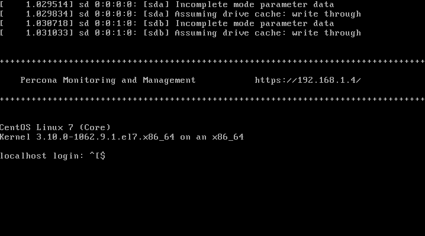
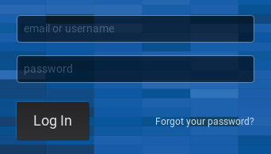
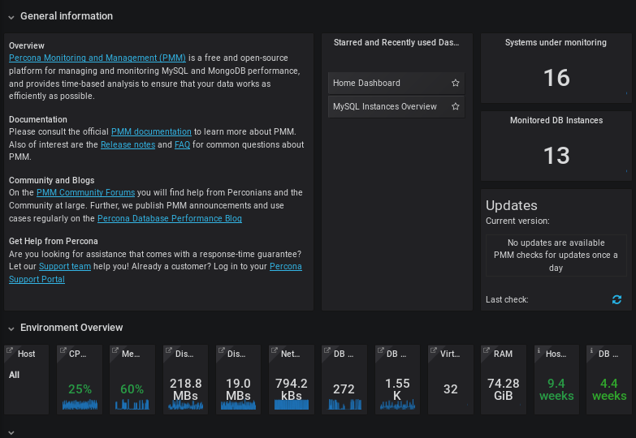

.. _pmm.deploying.server:

PMM Server as a Virtual Appliance
********************************************************************************

Percona provides a *virtual appliance* for running |pmm-server| in a virtual
machine.  It is distributed as an *Open Virtual Appliance* (OVA) package, which
is a :command:`tar` archive with necessary files that follow the *Open
Virtualization Format* (OVF).  OVF is supported by most popular virtualization
platforms, including:

* `VMware - ESXi 6.5`_
* `Red Hat Virtualization`_
* `VirtualBox`_
* `XenServer`_
* `Microsoft System Center Virtual Machine Manager`_

|chapter.toc|

.. contents::
   :local:
   :depth: 1

.. _pmm.deploying.server.virtual-appliance.supported-platform.virtual-appliance:

`Supported Platforms for Running the PMM Server Virtual Appliance <virtual-appliance.html#pmm-deploying-server-virtual-appliance-supported-platform-virtual-appliance>`_
=========================================================================================================================================================================

The virtual appliance is ideal for running |pmm-server| on an enterprise
virtualization platform of your choice. This page explains how to run the
appliance in |virtualbox| and VMware Workstation Player. which is a good choice
to experiment with |pmm| at a smaller scale on a local machine.  Similar
procedure should work for other platforms (including enterprise deployments on
VMware ESXi, for example), but additional steps may be required.

The virtual machine used for the appliance runs |centos| 7.

.. warning:: 

   The appliance must run in a network with DHCP, which will automatically
   assign an IP address for it.

   To assign a static IP manually, you need to acquire the root access as
   described in :ref:`pmm.deploying.server.virtual-appliance.root-password.setting`.
   Then, see the documentation for the operating system for further
   instructions: `Configuring network interfaces in CentOS
   <https://www.centos.org/docs/5/html/Deployment_Guide-en-US/s1-networkscripts-interfaces.html>`_

.. _pmm.deploying.server.virtual-appliance.supported-platform.virtual-appliance.setting-up:

.. rubric:: Instructions for setting up the virtual machine for different platforms
   
.. toctree::
   :maxdepth: 1
   :glob:
      
   ova.*

.. _pmm.deploying.server.virtual-appliance.pmm-server.ip-address.identifying:

`Identifying PMM Server IP Address <virtual-appliance.html#pmm-deploying-server-virtual-appliance-pmm-server-ip-address-identifying>`_
=======================================================================================================================================

When run |pmm-server| as virtual appliance, The IP address of your |pmm-server|
appears at the top of the screen above the login prompt. Use this address to
acces the web interface of |pmm-server|.

.. _figure.pmm/deploying/server/virtual-appliance.pmm-server.ip-address.identifying.above-login-prompt:

   The IP address appears above the login prompt.

|pmm-server| uses DHCP for security reasons, and thus you need to check the PMM
Server console in order to identify the address.  If you require configuration
of a static IP address, see
`Configuring network interfaces in CentOS <https://www.serverlab.ca/tutorials/linux/administration-linux/how-to-configure-centos-7-network-settings/>`_

.. id 9a96a76
.. _deploying.pmm-server.web-interface.opening:

`Accessing PMM Server <virtual-appliance.html#deploying-pmm-server-web-interface-opening>`_
============================================================================================

To run the |pmm-server|, start the virtual machine and open in your browser the
URL that appears at the top of the terminal when you are logging in to the
virtual machine.

.. _figure.9a96a76.pmm-server.password-change:

   Enter the user login and password to access the |pmm-server| web interface.

If you run |pmm-server| in your browser for the first time, you are requested to
supply the user login and password. The default PMM Server credentials are:

* **username:** admin
* **password:** admin

After login you will be proposed to change this default password. Enter the new
password twice and click |gui.save|. The |pmm-server| is now ready and the home
page opens.

   |pmm-server| home page

You are creating a username and password that will be used for two purposes:

1. authentication as a user to PMM - this will be the credentials you need in order
   to log in to PMM.
#. authentication between PMM Server and PMM Clients - you will
   re-use these credentials as a part of the server URL when configuring |pmm-client| for the first time on a server:

   |tip.run-this.root|

   .. code-block:: sh

      # pmm-admin config  --server-insecure-tls --server-url=https://admin:admin@<IP Address>:443

.. _pmm.deploying.server.virtual-appliance.accessing:

`Accessing the Virtual Machine <virtual-appliance.html#pmm-deploying-server-virtual-appliance-accessing>`_
==========================================================================================================

To access the VM with the *PMM Server* appliance via SSH, you will need to
provide your public key:

1. Open the URL for accessing |pmm| in a web browser.

   The URL is provided either in the console window or in the appliance log.

#. Select the |pmm-settings| dashboard in the main menu.

   .. figure:: ../.res/graphics/png/pmm-add-instance.png

      Choosing the |pmm| *Settings* menu entry

#. Submit your **public key** in the *SSH Key Details* section and click the
   *Apply SSH Key* button.

   .. figure:: ../.res/graphics/png/pmm.settings_ssh_key.png

      Submitting the public key on the *Settings dashboard*

After that you can use ``ssh`` to log in as the ``admin`` user.
For example, if *PMM Server* is running at 192.168.100.1
and your **private key** is :file:`~/.ssh/pmm-admin.key`,
use the following command::

 ssh admin@192.168.100.1 -i ~/.ssh/pmm-admin.key

Next Steps
================================================================================

:ref:`Verify that PMM Server is running <deploy-pmm.server-verifying>`
by connecting to the PMM web interface using the IP address
assigned to the virtual appliance,
then :ref:`install PMM Client <deploy-pmm.client.installing>`
on all database hosts that you want to monitor.

.. _`Red Hat Virtualization`: https://www.redhat.com/en/technologies/virtualization
.. _`VMware - ESXi 6.5`: https://www.vmware.com/products/esxi-and-esx.html
.. _`VMware`: http://www.vmware.com/
.. _`VirtualBox`: https://www.virtualbox.org/
.. _`XenServer`: https://www.xenserver.org/
.. _`Microsoft System Center Virtual Machine Manager`: https://www.microsoft.com/en-us/cloud-platform/system-center

.. include:: ../.res/replace.txt
