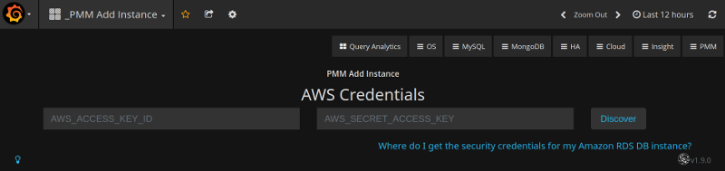
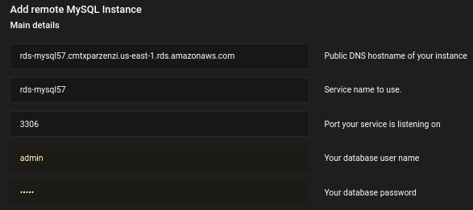

.. _pmm.amazon-rds:

--------------------------------------------------------------------------------
Using PMM Add Instance wizard
--------------------------------------------------------------------------------

.. versionadded:: 1.5.0

The |pmm-add-instance| is now a preferred method of adding an |amazon-rds| DB
instance to |pmm|. This method supports |amazon-rds| DB instances that use
|amazon-aurora|, |mysql|, or |mariadb| engines.

.. contents::
   :local:
   :depth: 1

.. _figure.pmm.amazon-rds.pmm-server.add-instance.access-key-id:

   
   Enter the access key ID and the secret access key of your |iam| user to view
   |amazon-rds| DB instances.

1. Open the |pmm| web interface and select the |pmm-add-instance| dashboard.
#. Select the |gui.add-rds-aurora-instance| option in the dashboard.
#. Enter the access key ID and the secret access key of your |iam| user.
#. Click the |gui.discover| button for |pmm| to retrieve the available |amazon-rds|
   instances.

.. _figure.pmm.amazon-rds.pmm-server.add-instance.displaying:

.. figure:: ../.res/graphics/png/metrics-monitor.add-instance.1.png

   |pmm| displays the available |amazon-rds| instances

For each instance that you would like to monitor, select the |gui.enabled| button
and enter the user name and password. Click |gui.connect|. You can now monitor your
instances in the |dbd.amazon-rds-aurora-mysql-metrics|.

.. _figure.pmm.amazon-rds.pmm-server.add-instance.rds-instances.db-user-credentials:

   Enter the DB user name and password to connect to the selected |rds| or
   |amazon-aurora| instance.

.. seealso::

   |aws| Documentation: Managing access keys of |iam| users
      https://docs.aws.amazon.com/IAM/latest/UserGuide/id_credentials_access-keys.html

.. |policy-name| replace:: *AmazonRDSforPMMPolicy*

.. include:: ../.res/replace.txt
