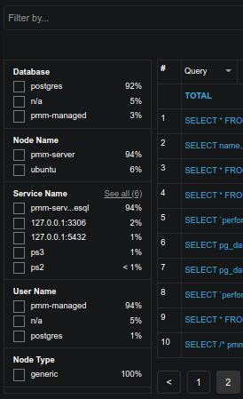
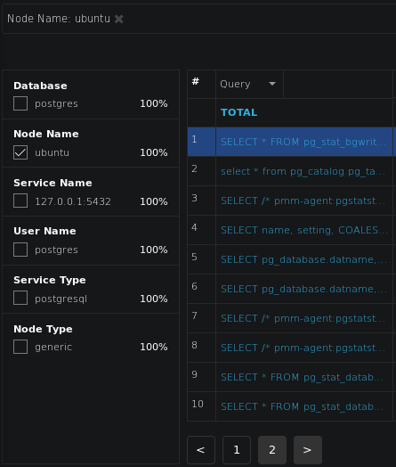

.. _pmm.qan.query.filtering:

--------------------------------------------------------------------------------
`Filtering Queries <pmm.qan.query.filtering>`_
--------------------------------------------------------------------------------

If you need to limit the list of available queries to only those that you are
interested in, use the filtering panel on the left, or use the search by bar to
set filters using *key:value* syntax.

Following example shows how to filter just the queries that are executed on the
*Ubuntu* node (note that the filtering panel reflects only Labels available
within the set of currently applied filters):

.. only:: showhidden

	In the |gui.query-filter| field, you can enter a query ID, query abstract, or
	query fingerprint. The ID is a unique signature of a query and looks like a
	long hexadecimal number. Note that each query in the summary table displays its
	ID in the *ID* column.

	The query fingerprint is a simplified form of a query: all specific values are
	replaced with placeholders. You may enter only a fragment of the fingerprint to
	view all queries that contain that fragment in their fingerprints.

	The query abstract is the portion of the query fingerprint which contains the
	type of the query, such as *SELECT* or *FIND*, and the attributes from the
	projection (a set of requested columns in case of |mysql| database, for example).

	When you apply a filter, the query summary table changes to display only the
	queries which match your criterion. Note that the TOTAL row which runs above the
	list of queries in the summary table does not change its values. These are
	always calculated based on all queries run within the selected time or date
	range.

	.. figure:: .res/graphics/png/qan.query-summary-table.1.png

	   A list of queries

.. _pmm.qan.time-date-range.selecting:

.. rubric:: Selecting Time or Date Range

The query metrics that appear in |qan| are computed based on a time period or a
range of dates. The default value is *the last hour*. To set another range use
the *range selection tool* located at the top of the |qan| page.

.. figure:: .res/graphics/png/qan.range-selection.1.png

   |qan| displays query metrics for the time period or date range that you
   specify.

The tool consists of two parts. The *Quick ranges* offers frequently used time
ranges.. The date picker sets a range of dates.

.. _pmm.qan.query-summary.total:

`Totals of the Query Summary <pmm.qan.query-summary.total>`_
--------------------------------------------------------------------------------

The first line of the query summary contains the totals of the *load*, *count*,
and *latency* for all queries that were run on the selected database server
during the time period that you've specified.

.. only:: showhidden

	.. figure:: .res/graphics/png/qan.query-summary-table.totals.1.png
		   
	   The totals appear at the top of the query summary table.

The *load* is the amount of time that the database server spent during the
selected time or date range running all queries.

The *count* is the average number of requests to the server during the specified
time or date range.

The *latency* is the average amount of time that it took the database server to
retrieve and return the data.

.. _pmm.qan.query-summary.query:

`Queries in the Query Summary Table <pmm.qan.query-summary.query>`_
--------------------------------------------------------------------------------

Each row in the query summary contains information about a single
query. Each column is query attribute. The *Query* attribute informs the type of
query, such as INSERT, or UPDATE, and the queried tables, or collections. The
*ID* attribute is a unique hexadecimal number associated with the given query.

The *Load*, *Count*, and *Latency* attributes refer to the essential metrics of
each query. Their values are plotted graphics and summary values in the numeric
form. The summary values have two parts. The average value of the metric and its
percentage with respect to the corresponding total value at the top of the query
summary table.

.. _pmm.qan.metric.value.viewing:

`Viewing a Specific Value of a Metric <pmm.qan.metric.value.viewing>`_
--------------------------------------------------------------------------------

If you hover the cursor over one of the metrics in a query, you can see a
concrete value at the point where your cursor is located. Move the cursor along
the plotted line to watch how the value is changing.

.. figure:: .res/graphics/png/qan.query-summary-table.1.png

   *Hover the cursor to see a value at the point.*

.. include:: .res/replace.txt
