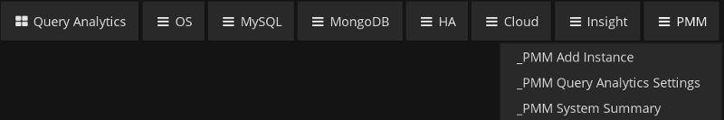

.. _pmm.qan.configuring:
--------------------------------------------------------------------------------
`Configuring QAN <pmm.qan.configuring>`_
--------------------------------------------------------------------------------

All |qan.name| settings are available from the |query-analytics-settings|
dashboard. To open this dashboard, use the |pmm| menu group.

.. _figure.pmm.qan.configuring.metrics-monitor.menu.pmm:

   The |pmm| group in the |metrics-monitor| navigation menu

.. _pmm.qan.configuring.settings-tab:

`Settings Tab <pmm.qan.configuring.settings-tab>`_
--------------------------------------------------------------------------------

The |gui.settings| tab displays the essential configuration settings of
the database server selected from the |gui.databases| list. From this tab
you can see which :ref:`DSN <DSN>` is being used as well as the :ref:`database
server version <Version>`.

This tab contains several settings which influence how the monitored data are
collected. Note that these settings cannot be changed directly in |qan|. You
need to set the appropriate options by using the tools from the database server
itself. You can, however, select where the database server mentrics are
collected from, such as |slow-log|, or |perf-schema|. For this, change the value
of the |gui.collect-from| field accordingly.

.. _figure.pmm.qan.configuring.pmm.qan.tab.settings:

.. figure:: .res/graphics/png/qan.settings.1.png
	   
   The |gui.settings| tab to view the essential settings of the selected
   database server.

When you choose to collect |mysql| data from |slow-log|, a group of read only
values becomes available. Note that these settings cannot be set in |pmm|
directly. These are essential parameters of |mysql| that affect the operation of
|slow-log|. If you need to change these settings refer to the appropriate sections
of |mysql| documentation.

.. seealso::

   |percona-server| Documentation:
      `Slow Query Log Rotation and Expiration
      <https://www.percona.com/doc/percona-server/LATEST/flexibility/slowlog_rotation.html>`_

   |mysql| Documentation:
      `The Slow Query Log
      <https://dev.mysql.com/doc/refman/5.7/en/slow-query-log.html>`_

.. _pmm.qan.configuring.status-tab:

`Status Tab <pmm.qan.configuring.status-tab>`_
--------------------------------------------------------------------------------

The |gui.status| tab contains detailed information about the current status of
the monitored database server. |qan| collects this information from the database
server directly. For example, in case of a |mysql| server, the |sql.show-status|
command is used.

.. _pmm.qan.configuring.log-tab:

`Log Tab <pmm.qan.configuring.log-tab>`_
--------------------------------------------------------------------------------

The |gui.log| tab contains the latest version of the monitored log, such
as |slow-log|. At the top of this tab, you may notice when exactly the snapshot
was taken.

.. include:: .res/replace.txt
