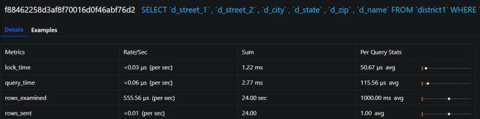

.. _pmm.qan.query.zooming:

--------------------------------------------------------------------------------
`Zooming into a Query <pmm.qan.query.zooming>`_
--------------------------------------------------------------------------------

Click one of the queries to zoom it in. QAN displays detailed information about
the query in the :ref:`query metrics summary table <Query-Metrics-Summary-Table>` below the :ref:`query
summary table <Query-Summary-Table>`. The detailed information includes the query type specific
metrics. It also contains details about the database and tables which are used
in the query.

.. figure:: .res/graphics/png/qan.query-metrics.1.png

   Select a query from the query summary table to open its metrics.

.. _pmm.qan.query.selecting:

`Query Section <pmm.qan.query.selecting>`_
--------------------------------------------------------------------------------
   
In addition to the metrics in the :ref:`query metrics summary table <Query-Metrics-Summary-Table>`,
:program:`QAN` displays more information about the query itself. The ``Query``
section contains the :ref:`fingerprint <Query-Fingerprint>` and an example of
the query.

   The Query section shows the SQL statement for the selected query.

.. _pmm.qan.explain-section:

`Explain Section <pmm.qan.explain-section>`_
--------------------------------------------------------------------------------

The |gui.explain| section enables you to run |sql.explain| on the selected query
directly from the PMM web interface (simply specify the database).

.. image:: .res/graphics/png/qan-realtime-explain.png

The output appears in three forms: classic, |json| and visual. The classic form
presents the attributes of the |sql.explain| command as columns of a table. The
JSON format presents the output of |sql.explain| as a |json| document. To help
you better understand how the query has been optimized, the visual form shows
how the query accesses the tables it includes. The output of the visual form is
identical to that of |pt-visual-explain|.

.. note::

   The |gui.copy-to-clipboard| button available in Explain, Fingerprint,
   Example, and Tables sections is useful to save the output and pass it to
   external tools, such as |pt-visual-explain|.

.. figure:: .res/graphics/png/qan.explain.1.png

   The three output formats of the |sql.explain| command.

Note that the |sql.explain| command only works with the following statements:

- |sql.select|
- |sql.delete|
- |sql.insert|
- |sql.replace|
- |sql.update|
	    
If you are viewing the details of a query of another type, the
|gui.explain| section will not contain any data.

.. admonition:: Related information

   |pt-visual-explain|: a tool to show the query plan based on the output of the |sql.explain| command
      https://www.percona.com/doc/percona-toolkit/LATEST/pt-visual-explain.html

.. _pmm.qan.table-info-section:

`Table Info Section <pmm.qan.table-info-section>`_
--------------------------------------------------------------------------------

At the bottom, you can run Table Info for the selected query.  This
enables you to get ``SHOW CREATE TABLE``, ``SHOW INDEX``, and ``SHOW
TABLE STATUS`` for each table used by the query directly from the PMM
web interface.

.. image:: .res/graphics/png/qan-create-table.png

.. include:: .res/replace.txt
