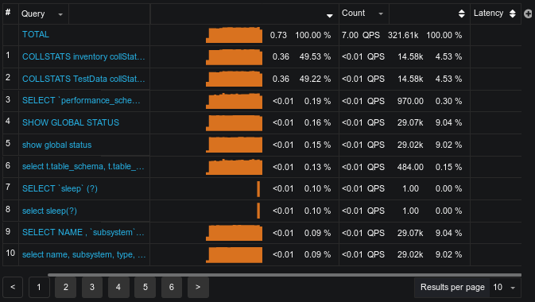

.. _pmm.qan.home-page.opening:

--------------------------------------------------------------------------------
`Navigating to Query Analytics <pmm.qan.home-page.opening>`_
--------------------------------------------------------------------------------
   
To start working with |qan|, open the list of dashboards on the |pmm| home
page. Then, proceed to the |gui.host| field at the top of the page and select a
host where the |pmm-client| is installed from the list of database instances.

The |qan| dashboard will show a summary of the selected host and database
activity metrics followed by the list of queries in a summary table. By
default, |qan| shows the top *ten* queries ranked by :ref:`%GTT <GTT>` (Grand total
time). Each query displays three essential metrics: *Load*, *Count*, and
*Latency*. Also queries which are newly seen within the the time range selected
are highlighted with a blue color for quicker identification.

Also it worth to mention that |qan| data come in with typical 1-2 min delay,
though it is possible to be delayed more because of specific network condition
and state of the monitored object. In such situations |qan| reports "no data"
situation, using sparkline to and showing a gap in place of the time interval,
for which data are not available yet.

.. figure:: .res/graphics/png/qan.query-summary-table.sparkline.png

   Showing intervals for which data are unavailable yet.

To view more queries, click the :guilabel:`Load next 10 queries` button below
the query summary table.

   The query summary table shows the monitored queries from the selected
   database.

.. include:: .res/replace.txt
