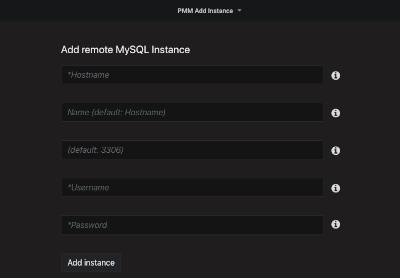

.. _1.16.0:

================================================================================
Percona Monitoring and Management 1.16.0
================================================================================

:Date: November 1, 2018

*PMM* (`Percona Monitoring and Management <https://www.percona.com/doc/percona-monitoring-and-management/index.html>`_) is a free and open-source platform for managing and monitoring |MySQL|, |MongoDB|, and |postgresql| performance. You can run *PMM* in your own environment for maximum security and reliability. It provides thorough time-based analysis for |MySQL| and |MongoDB| servers to ensure that your data works as efficiently as possible.

This release offers three new features for both the Community and Percona Customers:

* Agentless PMM support - Use PMM Server to gather Database Metrics and Queries
  from remote instances with no PMM Client installed!
* Query Analytics + Metric Series – See Related Database activity alongside queries
* Simplify metrics collections

We addressed 11 new features and improvements, and fixed 21 bugs.

Agentless PMM support for MySQL and PostgreSQL
================================================================================

You’re now able to connect |pmm-server| to your |MySQL| and |postgresql|
instances, whether they run in a cloud DBaaS environment, or under Operating
Systems which are not natively supported by |pmm| (e.g. Windows), or when you
do not have shell access to the server. This can help you get up and running
with |pmm| using minimal configuration and zero client installation, however be
aware there are limitations - *there won’t be any host-level dashboards
populated for these nodes* since we don’t attempt to connect to the provider’s
API nor are we granted access to the instance in order to deploy an exporter.

How to use
--------------------------------------------------------------------------------

You’ll be able to collect Metrics and Queries from |MySQL|, and Metrics from
|postgresql|.  You can add remote instances by selecting the |pmm-add-instance|
item in a |gui.pmm-dropdown| group of the system menu:

.. figure:: 1.16.0-1.png

where you will then have the opportunity to add a Remote MySQL or Remote
PostgreSQL instance:

.. figure:: 1.16.0-2.png

You’ll add the instance by supplying just the Hostname, database Username and
Password (and optional Port and Name):

Also new as part of this release is the ability to display nodes you’ve added,
on screen **RDS and Remote Instances**:

.. figure:: 1.16.0-4.png

Server activity metrics in the PMM Query Analytics dashboard
--------------------------------------------------------------------------------

The Query Analytics dashboard now shows host and database activity graphs linked
to the queries listed in a summary table.  This brings a view of System Activity
(CPU, Disk, and Network) and Database Server Activity (Connections, Queries per
Second, and Threads Running) to help you better pinpoint query pileups and other
bottlenecks.

.. raw:: html

    

Extending metrics with node_exporter textfile collector
--------------------------------------------------------------------------------

While |pmm| provides an excellent solution for system monitoring, sometimes you
may have the need for a metric that’s not present in the list of
``node_exporter`` metrics out of the box. There is a simple method to extend the
list of available metrics without modifying the ``node_exporter`` code. It is
based on the textfile collector.  We’ve enabled this collector as on by default,
and it is deployed as part of ``linux:metrics`` in |pmm-client|.

The default directory for reading text files with the metrics is
``/usr/local/percona/pmm-client/textfile-collector``, and the exporter reads
files from it with the ``.prom`` extension. By default it contains an example
file  ``example.prom`` which has commented contents and can be used as a
template.

You are responsible for running a cronjob or other regular process to generate
the metric series data and write it to this directory.

Example – collecting docker container information
********************************************************************************

This example will show you how to collect the number of running and stopped
docker containers on a host. It uses a ``crontab`` task, set with the following
lines in the cron configuration file (e.g. in ``/etc/crontab``)::

  */1 * * * *     root   echo -n "" > /tmp/docker_all.prom; docker ps -a -q | wc -l | xargs echo node_docker_containers_total >> /usr/local/percona/pmm-client/docker_all.prom;
  */1 * * * *     root   echo -n "" > /tmp/docker_running.prom; docker ps | wc -l | xargs echo node_docker_containers_running_total >> /usr/local/percona/pmm-client/docker_running.prom;

The result of the commands is placed into the ``docker_all.prom`` and
``docker_running.prom`` files and read by exporter and will create two new
metric series named ``node_docker_containers_total`` and
``node_docker_containers_running_total``, which we’ll then plot on a graph:

.. image:: 1.16.0-6.png

New Features and Improvements
================================================================================

* :pmmbug:`3195`: Remove Color scheme switch in favor of the UI Theme chooser in
  Preferences
* :pmmbug:`3194`: Change link for “Where do I get the security credentials for
  my Amazon RDS DB instance?”
* :pmmbug:`3189`: Include Remote MySQL & PostgreSQL instance logs into PMM
  Server logs.zip system
* :pmmbug:`3166`: Convert status integers to strings on ProxySQL Overview
  Dashboard – Thanks, `Iwo Panowicz <https://github.com/impimp>`_ for  https://github.com/percona/grafana-dashboards/pull/239
* :pmmbug:`3133`: Include Metric Series on Query Analytics Dashboard
* :pmmbug:`3078`: Generate warning “how to troubleshoot postgresql:metrics”
  after failed pmm-admin add postgresql execution
* :pmmbug:`3061`: Provide Ability to Monitor Remote MySQL and PostgreSQL
  Instances
* :pmmbug:`2888`: Enable Textfile Collector by Default in node_exporter
* :pmmbug:`2880`: Use consistent favicon (Percona logo) across all distribution
  methods
* :pmmbug:`2306`: Reconfigure instance automatically after the EBS volume size
  increase
* :pmmbug:`1358`: Improve Tooltips on Disk Space Dashboard – thanks, `Corrado Pandiani <https://www.percona.com/blog/author/corrado-pandiani/>`_ for texts

Fixed Bugs
================================================================================

* :pmmbug:`3202`: Cannot add remote PostgreSQL to monitoring without specified
  dbname
* :pmmbug:`3186`: Strange “Quick ranges” tag appears when you hover over
  documentation links on PMM Add Instance screen
* :pmmbug:`3182`: Some sections for MongoDB are collapsed by default
* :pmmbug:`3171`: Remote RDS instance cannot be deleted
* :pmmbug:`3159`: Problem with enabling RDS instance
* :pmmbug:`3127`: “Expand all” button affects JSON in all queries instead of the
  selected one
* :pmmbug:`3126`: Last check displays locale format of the date
* :pmmbug:`3097`: Update home dashboard to support PostgreSQL nodes in
  Environment Overview
* :pmmbug:`3091`: postgres_exporter typo
* :pmmbug:`3090`: TLS handshake error in PostgreSQL metric
* :pmmbug:`3088`: It’s possible to downgrade PMM from Home dashboard
* :pmmbug:`3072`: Copy to clipboard is not visible for JSON in case of long
  queries
* :pmmbug:`3038`: Error adding MySQL queries when options for mysqld_exporters
  are used
* :pmmbug:`3028`: Mark points are hidden if an annotation isn’t added in advance
* :pmmbug:`3027`: Number of vCPUs for RDS is displayed incorrectly – report and
  proposal from `Janos Ruszo <https://www.percona.com/blog/author/janos-ruszo/>`_
* :pmmbug:`2762`: Page refresh makes Search condition lost and shows all queries
* :pmmbug:`2483`: LVM in the PMM Server AMI is poorly configured/documented –
  reported by `Olivier Mignault <https://jira.percona.com/secure/ViewProfile.jspa?name=olivier%40ookla.com>`_ and lot of people involved.  Special thanks to  `Chris Schneider <https://jira.percona.com/secure/ViewProfile.jspa?name=schneiderdba%40gmail.com>`_ for checking with fix options
* :pmmbug:`2003`: Delete all info related to external exporters on pmm-admin
  list output

How to get PMM Server
================================================================================

PMM is available for installation using three methods:

* `Docker Hub <https://hub.docker.com/r/percona/pmm-server/>`_ – ``docker pull percona/pmm-server`` – `Documentation <https://www.percona.com/doc/percona-monitoring-and-management/deploy/server/docker.html>`_
* `AWS Marketplace <https://aws.amazon.com/marketplace/pp/B077J7FYGX>`_ – `Documentation <https://www.percona.com/doc/percona-monitoring-and-management/deploy/server/ami.html>`_
* `Open Virtualization Format (OVF) <https://www.percona.com/downloads/pmm/>`_ – `Documentation <https://www.percona.com/doc/percona-monitoring-and-management/deploy/server/virtual-appliance.html>`_

.. include:: ../.res/replace.txt
