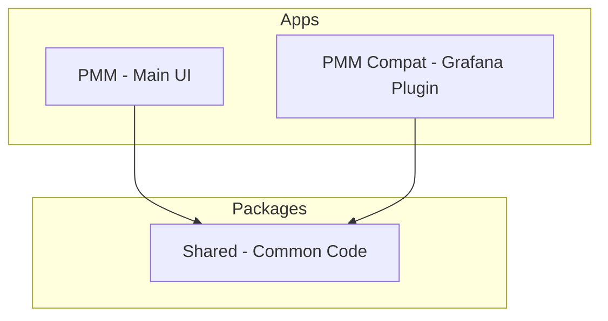

# PMM UI Contribution Guide

This guide covers contributing to the PMM UI—the native user interface for [Percona Monitoring and Management (PMM)](https://www.percona.com/software/database-tools/percona-monitoring-and-management). For project-wide policies (CLA, Code of Conduct, bug reporting, PR rules, feature builds), see the main [CONTRIBUTING.md](../CONTRIBUTING.md).

See the main UI entry: [README.md](README.md).

**Scope:** This guide applies to the `ui/` folder, including `apps/pmm`, `apps/pmm-compat`, and `packages/shared`.

## Table of contents

1. [Prerequisites](#prerequisites)
2. [Tech Stack](#tech-stack)
3. [Repository Structure](#repository-structure)
4. [Setup](#setup)
5. [Development Workflow](#development-workflow)
6. [Testing @percona/percona-ui Locally](#testing-perconapercona-ui-locally)
7. [Code Quality](#code-quality)
8. [Submitting Changes](#submitting-changes)

## Prerequisites

- [Node 22](https://nodejs.org/en) or later (you can use [nvm](https://github.com/nvm-sh/nvm) to manage Node versions)
- [Yarn](https://yarnpkg.com/)
- For full-stack testing with PMM server: Docker

## Tech Stack

The UI uses a monorepo setup with:

- **Build & package management:** Yarn workspaces, [Turborepo](https://turborepo.com/)
- **Language & framework:** [TypeScript](https://www.typescriptlang.org/), [React](https://react.dev/)
- **Bundling:** [Vite](https://vitejs.dev/) (pmm app), [Webpack](https://webpack.js.org/) (pmm-compat), [Rollup](https://rollupjs.org/) (shared package)
- **Testing:** [Vitest](https://vitest.dev/) (pmm), Jest (pmm-compat, shared)
- **UI:** MUI, [@percona/percona-ui](https://github.com/percona/percona-ui)
- **Code quality:** [Prettier](https://prettier.io/) (@percona/prettier-config), ESLint

## Repository Structure



- **apps/pmm** — Main PMM UI application (Vite, Vitest). See [apps/pmm/README.md](apps/pmm/README.md).
- **apps/pmm-compat** — Grafana application plugin that handles communication between Grafana and the PMM UI via an iframe messaging channel. See [apps/pmm-compat/README.md](apps/pmm-compat/README.md).
- **packages/shared** — Shared code used by both apps.

## Setup

From the `ui/` directory:

```bash
make setup
```

Or directly:

```bash
yarn install
```

## Development Workflow

### Run the UI

```bash
make dev
```

This starts the apps via Turborepo.

For full integration (UI + PMM server), run `docker compose up` from `ui/` alongside `make dev`. The Vite dev server is proxied through the PMM server (see `pmm-dev.conf`).

### Commands

| Command       | Description                  |
| ------------- | ---------------------------- |
| `make dev`    | Start development servers    |
| `make build`  | Build all packages and apps  |
| `make lint`   | Run ESLint across workspace  |
| `make format` | Format with Prettier         |
| `make test`   | Run all unit tests           |
| `make clean`  | Remove build artifacts       |
| `make ci`     | Setup, lint, test, and build |

## Testing @percona/percona-ui locally

To test changes to the shared [@percona/percona-ui](https://github.com/percona/percona-ui) library locally:

1. Clone the percona-ui repository and, from its `lib` folder, run `pnpm build:watch` and `yarn link`.
2. In `ui/apps/pmm`, run `yarn link @percona/percona-ui` and uncomment the `exclude` block in `vite.config.ts`.
3. Any change in percona-ui will trigger a build and refresh in PMM.
4. When done: comment back the `exclude` block, run `yarn unlink @percona/percona-ui` and `yarn install --force` from `ui/apps/pmm`.
5. Restart the dev server between linking and unlinking.

## Code Quality

### Linting

```bash
make lint
```

ESLint runs per app and package. The `pmm` app extends the shared package config.

### Formatting

```bash
make format
```

Prettier formats `**/*.{ts,tsx,md}` across the workspace using `@percona/prettier-config`.

### Type checking

```bash
yarn check-types
```

Runs TypeScript type checks via Turborepo.

### Tests

- **pmm:** Vitest with jsdom and React Testing Library (see `apps/pmm/src/setupTests.ts`).
- **pmm-compat, shared:** Jest.

Use `testUtils.tsx`, `testWrapper.tsx`, and `testStubs` from `apps/pmm/src/utils/` when writing component tests.

## Submitting Changes

Follow the main [CONTRIBUTING.md](../CONTRIBUTING.md) for:

- Signing the CLA and Code of Conduct
- Branch naming (e.g., `PMM-1234-short-description`)
- Commit message format
- Pull request process and review expectations

### Before opening a PR

1. Run `make lint`, `make test`, and `make build` (or `make ci`).
2. Ensure all tests pass and lint rules are satisfied.
3. Add `pmm-review-fe` as reviewer for UI changes.
4. For full integration testing, create a Feature Build as described in the main contribution guide.

### Related documentation

- [Working with Git and GitHub](../docs/process/GIT_AND_GITHUB.md)
- [Tech stack](../docs/process/tech_stack.md)
- [Best practices](../docs/process/best_practices.md)

Note: `best_practices.md` is oriented toward backend (Go). For the UI, follow Prettier and ESLint configs for code style.
