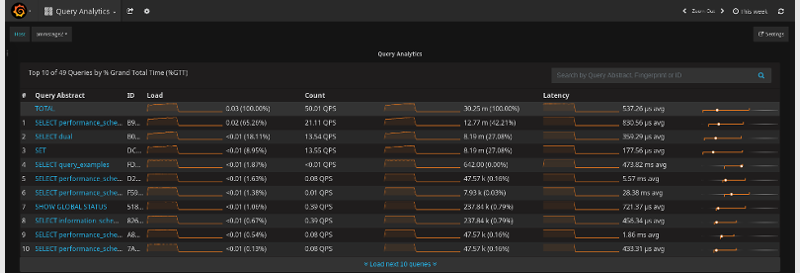
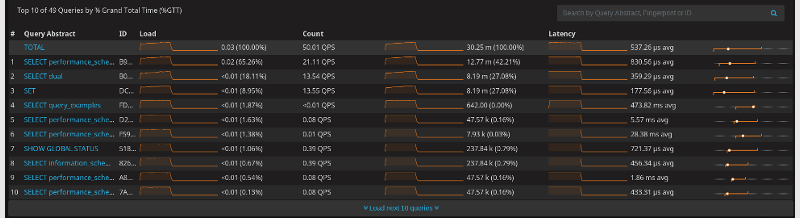
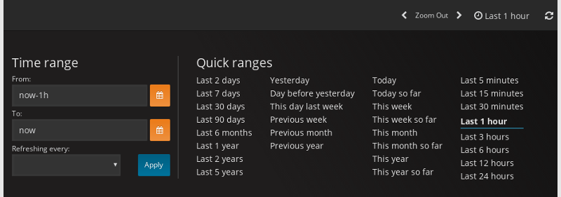
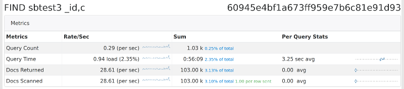

.. _using:

================================================================================
Using the Percona Monitoring and Management Platform
================================================================================

You can access the PMM web interface using the IP address of the host
where |pmm-server| is running.
For example, if |pmm-server| is running on a host with IP 192.168.100.1,
access the following address with your web browser: ``http://192.168.100.1``.

The landing page has links to corresponding PMM tools:

.. contents::
   :local:
   :depth: 1

These tools, implemented as |grafana| dashboards, provide
comprehensive information about the performance of monitored hosts.

.. _using-qan:

Query Analytics
================================================================================

The |qan| dashboard enables database administrators and application
developers to analyze database queries over periods of time and find performance
problems.  |qan| helps you optimize database performance by making
sure that queries are executed as expected and within the shortest time
possible.  In case of problems, you can see which queries may be the cause and
get detailed metrics for them. 

	    
   |qan| *helps analyze database queries over periods of time and find performance
   problems.*

|qan| displays its metrics in both visual and numeric form: the performance
related characteristics appear as plotted graphics with summaries.

Open |qan| from the |pmm| Home Page
--------------------------------------------------------------------------------
   
To start working with |qan|, open the list of dashboards on the |pmm| home
page. Then, select a host in the |gui.host| field at the top of the page from
the list of database instances.  where the |pmm-client| is installed.

.. suspecting that 'database instance' is not appropriate

.. SCREENSHOT: The Host field

The list of queries opens below in a summary table. Be default, |qan| shows the
top *ten* queries ranked by :term:`%GTT` (Grand total time) as a result of
monitoring your database server for the last hour. Each query displays three
essential metrics: *Load*, *Count*, and *Latency*.

To view more queries, click the :guilabel:`Load next 10 queries` button below
the query summary table.

   *The query summary table shows the monitored queries from the selected
   database.*

Filtering Queries
--------------------------------------------------------------------------------

If you need to limit the list of available queries to only those that you are
interested in, use the |gui.query-filter| field located above the query summary
table.

In the |gui.query-filter| field, you can enter a query ID, query abstract, or
query fingerprint.  The ID is a unique signature of a query and looks like a
long hexadecimal number. Note that each query in the summary table displays its
ID in the *ID* column.

The query fingerprint is a simplified form of a query: all specific values are
replaced with placeholders. You may enter only a fragment of the fingerprint to
view all queries that contain that fragment in their fingerprints.

The query abstract is the portion of the query fingerprint which contains the
type of the query, such as *SELECT* or *FIND*, and the attributes from the
projection (a set of requested columns in case of MySQL database, for example).

When you apply your filter, the query summary table changes to display only the
queries which match your criterion. Note that the TOTAL row which runs above the
list of queries in the summary table does not change its values. These are
always calculated based on all queries run within the selected time or date
range.

.. figure:: .res/graphics/png/pmm.qan.query-summary-table.1.png

   *A list of queries*

Selecting Time or Date Range
--------------------------------------------------------------------------------

The query metrics that appear in *QAN* are computed based on a time period or a
range of dates. The default value is *the last hour*. To set another range use
the *range selection tool* located at the top of your *QAN* page.

   |qan| displays query metrics for the time period or date range that you
   specify.*

The tool consists of two parts. The *Quick ranges* offers frequently used time
ranges.. The date picker sets a range of dates.

Totals of the Query Summary
--------------------------------------------------------------------------------

The first line of the summary table contains the totals of the *load*, *count*,
and *latency* for all queries that were run on the selected database server
during the time period that you've specified.

.. figure:: .res/graphics/png/pmm.qan.query-summary-table.totals.1.png
	   
   *The totals appear at the top of the query summary table.*

The *load* is the amount of time that the database server spent during the
selected time or date range running all queries.

The *count* is the average number of requests to the server during the specified
time or date range.

The *latency* is the average amount of time that it took the database server to
retrieve and return the data.

Queries in the Query Summary Table
--------------------------------------------------------------------------------

Each row in the query summary table contains information about a single
query. Each column is query attribute. The *Abstract* attribute is an essential
part of the fingerprint which informs the type of query, such as INSERT, or
UPDATE, and the queried tables, or collections. The *ID* attribute is a unique
hexadecimal number associated with the given query.

The *Load*, *Count*, and *Latency* attributes refer to the essential metrics of
each query. Their values are plotted graphics and summary values in the numeric
form. The summary values have two parts. The average value of the metric and its
percentage with respect to the corresponding total value at the top of the query
summary table.

Viewing a Specific Value of a Metric
--------------------------------------------------------------------------------

If you hover the cursor over one of the metrics in a query, you can see a
concrete value at the point where your cursor is located. Move the cursor along
the plotted line to watch how the value is changing.

.. figure:: .res/graphics/png/pmm.qan.query-summary-table.1.png

   *Hover the cursor to see a value at the point.*

Zooming into a Query
--------------------------------------------------------------------------------

Click one of the queries to zoom it in. QAN displays detailed information about
the query in the :term:`query metrics summary table` below the :term:`query
summary table`. The detailed information includes the query type specific
metrics. It also contains details about the database and tables which are used
in the query.

.. figure:: .res/graphics/png/pmm.qan.query-metrics.1.png

   *Select a query from the query summary table to open its metrics.*

Query Section
--------------------------------------------------------------------------------
   
In addition to the metrics in the :term:`query metrics summary table`,
:program:`QAN` displays more information about the query itself. The ``Query``
section contains the :term:`fingerprint <Query Fingerprint>` and an example of
the query.

.. figure:: .res/graphics/png/pmm.qan.query.1.png

   *The Query section shows the SQL statement for the selected query.*

Explain Section
--------------------------------------------------------------------------------

The ``Explain`` section enables you to run |sql.explain| on the selected query
directly from the PMM web interface (simply specify the database).

.. image:: .res/graphics/png/qan-realtime-explain.png

The output appears in two forms: classic and |json|. The classic form presents
the attributes of the |sql.explain| command as columns of a table. The JSON
format presents the output of |sql.explain| as a |json| document.

.. figure:: .res/graphics/png/pmm.qan.explain.1.png

   *The two output formats of the*
   |sql.explain|
   *command.*

Note that the |sql.explain| command only works with the following statements:

- |sql.select|
- |sql.delete|
- |sql.insert|
- |sql.replace|
- |sql.update|
	    
If you are viewing the details of a query of another type, the
``Explain`` section will not contain any data.

Table Info Section
--------------------------------------------------------------------------------

At the bottom, you can run Table Info for the selected query.  This
enables you to get ``SHOW CREATE TABLE``, ``SHOW INDEX``, and ``SHOW
TABLE STATUS`` for each table used by the query directly from the PMM
web interface.

.. image:: .res/graphics/png/qan-create-table.png

Configuring Query Analytics
--------------------------------------------------------------------------------

The :guilabel:`Settings` button opens a separate page with settings,
status, and log for the selected database instance.

.. SCREENSHOT: Settings button

.. rubric:: |gui.settings| Tab

The |gui.settings| tab displays the essential configuration settings of
the database server selected from the |gui.databases| list. From this tab
you can see which :term:`DSN` is being used as well as the :term:`database
server version <Version>`.

This tab contains several settings which influence how the monitored data are
collected. Note that these settings cannot be changed directly in |qan|. You
need to set the appropriate options by using the tools from the database server
itself. You can, however, select where the database server mentrics are
collected from, such as *slow log*, or *performance schema*. For this, change
the value of the |gui.collect-from| field accordingly.

.. figure:: .res/graphics/png/pmm.qan.settings.1.png
	   
   *The*
   |gui.settings|
   *tab to view the essential settings of the selected database server.*

.. rubric:: |gui.status| Tab

The |gui.status| tab contains detailed information about the current status of
the monitored database server. |qan| collects this information from the database
server directly. For example, in case of a |mysql| server, the |sql.show-status|
command is used.

.. rubric:: |gui.log| Tab

The |gui.log| tab contains the latest version of the monitored log, such
as |slow-log|. At the top of this tab, you may notice when exactly the snapshot
was taken.

Viewing Database and Server Summary Information
--------------------------------------------------------------------------------

The |pmm-system-summary| dashboard shows detailed infromation about the selected
host (the value of the |gui.host| field) and the database server deployed on
this host.

The |gui.system-summary| section contains details about the platform while the
|gui.database-summary| offers detailed statistics about the database server.

.. figure:: .res/graphics/png/pmm.metrics-monitor.system-summary.png

   *Accessing information about the system and database*
   
You can download the current values on this dashboard locally if you click the
|gui.download-summary| button.

.. _perf-schema:

|performance-schema|
--------------------------------------------------------------------------------

The default source of query data for |pmm| is the |slow-query-log|.  It is
available in |mysql| 5.1 and later versions.  Starting from |mysql| 5.6
(including |percona-server| 5.6 and later), you can choose to parse query data
from the |perf-schema|.  Starting from |mysql| 5.6.6, |perf-schema| is enabled
by default.

|perf-schema| is not as data-rich as the |slow-query-log|, but it has all the
critical data and is generally faster to parse.  If you are running |percona-server|,
a :ref:`properly configured slow query log <slow-log-settings>` will
provide the most amount of information with the lowest overhead.  Otherwise,
using :ref:`Performance Schema <perf-schema-settings>` will likely provide
better results.

To use |perf-schema|, make sure that the ``performance_schema`` variable is set to ``ON``:

.. include:: .res/code/sql.org
   :start-after: +show-variables.like.performance-schema+
   :end-before: #+end-block

If not, add the the following lines to :file:`my.cnf` and restart |mysql|:

.. include:: .res/code/sql.org
   :start-after: +my-conf.mysql.performance-schema+
   :end-before: #+end-block
		
.. note::

   |perf-schema| instrumentation is enabled by default
   in |mysql| 5.6.6 and later versions.
   It is not available at all in |mysql| versions prior to 5.6.

If the instance is already running, configure the |qan| agent to collect data
from |perf-schema|.

1. Open the |qan.name| dashboard.
#. Click the |gui.settings| button.
#. Open the |gui.settings| section.
#. Select |opt.performance-schema| in the |gui.collect-from| drop-down list.
#. Click |gui.apply| to save changes.

If you are adding a new monitoring instance with the |pmm-admin| tool, use the
|opt.query-source| *perfschema* option:

|tip.run-this.root|

.. include:: .res/code/sh.org
   :start-after: +pmm-admin.add.mysql.user.password.create-user.query-source+
   :end-before: #+end-block
		   
For more information, run
|pmm-admin.add|
|opt.mysql|
|opt.help|.

|qan| for |mongodb|
--------------------------------------------------------------------------------

|mongodb| is conceptually different from relational database management systems,
such as |mysql| or |mariadb|. Relational database management systems store data
in tables that represent single entities. In order to represent complex objects
you may need to link records from multiple tables. |mongodb|, on the other hand,
uses the concept of a document where all essential information pertaining to a
complex object is stored together.

.. figure:: .res/graphics/png/pmm.qan.query-summary-table.mongodb.1.png

   *A list of queries from a*
   |mongodb|
   *host*

|qan| supports monitoring |mongodb| queries. Although |mongodb| is not a relational
database management system, you analyze its databases and collections in the
same interface using the same tools. By using the familiar and intuitive
interface of :term:`QAN` you can analyze the efficiency of your application
reading and writing data in the collections of your |mongodb| databases.

.. note:: **Suppored** |mongodb| **versions**

   PMM supports `MongoDB`_ version 3.2 or higher. 

   *Analyze*
   |mongodb|
   *queries using the same tools as relational database management systems.*

.. _using-mm:

|metrics-monitor|
================================================================================

The |metrics-monitor| tool provides a historical view of metrics that are
critical to a database server.  Time-based graphs are separated into dashboards
by themes: some are related to |mysql| or |mongodb|, others provide general
system metrics.

When you open |metrics-monitor| for the first time, it loads the
|cross-server-graphs| dashboard.  The credentials used to sign in to |grafana|
depend on the options that you specified when :ref:`starting PMM Server
<deploy-pmm.server.installing>`:

.. TODO: Consider moving the following steps to the referenced section

* If you do not specify either :term:`SERVER_USER <SERVER_USER (Option)>` or
  :term:`SERVER_PASSWORD <SERVER_PASSWORD (Option)>`, you will log in
  as an anonymous user.  You can change to a different existing |grafana| user.

* If you specify both |opt.server-user| and |opt.server-password|,
  then these credentials will be used to sign in to |grafana|.

* If you specify only |opt.server-password|, a single user (``pmm``) will be
  used to sign in to all components (including |qan|, |prometheus|, |grafana|,
  etc.).  You will not be able to change to a different |grafana| user.

* If you specify only |opt.server-user|, this parameter will be ignored.

.. warning::

   The value of the |opt.server-user| parameter may not contain the **#** or
   **:** symbols.

To access the dashboards, provide default user credentials:

* User: ``admin``
* Password: ``admin``

On the Home screen, select a dashboard from the list of available |percona|
Dashboards.  For example, the following image shows the |mysql-overview|
dashboard:

.. image:: .res/graphics/png/metrics-monitor.png

Each graph has a graph descriptions to display more information about the
monitored data without cluttering the interface.

These are on-demand descriptions in the tooltip format that you can find by
hovering the mouse pointer over the |gui.more-information| icon at the top left
corner of a graph. When you move the mouse pointer away from the |gui.more-inf|
button the description disappears.

.. figure:: .res/graphics/png/pmm.metrics-monitor.description.1.png

   *Graph descriptions provide more information about a graph without claiming
   any space in the interface.*

|mysql-myrocks-metrics| Dashboard
--------------------------------------------------------------------------------

The MyRocks_ storage engine developed by |facebook| based on the |rocksdb|
storage engine is applicable to systems which primarily interact with the
database by writing data to it rather than reading from it. |rocksdb| also
features a good level of compression, higher than that of the |innodb| storage
engine, which makes it especially valuable when optimizing the usage of hard
drives.

|pmm| collects statistics on the |myrocks| storage engine for |mysql| in the
|metrics-monitor| information for this dashboard comes from the
|inf-schema| tables.

.. figure:: .res/graphics/png/pmm.metrics-monitor.mysql-myrocks-metrics.1.png
	    
   *The*
   |mysql|
   |myrocks|
   *metrics dashboard*

.. seealso::

   `Information schema <https://github.com/facebook/mysql-5.6/wiki/MyRocks-Information-Schema>`_

.. _pmm/using.orchestrator:

|orchestrator|
================================================================================

|orchestrator| is a |mysql| replication topology management and visualization
tool.  If it is enabled, you can access it using the ``/orchestrator`` URL after
|pmm-server| address.  Alternatively, you can click the
|gui.mysql-replication-topology-manager| button on the |pmm-server| landing
page.

To use it, create a |mysql| user for |orchestrator| on all managed instances:

.. include:: .res/code/sql.org
   :start-after: +grant.orc-client-user+
   :end-before: #+end-block

.. note:: The credentials in the previous example are default.
   If you use a different user name or password,
   you have to pass them when
   :ref:`running PMM Server <deploy-pmm.server.installing>`
   using the
   :term:`ORCHESTRATOR_PASSWORD <ORCHESTRATOR_PASSWORD (Option)>`
   and
   :term:`ORCHESTRATOR_USER  <ORCHESTRATOR_USER (Option)>` options.

   .. include:: .res/code/sh.org
      :start-after: +docker.run.orchestrator-enabled.orchestrator-user.orchestrator-password+
      :end-before: #+end-block

Then you can use the |gui.discover| page in the |orchestrator| web interface
to add the instances to the topology.

.. note:: **Orchestrator is not enabled by default starting with PMM 1.3.0**

   |orchestrator| was included into |pmm| for experimental purposes.  It is a
   standalone tool, not integrated with |pmm| other than that you can access it
   from the landing page.

   In version 1.3.0 and later, |orchestrator| is not enabled
   by default. To enable it, see
   :ref:`pmm/docker.additional_parameters` in the
   :ref:`run-server-docker` section.

.. include:: .res/replace/name.txt
.. include:: .res/replace/option.txt
.. include:: .res/replace/program.txt
.. include:: .res/replace/url.txt
.. include:: .res/replace/fragment.txt
